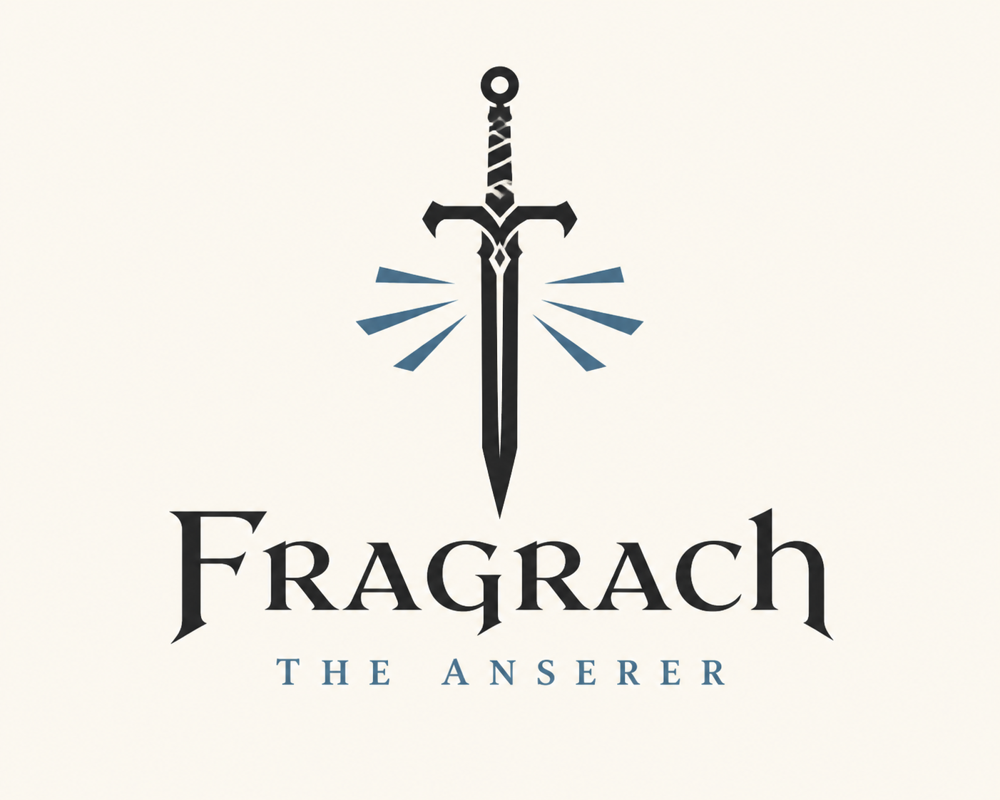
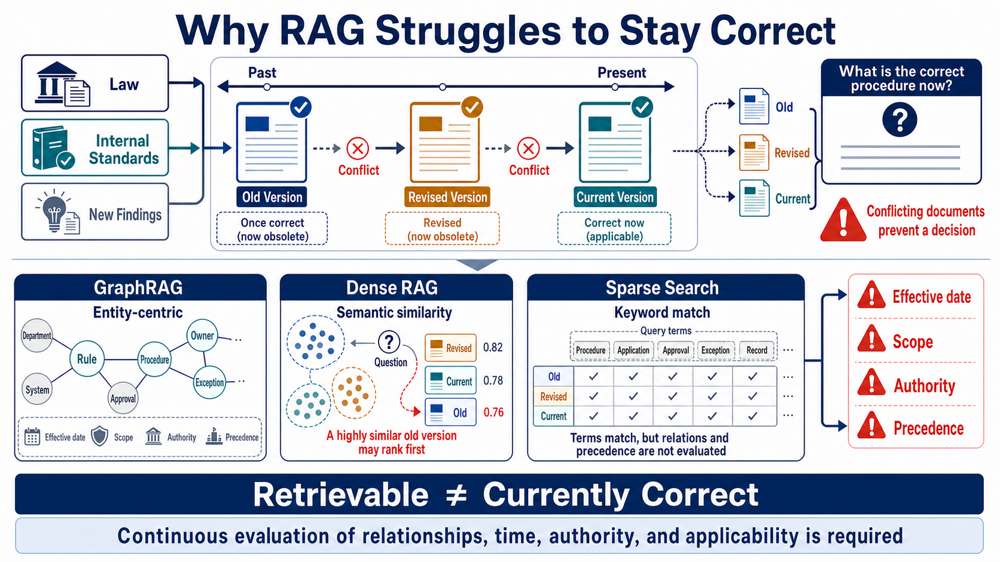
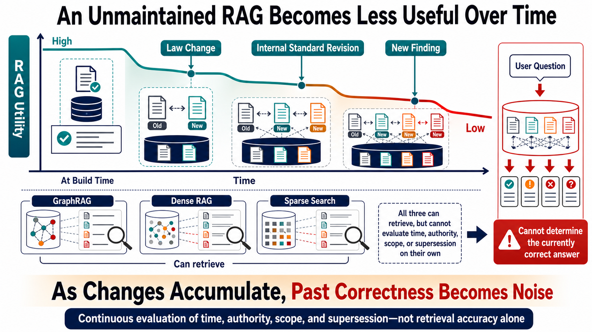
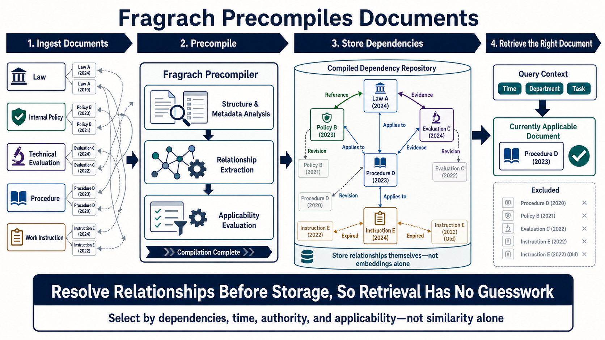

<p align="center">
  
</p>

# Fragrach

**Dependency-aware Living Corpus RAG**

[日本語](README_ja.md)

Fragrach is a metadata compiler for RAG systems that use changing corpora such as enterprise documents. Before retrieval, it compiles documents and their relationships into a Knowledge Build containing the metadata that should be attached to each document, including effective dates, scope, authority, version precedence, exceptions, and source evidence. This metadata helps an existing RAG system improve retrieval and answer accuracy as the corpus evolves.

An existing Sparse, Dense, or Hybrid RAG system can attach this metadata to its index or retrieved candidates to distinguish current documents from obsolete versions, approved documents from drafts, and general rules from scoped exceptions. Fragrach itself is not a vector database, retrieval server, chat UI, or answer generator.

The project is under development. The Rust CLI and npm launcher exist in this repository, but the npm package has not been published to the registry.

## Where Fragrach fits

Fragrach targets collections where relevance alone cannot determine which retrieved document should govern an answer. Typical examples contain current and obsolete revisions, approved rules and drafts, general rules and scoped exceptions, or policies and execution records in the same search domain.

### Why ordinary retrieval becomes unreliable

In enterprise collections, the correct answer changes as laws, internal standards, and new findings evolve. Graph, dense, and sparse retrieval can surface related documents, but retrieval alone does not continuously judge effective dates, scope, authority, or precedence.



If those changes and supersession relationships are not maintained, obsolete-but-once-correct documents accumulate and become retrieval noise.



### What Fragrach precompiles

Fragrach moves relationship analysis to ingestion time. It compiles document structure, metadata, dependencies, applicability, and version relationships into a Knowledge Build, so downstream retrieval can distinguish currently applicable documents from obsolete or out-of-scope candidates.



The normal flow is:

```text
source documents
  -> fragarach scan
  -> fragarach compile
  -> Knowledge Build
  -> downstream Sparse / Dense / Hybrid index
  -> Hybrid top 20
  -> Fragrach Soft Rerank v1
  -> context construction and answer generation
```

Compilation and query-time reranking are separate operations. `fragarach compile` creates the metadata, Decision Packets, and `retrieval-profile.yaml` needed by the reranker. The Rust library function `rerank()` applies that profile to an already retrieved candidate list. There is currently no standalone `fragarach rerank` CLI command.

## Final evaluation results

The final evaluation updated on August 10, 2026 reports the following results. Document Validity-Aware Adoption (DVAA) measures how well an answer supports its required claims with evidence that applies to the question while avoiding harmful evidence. It is separate from Accuracy, which measures whether the answer itself is correct.

On 125 questions from the 500-document Enterprise Fragrach 500 subset, Soft Rerank v1 kept the same top-20 candidate set while improving both Accuracy and DVAA.

| Condition | Recall@20 | Accuracy | DVAA |
|---|---:|---:|---:|
| Hybrid | 97.07% | 55.20% (69/125) | 0.6689 |
| Hybrid + Fragrach Soft Rerank v1 | 97.07% | 56.00% (70/125) | 0.7281 |

A separate practical holdout used 200 questions from 100 previously unseen document series. Its best Fragrach configuration reached 98.50% Accuracy and a 96.00% fully grounded answer rate. The fully grounded answer rate requires a correct answer, complete supporting evidence, and valid time, scope, approval, issuer, and document relationships; it is not DVAA.

| Condition | Recall@5 | Accuracy | Fully grounded answer rate |
|---|---:|---:|---:|
| Raw Ruri Dense | 92.75% | 78.50% (157/200) | 0.00% (0/200) |
| Fragrach Ruri Packet | 97.50% | 98.50% (197/200) | 96.00% (192/200) |

These are development evaluations on fixed corpora and model configurations, not guaranteed production performance. See the [final evaluation report](docs/evaluations/final-metrics_ja.md) for all baselines, confidence intervals, metric definitions, and limitations.

## Build and run the CLI from source

The workspace requires Rust 1.94 or later. Claim extraction also requires either a local Ollama model or a signed-in Codex CLI when the Codex App Server provider is selected.

Initialize a workspace and scan a source folder:

```powershell
cargo run -p fragarach-cli -- init .

cargo run -p fragarach-cli -- scan `
  --source tests/corpora/aobane-industries-ja/sources `
  --workspace .
```

Validate a Usage Intent and compile a Knowledge Build with Ollama:

```powershell
cargo run -p fragarach-cli -- intent validate `
  --file tests/corpora/aobane-industries-ja/intents/design-review.yaml

cargo run -p fragarach-cli -- compile `
  --workspace . `
  --intent tests/corpora/aobane-industries-ja/intents/design-review.yaml `
  --model gemma4:latest `
  --output target/design-review-build
```

Use the Codex App Server provider with the same compilation contract:

```powershell
cargo run -p fragarach-cli -- compile `
  --workspace . `
  --intent tests/corpora/aobane-industries-ja/intents/design-review.yaml `
  --provider codex-app-server `
  --model gpt-5.6-luna `
  --reasoning-effort low `
  --output target/design-review-codex-build
```

After building the executable, the equivalent command is:

```powershell
target/debug/fragarach compile `
  --workspace . `
  --intent tests/corpora/aobane-industries-ja/intents/design-review.yaml `
  --provider codex-app-server `
  --model gpt-5.6-luna `
  --reasoning-effort low `
  --output target/design-review-codex-build
```

`dossier-v1` is the default compilation strategy. `global-v1` and `linear-v2` remain available as explicit comparison strategies.

## Knowledge Build outputs

Successful compilation publishes an immutable build directory. Important artifacts include:

| Artifact | Purpose |
|---|---|
| `build-manifest.json` | Build status, model, usage, cache statistics, and artifact hashes |
| `evidence.jsonl` | Source text and provenance needed to return to the original document |
| `claims.jsonl` | Normalized claims with Evidence references |
| `document-profiles.jsonl` | Role, authority, scope, time, and approval metadata by document |
| `document-relations.jsonl` | Supersession, amendment, exception, approval, and other relations |
| `decision-packets.jsonl` | Materials classified as `governing`, `verifier`, `contender`, or `excluded` |
| `conflicts.jsonl` / `diagnostics.jsonl` | Resolved and unresolved conflicts, rejected data, and missing inputs |
| `retrieval-profile.yaml` | Retrieval filters and the standard rerank contract |
| `answer-contract.yaml` | Citation and unresolved-conflict disclosure requirements |

`compile` does not create embeddings, execute Hybrid retrieval, rerank a query result, or generate an answer.

## Standard reranker: Fragrach Soft Rerank v1

The library default is `fragrach-soft-rerank-v1`. It accepts a relevance-ordered Hybrid candidate list of at most 20 documents and changes only presentation order.

```text
adjusted_rank = original_rank + role_offset
```

| Decision Packet role | Offset |
|---|---:|
| `governing` | -4 |
| `verifier` | -2 |
| unclassified | 0 |
| `contender` | +2 |
| `excluded` | +6 |

Lower adjusted ranks sort first. Ties retain the original retrieval order. The candidate set is invariant: v1 never adds, removes, or backfills a document. Passing more than 20 candidates returns `RerankError::CandidateLimitExceeded` instead of silently truncating the list.

When a document has several packet roles, v1 selects one in this order: `excluded`, `contender`, `verifier`, `governing`.

The default Rust entry point is:

```rust
use fragarach_resolver::{RerankRole, rerank};

#[derive(Debug)]
struct Candidate {
    document_id: String,
    role: Option<RerankRole>,
}

let candidates = vec![
    Candidate {
        document_id: "policy-v1".into(),
        role: Some(RerankRole::Excluded),
    },
    Candidate {
        document_id: "policy-v2".into(),
        role: Some(RerankRole::Governing),
    },
];

let reranked = rerank(candidates, |candidate| candidate.role.clone())
    .expect("the Hybrid candidate list must contain at most 20 documents");

assert_eq!(reranked[0].document_id, "policy-v2");
```

Call `soft_rerank_v1()` when the algorithm version must be explicit. A future algorithm will receive a new versioned function before the library default changes. Answer-time Fragrach metadata and Sparse/Dense multi-chunk expansion remain separate downstream stages.

See [the reranking specification](docs/reranking_ja.md) for the complete v1 contract.

## Export for downstream RAG

Export a complete Knowledge Build as JSONL:

```powershell
cargo run -p fragarach-cli -- export `
  --build target/design-review-build `
  --output target/design-review-rag.jsonl
```

Export only the upsert and delete operations between two builds:

```powershell
cargo run -p fragarach-cli -- export `
  --base-build target/design-review-build-v1 `
  --build target/design-review-build-v2 `
  --output target/design-review-v1-v2.delta.jsonl
```

## Tests and documentation

```powershell
cargo test --workspace
npm test
```

- [Japanese README](README_ja.md)
- [User manual](docs/user-manual_ja.md)
- [Compilation pipeline](docs/compilation-pipeline_ja.md)
- [Standard reranking contract](docs/reranking_ja.md)
- [Evaluation recording rules](docs/evaluation-recording_ja.md)
- [Final evaluation (Japanese)](docs/evaluations/final-metrics_ja.md)
