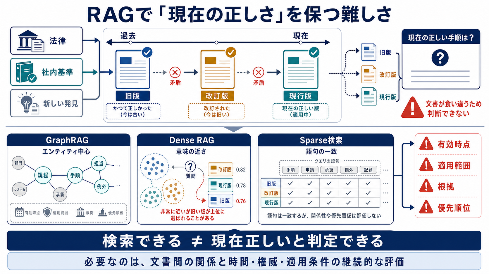
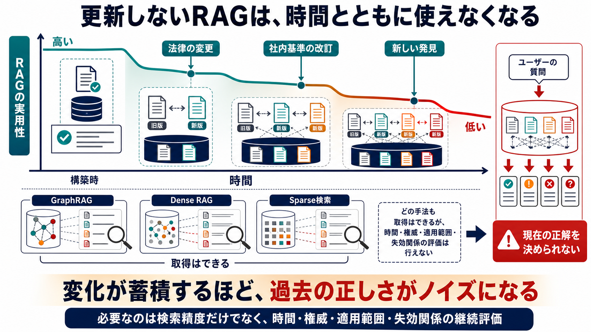
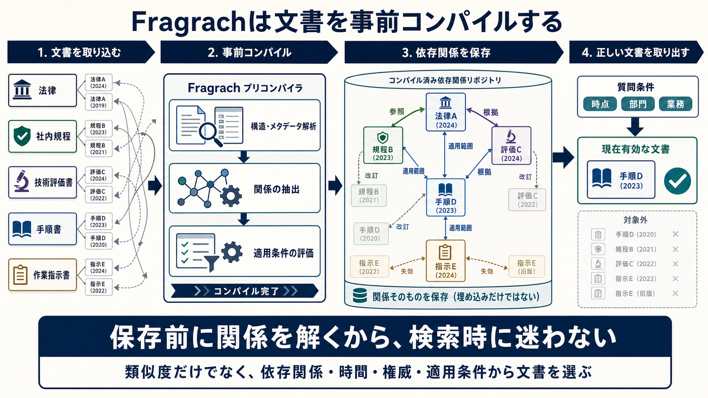

<p align="center">
  
</p>

# Fragrach

**Dependency-aware Living Corpus RAG**

[English](README.md)

Fragrachは、コーパスを解析し、各文書に付与すべきメタデータをコンパイルするツールです。

FragrachはベクトルDB、検索サーバー、チャットUI、回答生成器ではありません。Knowledge Buildと検索・回答契約を生成し、既存のSparse／Dense／Hybrid RAGがそれを利用する構成を想定しています。

現在は開発版です。Rust CLIとnpmランチャーはリポジトリにありますが、npmレジストリにはまだ公開していません。

## Fragrachを使う位置

対象は、関連度だけでは回答に採用すべき文書を決められない資料群です。現行版と旧版、正式規程と草案、一般規則と個別例外、方針と実施記録が同じ検索領域に入る企業内RAGを想定しています。

### 通常の検索が時間とともに不確かになる理由

企業文書の正しさは、法律、社内基準、新しい発見によって変化します。Graph、Dense、Sparse検索は関連文書を取得できますが、取得だけでは有効時点、適用範囲、権威、優先順位を継続的に判定できません。



変更や失効関係を保守しなければ、かつて正しかった旧版が蓄積し、検索時のノイズになります。



### Fragrachが事前コンパイルするもの

Fragrachは、文書構造、メタデータ、依存関係、適用条件、版の関係を取り込み時にコンパイルしてKnowledge Buildへ保存します。これにより後段の検索では、現在適用できる文書と、旧版や適用対象外の候補を区別できます。



処理の流れは次のとおりです。

```text
原文資料
  -> fragarach scan
  -> fragarach compile
  -> Knowledge Build
  -> 既存のSparse / Dense / Hybrid索引
  -> Hybrid top20
  -> Fragrach Soft Rerank v1
  -> Context構築と回答生成
```

コンパイルと質問時rerankは別の処理です。`fragarach compile`は、rerankに必要な文書Profile、Decision Packet、`retrieval-profile.yaml`を生成します。検索済み候補の並べ替えはRustライブラリの`rerank()`が行います。現在、独立した`fragarach rerank` CLIコマンドはありません。

## 最終評価結果

2026年8月10日更新の最終評価では、次の結果を得ました。500文書のEnterprise Fragrach 500から作成した125問では、Soft Rerank v1は上位20件の候補集合を変えずに、回答のAccuracyと、質問に適用できる根拠を採用したかを測るDVAAを改善しました。

| 条件 | Recall@20 | Accuracy | DVAA |
|---|---:|---:|---:|
| Hybrid | 97.07% | 55.20% (69/125) | 0.6689 |
| Hybrid＋Fragrach Soft Rerank v1 | 97.07% | 56.00% (70/125) | 0.7281 |

未見100系列から作成した200問の実践holdoutでは、最良のFragrach構成がAccuracy 98.50%、完全根拠付き正答率96.00%に達しました。完全根拠付き正答率は、正答に加え、必要根拠の完備と、根拠の時点・対象範囲・承認状態・発行主体・文書関係がすべて有効であることを求める指標であり、DVAAとは別の参考値です。

| 条件 | Recall@5 | Accuracy | 完全根拠付き正答率 |
|---|---:|---:|---:|
| Raw Ruri Dense | 92.75% | 78.50% (157/200) | 0.00% (0/200) |
| Fragrach Ruri Packet | 97.50% | 98.50% (197/200) | 96.00% (192/200) |

これらは固定コーパスと固定モデルによる開発時評価であり、実運用での性能保証ではありません。全比較条件、信頼区間、指標の定義、限界は[最終評価レポート](docs/evaluations/final-metrics-2026-08-09_ja.md)を参照してください。

## ソースからCLIを実行する

Rust 1.94以降が必要です。Claim抽出には、ローカルOllamaと対象モデル、またはCodex App Serverを使う場合はサインイン済みのCodex CLIも必要です。

ワークスペースを初期化し、文書フォルダを走査します。

```powershell
cargo run -p fragarach-cli -- init .

cargo run -p fragarach-cli -- scan `
  --source tests/corpora/aobane-industries-ja/sources `
  --workspace .
```

Usage Intentを検証し、OllamaでKnowledge Buildを生成します。

```powershell
cargo run -p fragarach-cli -- intent validate `
  --file tests/corpora/aobane-industries-ja/intents/design-review.yaml

cargo run -p fragarach-cli -- compile `
  --workspace . `
  --intent tests/corpora/aobane-industries-ja/intents/design-review.yaml `
  --model gemma4:latest `
  --output target/design-review-build
```

同じコンパイル契約をCodex App Serverで実行する場合はProviderを切り替えます。

```powershell
cargo run -p fragarach-cli -- compile `
  --workspace . `
  --intent tests/corpora/aobane-industries-ja/intents/design-review.yaml `
  --provider codex-app-server `
  --model gpt-5.6-luna `
  --reasoning-effort low `
  --output target/design-review-codex-build
```

ビルド済みバイナリでは同じ処理を次のように実行します。

```powershell
target/debug/fragarach compile `
  --workspace . `
  --intent tests/corpora/aobane-industries-ja/intents/design-review.yaml `
  --provider codex-app-server `
  --model gpt-5.6-luna `
  --reasoning-effort low `
  --output target/design-review-codex-build
```

既定のコンパイル方式は、文書単位ProfileとDossier単位Relationを組み合わせる`dossier-v1`です。比較用として`global-v1`と`linear-v2`も明示できます。

```powershell
cargo run -p fragarach-cli -- compile `
  --workspace . `
  --intent tests/corpora/aobane-industries-ja/intents/design-review.yaml `
  --provider codex-app-server `
  --model gpt-5.6-luna `
  --compile-strategy linear-v2 `
  --output target/design-review-linear-v2
```

## Knowledge Buildの生成物

コンパイルが成功すると、不変のBuildディレクトリが公開されます。主な生成物は次のとおりです。

| 生成物 | 役割 |
|---|---|
| `build-manifest.json` | Build状態、モデル、利用量、cache統計、成果物hash |
| `evidence.jsonl` | 原文へ戻るための本文と出典情報 |
| `claims.jsonl` | Evidence参照を持つ正規化済みClaim |
| `document-profiles.jsonl` | 文書単位のrole、権威、scope、時点、承認状態 |
| `document-relations.jsonl` | 改訂、追補、例外、承認などの文書間Relation |
| `decision-packets.jsonl` | 文書を`governing`、`verifier`、`contender`、`excluded`へ分類した判断材料 |
| `conflicts.jsonl`／`diagnostics.jsonl` | 解決済み・未解決Conflict、棄却、不足情報 |
| `retrieval-profile.yaml` | 検索filterと標準rerank契約 |
| `answer-contract.yaml` | 引用と未解決Conflict開示の条件 |

`compile`はembedding生成、Hybrid検索、質問ごとのrerank、回答生成を行いません。

## 標準rerank: Fragrach Soft Rerank v1

ライブラリの既定アルゴリズムは`fragrach-soft-rerank-v1`です。関連度順に並んだHybrid上位20文書を入力し、候補集合を変えずに提示順だけを調整します。

```text
adjusted_rank = original_rank + role_offset
```

| Decision Packet role | offset |
|---|---:|
| `governing` | -4 |
| `verifier` | -2 |
| roleなし | 0 |
| `contender` | +2 |
| `excluded` | +6 |

調整順位が小さい文書を先に置き、同順位では元の検索順位を維持します。v1は文書を追加、削除、補充しません。入力が20件を超える場合は、黙って切り捨てず`RerankError::CandidateLimitExceeded`を返します。

一つの文書が複数roleに現れる場合は、`excluded`、`contender`、`verifier`、`governing`の順で一つを選びます。

Rustでは`rerank()`が標準の入口です。

```rust
use fragarach_resolver::{RerankRole, rerank};

#[derive(Debug)]
struct Candidate {
    document_id: String,
    role: Option<RerankRole>,
}

let candidates = vec![
    Candidate {
        document_id: "policy-v1".into(),
        role: Some(RerankRole::Excluded),
    },
    Candidate {
        document_id: "policy-v2".into(),
        role: Some(RerankRole::Governing),
    },
];

let reranked = rerank(candidates, |candidate| candidate.role.clone())
    .expect("Hybrid候補は20文書以内");

assert_eq!(reranked[0].document_id, "policy-v2");
```

アルゴリズム版を明示する場合は`soft_rerank_v1()`を呼び出します。将来の方式は、既存v1の意味を変えず、新しい版付き関数として追加します。回答時のFragrachメタデータ付与と、Sparse／Dense双方からの複数チャンク再展開は別の後段処理です。

詳細は[標準rerank仕様](docs/reranking_ja.md)に記載しています。

## 既存RAGへexportする

Knowledge Build全体をJSONLへ出力します。

```powershell
cargo run -p fragarach-cli -- export `
  --build target/design-review-build `
  --output target/design-review-rag.jsonl
```

二つのBuild間のupsert／delete差分だけを出力することもできます。

```powershell
cargo run -p fragarach-cli -- export `
  --base-build target/design-review-build-v1 `
  --build target/design-review-build-v2 `
  --output target/design-review-v1-v2.delta.jsonl
```

原文を追加、編集、削除した場合は、`scan`後に新しい出力先へ`compile`します。`recompile`は既存Build内のEvidenceとClaimを保ったまま、基準日、権威順位、Conflict、現在の検証規則を適用し直す処理であり、原文変更の取り込みには使いません。

## テストと関連文書

```powershell
cargo test --workspace
npm test
```

- [ユーザーマニュアル](docs/user-manual_ja.md)
- [コンパイル処理と失敗時の動作](docs/compilation-pipeline_ja.md)
- [標準rerank仕様](docs/reranking_ja.md)
- [Conflict診断の設計](docs/architecture/conflict-diagnostics_ja.md)
- [評価記録の規約](docs/evaluation-recording_ja.md)
- [最終評価](docs/evaluations/final-metrics-2026-08-09_ja.md)
