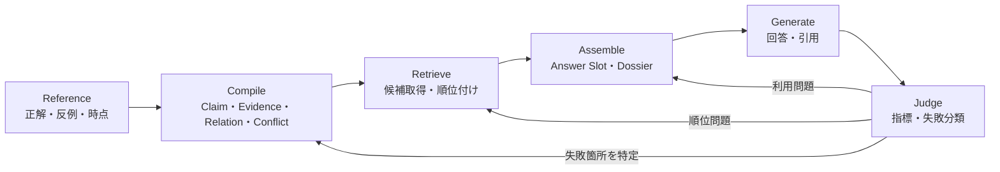

# Fragrach 精度改善・比較調査計画

この計画は、Fragrachの精度を一度のモデル比較で判断せず、強い通常RAGの測定、手法調査、仮説検証、レイヤー実装、再評価を反復できる形にするためのものである。最終的には、十分に調整した通常RAGを基準に、Fragrachがどの段階をどれだけ改善したかを再現可能な結果として示す。

現在の[500文書・100問評価](../tests/benchmarks/rag-comparison/MEDIUM_500_FINDINGS_ja.md)では、Actual ClaimのCompile Coverageは87.5%、R@5はRaw RAGと同じ57.7%、R@10はRawを1.3ポイント上回る73.5%である。一方、R@20はRawより12.2ポイント低く、矛盾質問のConflict Unit再現率もtop 10で0%にとどまる。その後のSparse tuningでは、純粋なRaw RAGがR@5 74.0%、R@10 89.5%、R@20 99.5%まで改善した。Qwen HybridではR@5 75.0%、R@10 91.5%、Conflict両側取得@10 96.2%まで改善したが、Conflict解決精度@10は80.0%であり、関連度と正規側の判断を分離する必要がある。この値を検索目標とし、rerankerとgovernance層によって強い通常RAGを確定する。評価指標と実行形式は[通常RAGとの比較手順](../tests/benchmarks/rag-comparison/README.md)、全体の技術分類は[RAG技術調査](research/rag-methods-2026_ja.md)、既存手法の詳細比較と実験順は[既存RAG手法の詳細調査](research/rag-existing-methods-deep-dive-2026_ja.md)、企業文書の役割と効力は[企業文書の有力度と活用ケース](research/enterprise-document-validity-cases_ja.md)、複数Resolverの比較実装は[文書有力度を含む精度改善計画](document-validity-improvement-plan_ja.md)、抽出・キャッシュ境界は[コンパイル処理](compilation-pipeline_ja.md)を正とする。

実行順は次の四段階とする。

1. 純粋なRAGを調整し、Fragrachが超えるべき目標値を測る。
2. 現在の手法を広く調査し、検索時補正と事前コンパイルの代表構成を決める。
3. 調査結果と残存課題から複数の仮説を作り、採否指標を固定する。
4. レイヤーを一つずつ交換して実装し、検索、回答、費用を比較する。

## 改善サイクルの単位

精度低下の原因を混ぜないため、評価を次の六段階へ分ける。改善案は、どの段階へ作用するかを明記してから実験する。

Compile Coverageが低ければ抽出または検証を直す。Coverageが高くR@kが低ければ検索表現と順位付けを直す。必要根拠を取得できているのにStrict Passが低ければ、Dossier、引用選択、回答制約を直す。この切り分けを行わず、最終回答の点数だけでPromptやモデルを変更しない。

## 参照データを確定する

最初の参照データには、既存の「青羽精機 社内文書コーパス M」を使う。500文書と100問を固定し、既存16問は後方互換の回帰群、追加84問は一般化確認群として常に分けて集計する。`sources/`以外のGold、Intent、質問、シナリオを検索索引へ入れない。

### 1. 既存Goldを監査する

現在の`evaluation/questions.jsonl`、`gold/*.jsonl`、`ground-truth/expected.json`を一つの参照契約として検証する。各質問について、次を機械検査する。

- GoldのSourceとSectionが実在し、`content_terms`が該当箇所に存在する。
- 必須回答要素と禁止結論が同じ意味を要求していない。
- 矛盾質問には正規側と競合側があり、権威性、状態、適用時点から期待する扱いを説明できる。
- 版、Alias、完全重複、時系列EventのIDが相互に参照できる。
- 一つの質問が複数Intentへ暗黙に依存していない。依存する場合は必要Intentを明示する。

LLMはGold候補や不整合候補の提示には使えるが、LLMの出力だけで正解を確定しない。正解は原文と構造化した企業世界から決定し、変更理由を差分として残す。

### 2. 失敗例をHard Setとして固定する

現行100問の質問別結果から、少なくとも次の失敗群を抽出する。

- Claimが存在せず、原文へ戻らないと回答できない。
- Claimは存在するが、対象・値・条件の対応が誤っている。
- 現行版、旧版、FAQ、下書き、議事録の優先順位を誤る。
- 矛盾の片側だけを取得する、またはConflict Unitが質問へ接続されない。
- 表の行や複数文書に分かれた役割を取りこぼす。
- 否定、情報不在、未承認、未指定を肯定的なClaimへ変えてしまう。
- 正しい根拠を取得しても、回答要素や引用へ反映できない。

Hard Setには質問ID、期待する段階、現行の失敗段階、必要Evidence、再発防止用の最小条件を記録する。改善中はこの集合を短い回帰試験として使い、全量評価へ進む前に重大な回帰を検出する。

### 3. 参照データを拡張する

既存コーパスだけへ過適合しないよう、次の順で参照データを増やす。

1. 既存文書から、未使用の矛盾、版更新、否定、表、複数部署参照を質問化する。
2. 同じ正解を保った言い換え質問を追加し、検索語への過適合を調べる。
3. 正解と語彙が近いが対象が異なる反例文書を追加する。
4. 内部評価が安定した後、利用条件が明確な公開テキストコーパスを調査し、外部妥当性を確認する。

公開データは、ライセンス、再配布可否、更新履歴、文書間関係、質問と正解の作成可能性を確認してから採用する。候補調査とライセンス判断は分け、ライセンスが未確定のデータをnpmパッケージやリポジトリへ取り込まない。自作コーパスのライセンスは、パッケージ全体のライセンス決定時に合わせて確定する。

参照データを変更した場合は、文書数、文字数、Evidence数、質問数、Intent別内訳、Corpus hash、Gold schema版を`reference-manifest.json`へ記録する。過去の測定結果は上書きせず、どの参照版で測ったかを追跡できるようにする。

## 調査する手法

手法調査は、Fragrachだけを有利にするためではなく、比較対象とコンパイラの双方を改善するために行う。各手法は「解決したい失敗」「期待する効果」「副作用」「必要な実装」「採否指標」を一枚の調査記録にまとめる。

### 調整済みRaw RAG

Raw RAGは固定の弱いBaselineにしない。文字n-gram BM25を現在の再現用Baselineとして残しながら、チャンクサイズ、重なり、見出し付与、文書メタデータ、旧版filter、BM25とベクトルのHybrid、query expansion、rerankを調査する。調整値は開発用質問群で選び、評価用質問群に直接合わせない。

Raw RAGの最良条件を`Tuned Raw`として固定し、それ以後のFragrach比較で主Baselineにする。単純Rawも残し、Baseline調整による改善量とFragrachによる改善量を分離する。

### コンパイル表現

現在のClaim-first表現に加え、次の三方式を比較する。

| 方式 | 原文の扱い | コンパイルする情報 | 主な確認点 |
|---|---|---|---|
| Claim-first | ClaimからEvidenceへ戻る | 正規化Claimを中心にする | 短い検索表現と欠落の交換条件 |
| Evidence-first | 原文Evidenceを主索引に残す | 文書間Relation、時点、権威、状態を付与する | 原文の情報量を失わず順位を改善できるか |
| Hybrid | Claimと原文Evidenceを併置する | Claim、Relation、Conflictを重ねる | 条件付きfallbackと重複抑制が有効か |

特に、同じ対象を表現している、旧版である、上位文書である、内容が競合する、提案から承認・実装へ進んだ、という文書間Relationを独立したIRとして扱う方法を調査する。無効な原文を削除するのではなく、状態と関係を使って通常検索から降格し、履歴質問や矛盾開示では再び取得できる設計を優先する。

### Compiler Provider

Ollamaの`gemma4:latest`とCodex App Serverの`gpt-5.6-luna`を同じ抽出契約で比較する。Gemma 4はローカルBaselineとして維持し、Lunaはまず`reasoning-effort=low`で測る。低難度条件で残る意味対応、矛盾、否定の失敗が推論不足と判断できた場合だけ、Hard Setで`medium`を試す。

Provider比較では、Claim数の多さを精度とみなさない。Goldに必要な事実のCoverage、不要または誤ったClaim、Evidence参照の妥当性、RelationとConflictのPrecision/Recall、棄却率、token、時間、費用を同時に記録する。

### 検索とEvidence Dossier

検索では、Claimの被覆不足時だけEvidenceへ戻る条件付き二段検索、質問に関係するConflictの強制展開、時点・状態・権威性によるrerank、Alias展開、同一論点の重複抑制を調査する。固定比率でClaim枠とEvidence枠を分ける方式は比較条件として残すが、完成形はAnswer Slotの不足を検出して補う方式を目標とする。

Dossierは、取得した単位をtop-k順に並べるのではなく、回答に必要な要素、正規側Evidence、競合側Evidence、未解決事項、禁止結論を束ねる。Claimには検索用の正規化文と回答・引用用の短い原文抜粋を併置し、抽象化によって断言の強さが失われる問題を確認する。

## 最初に検証する仮説

仮説は実装前に判定方法まで決める。結果が悪い場合も削除せず、条件と棄却理由を残す。

| ID | 仮説 | 主な判定 |
|---|---|---|
| H1 | LunaはGemma 4より、否定・時系列・文書間関係を正しく抽出し、Compile Coverageを改善する | Intent別Coverage、Relation/Conflict Precision・Recall、不正Claim率 |
| H2 | Evidence-firstへRelationを重ねると、Claim欠落を避けながら旧版や無効文書を降格できる | R@5/10/20、不要単位率、解決精度とCoverage |
| H3 | Claimに短い原文抜粋を常設すると、根拠取得を維持したまま引用と回答要素が改善する | 引用再現率、回答要素、入力token |
| H4 | Conflictを通常検索単位ではなく関連Claimから展開すると、矛盾両側とConflict Unitの再現率が上がる | conflict complete/unit recall、禁止誤答率 |
| H5 | Answer Slot不足時だけEvidenceを補うと、全面fallbackより不要単位と禁止誤答を減らせる | Strict Pass、不要単位率、禁止誤答率、索引・入力token |
| H6 | 調整済みRaw RAGは現在のRaw値を改善するが、時点・権威・矛盾を含む質問ではFragrachの優位が残る | Intent・タグ別のTuned Raw対Fragrach差 |
| H7 | 検索と回答生成の間に検証可能なAnswer Contractを置くと、Oracleでも残ったGenerate失敗を減らせる | Slot充足率、引用、Strict Pass、禁止誤答率 |

## 実験の進め方

### Phase 0: Tuned Rawを測定する

回答生成やFragrachのBuildを使わず、Raw Sourceだけでチャンク構成、日本語検索表現、BM25、Hybrid検索、rerank、top-kを調整する。最初のSparse tuningは完了しており、全100問でR@5 74.0%、R@10 89.5%、R@20 99.5%を得た。top 10を回答へ渡した場合はStrict Pass 35.0%、引用再現率69.3%、禁止誤答率1.0%であった。その後、Qwen3 Embeddingを加えたHybridでR@5 75.0%、R@10 91.5%、Conflict complete@10 96.2%を得た。次にrerankを追加し、回答まで含むTuned Rawの最終目標値を固定する。

条件選択には開発群を使い、保留群と全100問を別に報告する。既存16問と追加84問、Intent、矛盾質問も分ける。検索結果の再現性に加え、同じ回答モデルでStrict Pass、禁止誤答、引用、Tokenを測定できた時点で完了とする。

### Phase 1: 手法調査と比較対象を確定する

検索後に絞り込むTuned Raw Hybrid + Rerank、軽量な事前加工であるContextual Chunk、用途別に関係を作るFragrach Evidence + Relationを主比較対象とする。階層要約とGraphRAGはglobal questionを追加した後の別実験とする。

この段階ではFragrach本体を変更しない。比較手法の再現条件、得意な質問、計算位置、費用を整理し、同じ問題を解かない手法を単純な順位表へ混ぜない。

### Phase 2: 仮説と参照データを固定する

技術調査から得た仮説を、作用するレイヤー、期待する改善、予想する副作用、採否指標とともに登録する。同時にGoldを監査し、現行の失敗をHard Setとして固定する。仮説に合わせて正解を変えず、参照データの修正と製品改善を別Runとして扱う。

初期仮説は、Hybrid + Rerankの通常質問優位、Contextual Chunkの孤立段落改善、Evidence-first Relationの情報損失抑制、Conflict edge展開、検索時補正と事前コンパイルの相補性、Dossierによる回答改善である。

### Phase 3: レイヤー単位で実装する

Source/Evidence、Retrieval View、Relation Index、Candidate Retrieval、Query-time Control、Evidence Dossier、Generate/Verifyを交換可能な境界にする。まずTuned RawのL1とL3を固定し、Hybrid、Contextual Chunk、Fragrach Relation、Corrective Retrieval、Dossierの順に一レイヤーずつ追加する。

文書の採否はCandidate Retrievalから分離し、Weighted Metadata、Filter-first、Relation Graph、Query-time LLM、Compiled Hybridを同じCandidate Snapshotで比較する。詳細なIR、Resolver境界、Validity Extension、実験E0～E6、採用ゲートは[文書有力度を含む精度改善計画](document-validity-improvement-plan_ja.md)に従う。

Compiler ProviderのGemma 4とLunaは、Evidence + Relation層の内部比較として扱う。同じCorpus、Intent、Prompt、Schema、Source単位バッチでCompile Coverage、RelationとConflictのPrecision/Recall、不正Claim、棄却、利用量を比較する。

### Phase 4: 性能を比較する

B0 現行Raw、B1 Tuned Raw Sparse、B2 Tuned Raw Hybrid + Rerank、B3 Contextual Chunk Hybrid + Rerank、F1 Fragrach Evidence + Relation、F2 F1 + Corrective Retrieval + Dossierを比較する。一度に複数のレイヤーを変えず、各変更の寄与を記録する。

最終回答評価は、検索評価でTuned Raw以上となった条件だけ実施する。回答モデルと採点条件を固定し、必要なら複数回実行して中央値と質問別の変動を記録する。

### Phase 5: 採用と製品化を判断する

改善案は、全体平均だけでなく重大な安全回帰がないことを確認して採用する。少なくとも次を目標値とする。

- Compile Coverageは現行87.5%を上回り、Intent別の大幅な回帰を残さない。
- R@5はTuned Raw以上、R@10はTuned Rawを上回り、R@20の現行不足を縮める。
- 矛盾質問ではConflict Unitと両側Evidenceを検索へ接続し、正規側の順位を改善する。
- 最終回答のStrict PassはTuned Rawを上回り、禁止誤答率は0%とする。
- 回答入力tokenは原則としてTuned Rawの1.5倍以内を目標とする。

100問では一問の影響が大きいため、差は平均値だけでなく質問単位の勝敗と失敗分類で判断する。可能であればpaired bootstrapの信頼区間も併記し、小さな差を一般化しない。

## キャッシュと再現性

精度改善では、キャッシュを速さのためだけでなく実験条件の境界として扱う。

- モデル、Provider、Prompt、Schema、述語、reasoning effortを変えた場合は、異なる抽出キャッシュを使う。
- Rust側の検証やEvidence補強だけを変えた場合は、同じ生応答を再検証し、LLM差を混ぜない。
- 権威順位、基準日、Conflictポリシーだけを変える場合は、可能なら`recompile`する。
- `--no-cache`はキャッシュ汚染の確認と再現性監査に限定し、通常のアブレーションでは使わない。
- 出力先はRun IDごとに分け、既存結果を上書きしない。
- Provider間でキャッシュhit率を速度比較に混ぜず、初回と再実行を別に報告する。

現行キャッシュキーはProvider、モデル、Prompt、Schemaなどを分離できる。今後は、Rust側の検証契約版もProvenanceへ明示し、同じ生応答から異なる後処理結果を再現できるようにする。

## 失敗記録と成果物

各実験は、点数だけでなく質問別の失敗段階を次の分類で保存する。

| 分類 | 意味 |
|---|---|
| `reference` | Goldが不足、曖昧、または参照切れ |
| `compile_missing` | 必要情報がKnowledge Buildにない |
| `compile_incorrect` | Claim、Relation、時点、権威、Conflictが誤っている |
| `retrieve_missing` | Buildにはあるがtop-kへ入らない |
| `retrieve_distractor` | 旧版、別対象、不要単位が上位を占める |
| `assemble_missing` | 取得済み根拠がAnswer Slotへ割り当てられない |
| `generate_error` | 構造化された内容を回答や引用へ反映できない |
| `judge_error` | 自動採点がGoldと回答を誤判定する |

成果物は次の場所へ整理する。

- `tests/corpora/aobane-industries-ja-medium/`: 固定したSource、質問、Gold、Reference Manifest
- `tests/benchmarks/rag-comparison/`: 実行器、評価器、確定した調査結果
- `target/benchmarks/<run-id>/`: Build、検索結果、回答、利用量、Run Manifest
- `docs/research/`: 手法調査、仮説台帳、採否理由

`target/`の実行結果を正本にせず、採用判断に使った集計と再現コマンドは`tests/benchmarks/rag-comparison/`の結果文書へ残す。

## 最初の作業順序

次の順で着手する。

1. 完了: Raw Sparseを240条件で探索し、Tuned Raw Sparseを固定する。
2. 完了: Tuned Raw Sparseを最終回答まで測り、暫定目標値を確定する。
3. 進行中: Tuned Raw Hybridの候補生成を実装済み。次にrerankを追加し、強い通常RAGを確定する。
4. 並行してValidity Extension P0、Gold validator、Candidate Snapshotを追加する。
5. Weighted MetadataとFilter-first ResolverをOracle Profileで比較する。
6. 有効な差を確認してからRelation Graph、Gemma 4／Lunaの質問時判定を比較する。
7. Contextual ChunkとEvidence-first RelationのCompile方式を比較する。
8. Conflict・Amendment・Exception展開、Corrective Retrieval、Dossierを順に追加する。
9. 結果を仮説台帳へ反映し、採用、用途限定採用、保留、棄却を決める。

当面は二つのTrackを並行する。Track AではB2のrerank境界を実装し、強い通常RAGを固定する。Track BではValidity Extension P0とResolver評価契約を作り、現行HybridのCandidate SnapshotでWeighted MetadataとFilter-firstを比較する。Hybrid候補生成はR@10と矛盾両側の取得を改善したが、正規側の順位は改善しなかったため、関連度の改善と文書採否の改善を別々に測る。
