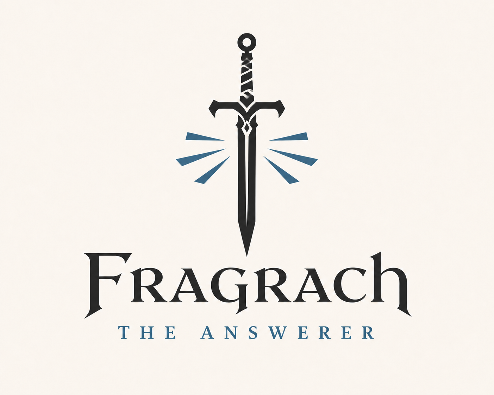

<p align="center">
  
</p>

# 矛盾診断とコンパイルポリシー

Fragrachは、矛盾を検出しても根拠が足りなければ一方を真実として選ばない。競合するClaimとEvidenceをKnowledge Buildへ残し、「AとBが矛盾しており、現在の根拠では判断できない」という診断を出す。

この設計では、矛盾の検出結果とビルドを継続できるかを分離する。Warningを選んでもConflictは消えず、Errorを選んでも入力文書や検出結果は失われない。

## 診断の出力

未解決の矛盾には、少なくとも診断コード、重大度、競合するClaim、各Evidence、判断できない理由、対応候補、確認質問を含める。

表示例:

```text
warning[FRG-CST-UNRESOLVED-CONFLICT]: 緊急変更の事後レビュー期限を決定できません
  A: 五営業日以内
     sources/30-product-development/guides/emergency-change-cheatsheet.md # 変更後
  B: 二営業日以内
     sources/20-quality-assurance/standards/design-review-standard-v2.md # 緊急変更
  reason: 文書は競合しています。適用時期または権威性による解決が必要です
  help: 文書の施行日とauthorityを確認するか、明示的なoverrideを登録してください
```

機械可読出力では、同じ内容を`Diagnostic`と`Conflict`として保存する。Warningを標準エラー出力だけに流して成果物から失うことはしない。

## コンパイル時の扱い

初期実装では、次のオプションを提供する。

```text
--on-unresolved-conflict <warn|error>
--warnings-as-errors
--conflict-overrides <path>
```

既定の`warn`では、Knowledge Buildを`completed_with_warnings`として生成し、未解決Conflictを検索・回答時に開示できるよう残す。`error`では成果物を公開可能なBuildとして確定せず、非ゼロで終了する。`--warnings-as-errors`はCI向けで、矛盾以外を含むすべてのWarningをErrorとして扱う。

`--conflict-overrides`は、人が確認した判断をEvidence付きで入力するために使う。overrideは競合を削除せず、誰が、どの根拠で、いつ解決したかをResolutionとして追加する。

## 自動解決の境界

自動解決は、入力から決定的に確認できる場合だけ行う。

- 適用時点が指定され、`valid_from`と`valid_to`から有効なClaimが一つに決まる。
- 文書の権威性が明示され、同じ適用範囲では上位文書を優先すると規程で定められている。
- Evidence付きの明示的なoverrideが登録されている。

更新日が新しい、文章が詳しい、LLMの信頼度が高いという理由だけでは解決しない。これらは候補の順位付けには使えても、真実を確定する根拠にはならない。

## Usage Intentとの関係

`unresolved_conflicts_allowed: true`は、矛盾を無視する設定ではない。未解決Conflictを含むBuildの利用を許可し、回答時に競合開示を必須にする設定として扱う。`false`の場合は、コンパイルポリシーが`warn`でも、そのIntent向けBuildを公開可能とする前に解決を要求する。

これにより、探索用途では判断保留の知識を利用でき、規程案内や障害対応のように一意の判断が必要な用途では安全側に停止できる。
