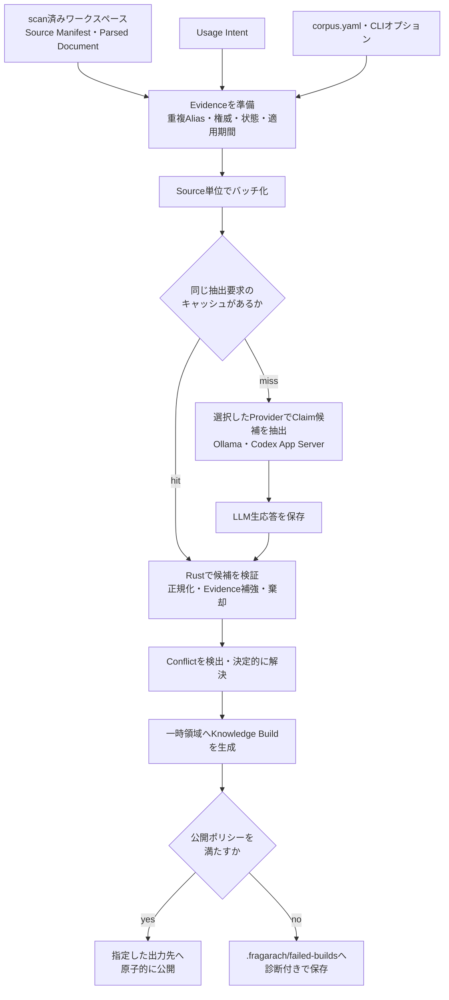

<p align="center">
  
</p>

# Fragrachのコンパイル処理

Fragrachの`compile`は、文書を検索用チャンクへ分割するだけの処理ではない。事前に`scan`したEvidenceをUsage Intentに照らしてClaimへ変換し、根拠参照、適用時期、権威性、矛盾、情報不足を検証したうえで、RAGへ投入できるKnowledge Buildを作る。

LLMはClaim候補の抽出に使うが、候補をそのまま成果物にはしない。参照の検証、値の正規化、Evidenceの補強、Conflict判定、公開可否の決定はRust側で行う。

## 処理の全体像



コンパイル中はワークスペースをロックするため、同じワークスペースに対する`scan`、`compile`、`recompile`は並行実行できない。また、既存Buildを上書きしないよう、`--output`に存在しないパスを要求する。

## 入力をEvidenceへ整える

`compile`は`.fragarach/manifest.json`と`.fragarach/parsed/`を読み込む。原文を再解析する処理ではないため、原文を変更した場合は先に`scan`を実行する必要がある。

Parsed Documentから作ったEvidenceには、次の情報を付加する。

- 完全重複文書の別パスを`source_aliases`として保持する。
- Front Matterの`status`、`effective_from`、`effective_to`を同じSourceのEvidenceへ伝播する。
- `corpus.yaml`のパス規則から権威性とライフサイクルを付ける。
- 規則がない場合は、`standards`、`reviews`、`changes`、`guides`、`faq`、`notes`などのパスから限定的な既定値を付ける。
- CLIで権威順位を指定しなかった場合は、`corpus.yaml`の`authority_precedence`を使う。

Usage Intentがリリースやチェックリストを扱う場合は、同じ節の他項目には担当者があるのに一部だけ欠けている状態も診断する。つまり、IntentはLLMへの検索条件だけでなく、決定的な完全性検査を有効にする条件としても働く。

## Source単位でコンパイルProviderへ要求する

EvidenceはSourceを混ぜずにバッチ化する。一つのSourceが`--batch-size`以下なら、Source全体を一度に渡す。長いSourceだけを分割し、分割境界には最大2 Evidenceの重なりを持たせる。既定の`--batch-size`は12であり、Token数ではなくEvidence数を表す。

OllamaとCodex App Serverは同じClaim抽出契約を実装する。要求にはUsage IntentとEvidence本文に加えて、Source ID、Evidence ID、見出し、権威性、状態、適用期間を含める。Ollamaではコンテキスト長32KB、temperature 0、seed 42を使う。Codex App Serverでは一時Thread、read-only sandbox、ネットワーク無効、承認なし、JSON Schema出力を使い、モデルとreasoning effortをCLIで指定する。

抽出契約は、Claimを主語・述語・目的語へ分け、必ず入力中のEvidence IDを引用するよう要求する。原因、暫定対応、恒久対策、正式責任者、承認状態など、現在対応している述語はJSON Schemaの列挙値で制限される。責任者が明記されていない事実も捨てず、`has_formal_owner`の`unspecified`として表現できる。

## キャッシュはLLMの生応答を保存する

抽出キャッシュは`.fragarach/cache/claim-extraction-v1`へバッチごとに保存する。キャッシュキーは、直列化した抽出要求とLLMの識別情報から作る。

LLMの識別情報には、Provider固有の実行条件、抽出契約版、抽出契約の指紋が入る。Ollamaではモデル名、モデルdigest、seed、32KBのコンテキスト長を使う。Codex App ServerではCodex CLI版、App Serverプロトコル版、モデル、reasoning effortを使う。指紋は実際のPrompt、出力Schema、述語カタログから計算する。このため、異なるProviderの応答が混ざらず、Promptだけを変更した場合も古い応答を再利用しない。

キャッシュに保存するのは、検証済みClaimではなくLLMの生応答である。この境界により、変更内容に応じて次の再処理ができる。

| 変更内容 | LLM再抽出 | 適した操作 |
|---|---|---|
| 原文、Evidenceメタデータ、Usage Intent | 変更された要求は必要 | `scan`後に`compile` |
| モデル、モデルdigest、Prompt、Schema、述語 | 必要 | `compile` |
| バッチ構成 | 構成が変わったバッチだけ必要 | `compile` |
| Rust側の候補検証・Evidence補強 | 不要。生応答を再検証できる | 同じ条件で`compile` |
| 権威順位、基準日、Conflictポリシー | 不要 | `recompile`またはキャッシュ付き`compile` |

コンパイルが途中で止まっても、完了したバッチの応答はキャッシュに残る。同じ条件で再実行すれば、保存済みバッチを飛ばして続行できる。`--no-cache`を指定した場合だけ、保存済み応答を使わず全バッチを再抽出する。

## Claim候補をRust側で確定する

キャッシュまたは選択したProviderから得た候補は、次の順に処理する。

1. 述語に対応する専用Evidenceを補強する。
2. 引用したEvidenceから権威性、状態、適用期間を付ける。
3. 相対的な期限とカレンダー上の適用期間を分離し、レビュー要否など一部の値を正規化する。
4. 主語・述語・目的語、confidence、日付形式、Evidence参照を検証する。
5. 検証に通った候補を安定ID付きClaimへ変換し、同一IDを重複排除する。

Evidence補強は、現在は障害の`incident_cause`、`temporary_remediation`、`permanent_remediation`を対象とする。LLMが概要節だけを引用していても、同じSourceに「原因」「復旧」「恒久対策」などの専用節があれば、その本文Evidenceを追加する。別Sourceへは広げず、見出し行そのものも引用対象にしない。

存在しないEvidence ID、空の主語や目的語、不正な日付、範囲外のconfidenceなどを含む候補は棄却する。棄却理由は`FRG-EXT-INVALID-CLAIM`として`diagnostics.jsonl`へ残り、無言で失われることはない。

## Conflictを検出して公開可否を決める

同じ対象と単一値の述語について異なる値を持つClaimがあれば、Conflict候補として比較する。条件付き述語では条件も比較するため、通常時と例外時の規則を直ちに矛盾とは扱わない。

自動解決は、入力から決定的に判断できる場合に限る。現在の順序は次のとおりである。

1. 適用期間が重ならない版系列として保持できるか。
2. `--as-of`時点で有効なClaimが一つに決まるか。
3. `active`、`approved`、`implemented`などの状態と、`draft`、`superseded`などの状態から決まるか。
4. 宣言済みの権威順位で決まるか。

どれでも決まらない場合は、競合するClaimとEvidence、判断できない理由、対応案、確認質問を未解決Conflictとして残す。更新日が新しい、説明が詳しい、LLMのconfidenceが高いという理由だけでは解決しない。

最終状態は次の三つである。

| 状態 | 公開先 | 条件 |
|---|---|---|
| `completed` | 指定した`--output` | 公開を妨げる診断がない |
| `completed_with_warnings` | 指定した`--output` | Warningはあるが現在のポリシーで利用可能 |
| `failed` | `.fragarach/failed-builds/<build-id>` | ポリシーが失敗とする診断がある、またはIntentが未解決Conflictを許可しない |

`unresolved_conflicts_allowed: false`のIntentは、CLIのConflict動作がWarningでも未解決Conflictが一件あれば公開を停止する。失敗時もClaim、Evidence、Conflict、Diagnosticは保存されるため、原因を調べずに再抽出する必要はない。

成果物は一時ディレクトリで完成させてから、最後に一度だけ移動する。したがって、処理途中の不完全なディレクトリが公開済みBuildとして見えることはない。

## Knowledge Buildに含まれるもの

| 成果物 | 役割 |
|---|---|
| `build-manifest.json` | 状態、件数、LLM利用量、キャッシュhit/miss、成果物hash |
| `usage-intent.yaml` | このBuildが対象とする利用目的 |
| `evidence.jsonl` | 原文へ戻るための本文、位置、別名、時点、権威性 |
| `claims.jsonl` | Intentに必要な正規化済みClaimとEvidence参照 |
| `conflicts.jsonl` | 解決済み・未解決Conflict |
| `diagnostics.jsonl` | 棄却、不足、未解決理由、対応案 |
| `retrieval-profile.yaml` | Intent・時点フィルターと権威順位 |
| `answer-contract.yaml` | 引用必須と未解決Conflict開示の条件 |
| `provenance.json` | モデル、Prompt指紋、Intent hash、Parser、コンパイル条件 |
| `overview.md`、`unresolved-questions.md` | 人がBuildの状態を確認するための要約 |

Fragrachはここでベクトル化や回答生成を行わない。Knowledge Buildまたは`export`したJSONLを、利用者のRAGアダプターが索引へ登録する。

## 文書の追加・編集・削除をどう反映するか

現行実装は、既存Buildへ差分を直接書き込まない。`scan`が現在のsource集合と前回状態を比較し、そのSource Manifestから`compile`が新しい不変Knowledge Buildを作る。公開済みBuildは残し、新Buildが完成した時点で出力先へ原子的に公開する。このため、削除やRelationの組み替えを部分更新で取りこぼしにくい一方、成果物生成そのものは毎回Build全体を対象にする。

| 変更 | 現行動作 | 対応状況と制限 |
|---|---|---|
| 文書追加 | `scan`が`added`として解析し、次の`compile`がEvidence、Profile、Relation、Dossierへ含める | 対応済み。変更のないSourceのClaim抽出要求はcache hitになる |
| 同じパスの本文編集 | パス由来の内部Source IDを維持し、content hashの変化を`changed`として再解析する | 対応済み。編集SourceのClaim抽出cacheだけが外れ、RelationとDossierは現在集合から再計算される |
| 文書削除 | `scan`が`removed_paths`へ記録し、現在Manifestから除外する | 新しい`compile`ではEvidence、Profile、Relation、Dossierから消える。ただし旧Build、Parsed artifact、抽出cacheは監査・再利用用に残るため、安全消去ではない |
| 削除文書の再追加 | `added`として再解析する | 同じパスなら内部Source IDは同じになる。本文が違えばcontent hashとEvidenceは更新される |
| 改名・移動 | 旧パスの削除と新パスの追加として扱う | パス由来Source IDは変わる。企業文書の`document_id`と`revision`による系列接続は作り直せるが、外部文書管理システムとの永続ID対応は未実装 |

この意味で、現在のFragrachは「抽出費用を文書単位で増分化し、成果物は全体整合した新Buildとして作る」構造である。Claim抽出はSource単位でcacheされるため、追加または編集した文書と、バッチ構成が変わった部分だけを再実行できる。削除文書のcacheが残っても、現在ManifestにそのSourceがないため新Buildへは読み込まれない。

一方、Document Profile抽出要求は全Sourceから選んだEvidenceを一つにまとめてcache keyを作る。このため、一文書の追加・編集・削除でもProfile抽出cacheは全体として外れる。明示metadataを読むProviderではLLM費用は発生しないが、LLM Profile抽出を使う場合は全体一回の再抽出が必要である。Relation依存範囲だけを求めてProfile、Relation、Dossierを差分再計算する機能はまだない。

原文が変わった後に使うコマンドは`recompile`ではない。`recompile`は既存Build内のEvidenceとClaimを保持したまま、基準日、権威順位、Conflict、現在の検証規則を適用し直す。削除済みSourceも入力Buildに残っていれば保持される。文書の追加・編集・削除を反映する場合は、必ず`scan`後に新しい出力先へ`compile`する。

利用中のRAG indexを全置換せずに更新するため、`export`は二つのBuild間の最小差分も出力できる。

```powershell
fragarach export `
  --base-build C:\knowledge\builds\developer-onboarding-v1 `
  --build C:\knowledge\builds\developer-onboarding-v2 `
  --output C:\knowledge\exports\developer-onboarding-v1-v2.delta.jsonl
```

差分JSONLのデータ操作は`upsert`と`delete`だけである。対象Buildにだけ存在する、または同じIDで内容が変わった検索レコードは`upsert`し、基準Buildにだけ存在するIDは`delete`する。同じIDかつ同じ内容のレコードは出力しない。Evidence IDは内容hashを含むため、原文編集は原則として旧Evidenceの`delete`と新Evidenceの`upsert`になる。これにより過去の引用IDを別内容へ上書きしない。Evidence由来の検索単位だけでなく、Relation DossierとDiagnosticも同じ差分対象である。

末尾の`commit`レコードは、`base_build_id`、`target_build_id`、両Source Manifest hash、操作件数を持つ制御マーカーであり、検索レコードではない。下流adapterは次の順で扱う。

1. 現在公開中のBuildが`base_build_id`と一致することを確認する。
2. `upsert`と`delete`を`target_build_id`のstaging更新として適用し、途中状態を検索へ公開しない。
3. `commit`の件数とBuild IDを検証してからcurrent Buildを切り替える。
4. 途中で失敗した場合はstaging更新を破棄し、基準Buildを公開したままにする。

この契約により、変更なしはデータ操作0件、追加は必要レコードの`upsert`、編集は影響レコードの`delete`と`upsert`、削除は必要レコードの`delete`だけで済む。回帰テストでは、各差分を基準Buildの検索レコードへ適用した結果が、対象Buildをフルexportした結果と完全一致することを確認している。

ここで実装済みなのは、検索基盤に依存しない差分生成とcommit契約までである。LanceDBなど個別indexへのtransaction適用とcurrent Build切替はadapter側に残る。また、Profile抽出の全体cache無効化、Relation依存closureに限定したコンパイル、安全消去は未完成である。旧Buildを監査用に残す保持方針と、法的削除などでParsed artifactとcacheまで消す方針も分けて設計する必要がある。

## `compile`と`recompile`の違い

`compile`は、Parsed EvidenceとUsage IntentからLLMの生応答を取得または再利用し、現在の候補検証を通してClaimを作り直す。Rust側の抽出後処理だけを変更した場合も、キャッシュ付き`compile`を使う。

`recompile`は、既存Buildの確定済みClaimとEvidenceを読み込む。LLMは呼ばず、現在のClaim検証、Sourceメタデータ、完全性診断、Conflict判定、成果物hashを再計算する。ただし、LLMの生応答へ戻って候補を作り直したり、`compile`時のEvidence補強を新たに適用したりはしない。

したがって、判断基準は「LLMを呼ぶか」だけではない。どの段階から再処理したいかでコマンドを選ぶ。

- 原文またはIntentを変えた場合は、`scan`後に`compile`する。
- Promptや述語を変えた場合は、キャッシュが自動的に外れるため`compile`する。
- Rust側のClaim候補処理を変えた場合は、生応答キャッシュを使って`compile`する。
- 権威順位、基準日、Conflictポリシーだけを変えた場合は`recompile`する。

## 現在の制約

Source単位の要求は文書間の混同を抑える一方、文書数に近い回数のLLM呼び出しが必要になる。単純に複数Sourceを大きな要求へまとめるとIncident ResponseのClaim抽出が悪化したため、現在は採用していない。

キャッシュキーはLLM抽出契約を自動で追跡するが、Rust側の検証実装の個別バージョンは独立した指紋として記録していない。現在のBuildにはSchema版、Prompt指紋、Parser版、成果物hashは残るが、厳密な再現性を高めるにはコンパイラの版または検証契約の指紋もProvenanceへ追加する余地がある。

また、Conflict overrideを承認・適用する機能はまだ実装していない。未解決Conflictを解消する場合は、原文、Front Matter、`corpus.yaml`、基準日、権威順位を修正し、再走査または再コンパイルする。
