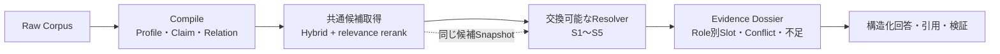

# 文書有力度を含むFragrach精度改善・比較実装計画

作成日: 2026-08-01  
前提: [企業文書の有力度と活用ケース](research/enterprise-document-validity-cases_ja.md)で整理した文書役割、適用範囲、時点、部分改訂、例外、正本性、Lineageを評価対象へ加える。

## 計画の変更点

従来の改善計画は、Sparse / Dense / rerankで必要根拠を集め、時点・状態・権威性で順位を補正し、Dossierへ渡す構成だった。この方向は維持するが、`authority_score`を増やすだけでは企業文書の関係を解決できない。

今後は検索品質と文書解決品質を別の実験系列にする。検索系列では「必要な候補を集められたか」を測る。解決系列では同じ候補集合を入力し、「この対象・時点・用途で、どの文書を規範、個別指示、実績、履歴、参考として扱うか」を測る。最後に両者を接続し、回答品質へ変換できたかを確認する。



複数案を同時に製品へ組み込むのではない。共通のIRと評価器を先に作り、最小の方式から順に実装して比較する。各方式は採用、用途限定採用、保留、棄却のいずれかを記録する。

## 比較する方式

### R0: Relevance-only

現在のTuned SparseまたはQwen Hybrid + rerankをそのまま使う。文書の状態や権威性を検索Textへ含めることはできるが、採否規則は持たない。

これは弱いBaselineではない。現在のQwen Hybridは全100問でR@5 75.0%、R@10 91.5%、Conflict両側取得@10 96.2%である。文書解決層の追加効果は、必ずこの条件との差として示す。

予想される長所は実装が単純で質問の種類を選ばないこと、短所は関連する旧版・例外・記録も高順位になり、正規側の選択理由を説明できないことである。

### S1: Weighted Metadata Score

現行の`authority_score_step`を広げ、状態、時点、承認、正本性などを加点・減点する。

```text
final_score = relevance
            + authority_bonus
            + active_bonus
            + approved_bonus
            + scope_match_bonus
            - expired_penalty
            - draft_penalty
```

最も実装しやすく、現在のrerankへ接続しやすい。比較対象として実装する価値はあるが、完成形にはしない。対象外の高権威文書が点数で残る、期限付きDeviationを全社標準より上位に一般化する、規範と実績記録を同列に並べる問題が残るためである。

S1の役割は、「多次元情報を単一Scoreへ混ぜる方式がどこで破綻するか」を実測することにある。

### S2: Filter-first Deterministic Resolver

重み付けの前に、適用条件を順番に判定する。

1. 法人、法域、拠点、製品、設備、人物、案件、LotなどのScopeを照合する。
2. 質問が必要とする文書Roleへ、規範、指示、記録、分析、提案を分ける。
3. 質問時点で有効か、承認・発行済みかを判定する。
4. 明示されたauthority precedenceを、残った同一Role・同一Scopeの候補へ適用する。
5. 同順位の候補だけrelevanceで並べる。

S2はLLMを呼ばず、入力metadataが揃っている限り再現可能である。通常手順、現行規程、対象製品の仕様、過去時点監査に向く。一方、部分改訂、組込み参照、個別例外、契約内の局所優先を十分に扱えない。

### S3: Relation Graph Resolver

S2へ、Clause単位のRelationと局所Policyを加える。

- `supersedes`
- `amends`
- `corrects`
- `incorporates_by_reference`
- `implements`
- `applies_to`
- `exception_to`
- `deviation_from`
- `waives`
- `records_execution_of`
- `order_of_precedence`
- `conflicts_with`

質問に一致したEvidenceを起点に必要なEdgeだけを展開し、元文書、改訂Clause、個別例外、実績記録を異なるRoleへ配置する。全面的なKnowledge Graphではなく、文書の採否へ直接必要なRelationに限定する。

S3はFragrachの中心仮説である。文書関係をCompile時に再利用可能にし、質問ごとのLLM推論を減らせる。一方、Relation抽出を誤ると決定的に誤判定するため、Relation自体のPrecision / RecallとEvidence参照を検証する必要がある。

### S4: Query-time LLM Adjudicator

候補文書、短い原文、metadata、質問をLLMへ渡し、採用、例外、履歴、参考、未解決を構造化出力させる。Gemma 4とCodex App Server / Lunaを同じSchemaで比較する。

S4は未知の文書種別や複雑な契約条項へ柔軟に対応でき、S3で未実装のRelationも自然文から判断できる可能性がある。しかし、質問ごとに費用と遅延が発生し、候補順やPromptへの感度があり、同じ入力での再現性を検証しなければならない。LLMの判断だけで正本性や承認権限を確定しない。

S4は完成形候補というより、次の二つに使う。

- S1～S3が解けないHard Setで、どこまで救えるかを測る上限候補。
- S3へ追加すべきRelationやPolicyを発見する比較対象。

### S5: Compiled Hybrid Resolver

Compile時にLLMでDocument ProfileとRelation候補を抽出し、RustでEvidence、型、Scope、日付、承認関係を検証する。質問時はS3の決定的Resolverを使い、不足または未解決のときだけS4を呼ぶ。

```text
Compile time:
  Raw Evidence
    -> LLM relation candidates
    -> Rust validation
    -> Document Profile / Relation Index / Diagnostics

Query time:
  Hybrid retrieval
    -> relevance rerank
    -> deterministic resolution
    -> unresolved only LLM adjudication
    -> Evidence Dossier
```

これは現時点の本命案である。ただし、S1～S4との比較前に本命として固定しない。S2だけで十分な質問へGraphやLLMを使わず、難しい質問だけ処理を増やす設計にする。

## 方式の比較軸

| 方式 | Scope | Role分離 | 部分改訂・例外 | 未知形式 | 再現性 | 質問時費用 |
|---|---:|---:|---:|---:|---:|---:|
| R0 Relevance-only | 弱い | なし | なし | 高 | 高 | 低 |
| S1 Weighted score | 一部 | なし | 弱い | 中 | 高 | 低 |
| S2 Filter-first | 強い | 強い | 一部 | 中 | 非常に高い | 低 |
| S3 Relation graph | 強い | 強い | 強い | Relation定義内 | 非常に高い | 低～中 |
| S4 LLM adjudicator | 入力依存 | 強い可能性 | 強い可能性 | 高 | 低～中 | 高 |
| S5 Compiled hybrid | 強い | 強い | 強い | 高 | 高 | 条件付き |

一つの方式が全Intentで勝つとは限らない。Current actionはS2、契約・例外・履歴はS3、未分類文書はS4が適する可能性がある。最終構成は、質問Routerが必要最小限のResolverを選ぶ形も許容する。

## 共通実装境界

方式差を評価するため、Candidate retrievalと文書解決を分離する。

### IR

現行`Claim`へ全fieldを直接追加せず、並列の型を導入する。Schema versionは実装時に更新し、旧Buildとの互換方針を明記する。

```rust
pub struct DocumentProfile {
    pub source_id: String,
    pub role: DocumentRole,
    pub force: ForceProfile,
    pub scope: ApplicabilityScope,
    pub time: TemporalProfile,
    pub official_record: Option<bool>,
    pub evidence: Vec<EvidenceReference>,
}

pub struct DocumentRelation {
    pub id: String,
    pub kind: RelationKind,
    pub source_id: String,
    pub target_id: String,
    pub source_clauses: Vec<String>,
    pub target_clauses: Vec<String>,
    pub scope: ApplicabilityScope,
    pub valid_from: Option<String>,
    pub valid_to: Option<String>,
    pub evidence: Vec<EvidenceReference>,
}

pub struct ResolutionContext {
    pub intent_id: String,
    pub as_of: Option<String>,
    pub requested_roles: Vec<DocumentRole>,
    pub scope: ApplicabilityScope,
}

pub struct ResolutionDecision {
    pub candidate_id: String,
    pub disposition: Disposition,
    pub reasons: Vec<DecisionReason>,
    pub relation_path: Vec<String>,
    pub missing_inputs: Vec<String>,
}
```

`Disposition`は少なくとも`canonical`、`instance_exception`、`execution_record`、`historical`、`reference`、`excluded`、`unresolved`を持つ。採用文書だけでなく、なぜ除外したかも保存する。

### Resolver

製品実装では、各方式が同じ入力と出力を使う。

```rust
pub trait DocumentResolver {
    fn resolve(
        &self,
        context: &ResolutionContext,
        candidates: &[ResolutionCandidate],
        relations: &[DocumentRelation],
    ) -> ResolutionOutcome;
}
```

実装候補は`WeightedResolver`、`FilterFirstResolver`、`RelationGraphResolver`である。LLM方式は同じ`ResolutionOutcome`を返すAdapterとして実装する。Dossierは方式名を知らず、`Disposition`とRole別Evidenceだけを受け取る。

### Candidate Snapshot

検索器の揺れを解決方式へ混ぜないため、各質問のtop 50候補をJSONLへ固定する。Snapshotには本文、Source、Section、relevance score、retriever別順位、metadata hashを含める。

同じSnapshotへR0、S1、S2、S3、S4を適用する。検索器を更新したRunではSnapshot IDを変え、旧結果を上書きしない。

## 評価データ

### 既存100問は固定する

青羽精機Mの500文書・100問は検索回帰として変更しない。R@5、R@10、R@20、Conflict complete、解決精度の時系列を維持する。

### Validity Extensionを別に作る

文書有力度の方式比較には、既存CorpusへGoldを後付けせず、`aobane-industries-ja-validity`を別の評価Packとして作る。最初は企業文書ケースで優先度P0とした7類型を実装する。

1. 規範・指示・実績記録のRole分離。
2. 全社規程と拠点・製品限定手順のScope。
3. Lot限定Deviationと期限切れDeviation。
4. 元規程と一条だけのAmendment。
5. 新しいDraftと古いApproved版。
6. 契約一式と明示Order of Precedence。
7. Controlled repositoryと共有Copyの正本性。

各類型は最低でも次の4問を持つ。

- 現在何をすべきか。
- 過去の指定時点では何が有効だったか。
- 対象外の製品・拠点・案件ではどうか。
- 監査上、何が要求され何が実施されたか。

最小28問でResolverの契約を確立し、その後P1の組込み参照、Dual time、Lineage、Local adaptation、構成依存、緊急指示、Accessを加えて56問以上へ広げる。

Goldには正解Sourceだけでなく、次を持たせる。

```yaml
expected_resolution:
  requested_roles: [normative, instruction, record]
  canonical_sources: [work-instruction-v2]
  instance_exceptions: [deviation-lot-042]
  historical_sources: [work-instruction-v1]
  excluded_sources:
    draft-v3: not_approved
    deviation-lot-019: scope_mismatch
  required_relation_path:
    - deviation-lot-042
    - exception_to
    - work-instruction-v2
  expected_behavior: answer_with_exception
```

Goldは架空企業世界から決定的に生成または検査し、LLM判定だけで確定しない。

## 評価指標

### 候補取得

- R@5 / R@10 / R@20
- Conflict両側取得
- Distractor rate
- Candidate generation latency

### 文書解決

- Applicability precision / recall
- Role separation accuracy
- Temporal resolution accuracy
- Canonical selection accuracy
- Exception scope accuracy
- Clause patch accuracy
- Resolution reason accuracy
- Resolution coverage
- Clarification / abstention accuracy
- Relation path recall

### Compile

- Document Profile field precision / recall
- Relation precision / recall
- Evidence grounding rate
- Unsupported relation rate
- Diagnostic precision / recall
- Compiler token、時間、cache hit率

### 回答

- 回答要素再現率
- 引用再現率
- 禁止誤答率
- Strict Pass
- Conflict / Exception disclosure
- Access leakage rate
- 入力Token、質問時Latency、LLM呼出し回数

`Resolution accuracy`だけを見ない。S4が多くの質問を断言してAccuracyを上げても、対象不足時に停止できなければ採用しない。AccuracyとCoverage、誤一般化、確認要求を併記する。

## 実験系列

### E0: 強い検索Baselineを確定する

現在進行中の日本語Cross Encoder比較を完了する。Japanese Reranker Base v2、Qwen3-Reranker-0.6B、bge-reranker-v2-m3を同じHybrid候補へ適用する。

この完了をResolver開発のブロッカーにはしない。暫定Snapshotは現在のQwen Hybrid 0.85で作り、reranker確定後に最終Snapshotだけ再生成する。

### E1: Oracle ProfileでResolverだけを比較する

Validity ExtensionのDocument ProfileとRelationをGoldから与え、R0、S1、S2、S3を比較する。ここではLLM抽出誤りを入れない。

この実験でS2またはS3がS1を上回らなければ、IRまたは解決規則が不適切である。Compiler modelを変える前にResolverを直す。

### E2: Query-time LLMを比較する

同じCandidate SnapshotとGold metadataをS4へ渡す。Gemma 4とLunaを比較し、各質問を最低3回実行して一致率を測る。候補順を入れ替えるPermutation testも行う。

品質だけでなく、質問当たり呼出し数、Token、Latency、同一入力の判定一致率を報告する。

### E3: Document ProfileとRelationをCompileする

まずFront Matter、Path、設定Fileから決定的に得られるmetadataを抽出する。次にGemma 4とLunaで、自然文にしかないRole、Scope、Relation候補を抽出する。

比較条件は次の通りである。

| ID | Profile / Relation生成 |
|---|---|
| C0 | Gold Oracle |
| C1 | Front Matter・規則だけ |
| C2 | C1 + Gemma 4 |
| C3 | C1 + Luna low |
| C4 | C1 + Luna medium、Hard Setのみ |

Raw LLM応答を保存し、Rust側の検証規則だけを変えた場合は再利用する。Prompt、Schema、Provider、model、reasoning effortを変えた場合は別cache keyにする。

### E4: Compile方式とResolverを直交比較する

C1～C4の出力へS1～S3を適用する。これにより、「Relation Graphの考え方は正しいが抽出が弱い」のか、「抽出できても解決規則が弱い」のかを分離する。

全組合せを最初から回答生成しない。検索・解決指標でPareto frontierに残った条件だけE5へ進める。

### E5: Relation-aware retrievalを比較する

質問一致Evidenceから`conflicts_with`、`amends`、`exception_to`、`records_execution_of`を一段展開する。Relation展開なし、top-k拡大、Relation展開を比較し、少ない候補数で必要な両側・例外・実績を揃えられるか測る。

### E6: Dossierと最終回答を比較する

同じ解決結果から次を比較する。

1. 検索top-kをそのまま渡す。
2. canonicalだけを渡す。
3. Role別に規範、個別例外、実績、履歴を分ける。
4. 3 + 未解決Conflict + prohibited conclusions。
5. 4 + Slot不足時だけのEvidence fallback。

検索改善と回答改善を混ぜないため、E6ではRetriever、Resolver、回答modelを固定する。

## 実装順序

### 進捗（2026-08-01）

- Milestone 1のP0 7類型・28問、Gold Profile / Relation、固定Candidate Snapshot、評価指標を追加済み。
- Milestone 2の共通IR、`DocumentResolver`、R0、S1、S2を追加済み。
- Milestone 3の先行RelationとS3を追加し、Oracle Profile比較を実行済み。
- Oracle比較結果は[文書有力度Resolver Oracle比較](research/document-validity-oracle-comparison_ja.md)に記録した。
- Milestone 4の一括抽出、Scope・Clause正規化、Profile validator、保存済み抽出を使うE2E比較を追加した。
- 改善後の結果は[Document Profile・Relation抽出比較](research/document-profile-extraction-comparison_ja.md)に記録した。Codex + S3は開発用28問でStrict 100%、Gemma + S3は64.3%だった。
- 5類型・20問の未調整Holdoutを追加した。初回Oracle S3はStrict 65%、Codex抽出は60%で、開発用100%への過適合を確認した。
- 合成、追補連鎖、正本Lineageの一般規則を修正し、既存28問を100%に保ったままHoldout Oracle 100%、Codex抽出85%へ改善した。詳細は[S3文書有力度 Holdout検証](research/document-validity-holdout-comparison_ja.md)に記録した。

### Milestone 1: 評価契約

1. Validity ExtensionのP0 7類型・28問を作る。
2. Gold schemaとValidatorを追加する。
3. Candidate Snapshot形式を追加する。
4. 文書解決指標を評価器へ追加する。

この段階では製品IRを変更しない。評価器が誤判定する状態でResolverを作らないためである。

### Milestone 2: Resolver比較の最小縦切り

1. `DocumentProfile`、`ApplicabilityScope`、`ResolutionContext`、`ResolutionOutcome`をIRへ追加する。
2. `DocumentResolver`境界を追加する。
3. S1 `WeightedResolver`を実装する。
4. S2 `FilterFirstResolver`を実装する。
5. Oracle ProfileでE1を実行する。

ここで、単一Scoreと順序付き判定の差を最初に確定する。

### Milestone 3: Relation

1. `DocumentRelation`とRelation validatorを追加する。
2. `amends`、`applies_to`、`exception_to`、`records_execution_of`の4種類を先行実装する。
3. S3 `RelationGraphResolver`を実装する。
4. Clause patch、期限付き例外、Role分離をE1で比較する。
5. 有効だったRelationだけを残りの種類へ拡張する。

Relationを23種類すべて同時に実装しない。P0 Goldで必要な4種類から始め、失敗が確認できた型を追加する。

### Milestone 4: LLM比較

1. S4の構造化`ResolutionOutcome` Schemaを作る。
2. Gemma 4とLunaのAdjudicator adapterを追加する。
3. E2の反復・候補順Permutation testを実行する。
4. Document Profile / Relation extractionを現行Claim抽出と別cache namespaceで追加する。
5. C1～C4とS1～S3をE3、E4で比較する。

Claim promptを直接拡張して一度に出力させる条件と、Document Profile / Relationを別passで抽出する条件も比較する。別passは呼出し数が増えるが、Claim cacheを無効にせず改善を試せる。

### Milestone 5: 統合

1. E4で選んだCompile方式とResolverを接続する。
2. 一段Relation展開を検索へ追加する。
3. 未解決時だけS4へfallbackするS5を実装する。
4. Role別DossierとAnswer Contractを接続する。
5. 既存100問とValidity Extensionの両方で最終回帰を行う。

## キャッシュ境界

試行錯誤で不要な再Compileを避けるため、Cacheを次の層へ分ける。

| Cache | Keyへ含めるもの | 再利用できる変更 |
|---|---|---|
| Parsed Evidence | Source hash、parser version | Resolver、Policy、rerank |
| Claim raw response | Provider、model、Prompt、Schema、Source batch | Rust検証、Resolver |
| Profile raw response | Provider、model、Profile Prompt、Schema、Source batch | Profile validator |
| Relation raw response | Provider、model、Relation Prompt、Schema、Source batch | Relation validator、Policy |
| Validated IR | Raw response hash、validator version | Resolver、質問時Policy |
| Candidate Snapshot | Corpus hash、Retriever、Embedding、reranker、top-k | Resolver全方式 |
| Resolution | Snapshot hash、Resolver kind/version、Context hash、Policy hash | Dossier、回答model |
| Dossier | Resolution hash、Contract version | 自然文model、judge |

S1～S3の切替ではLLM cacheを無効にしない。Relation種別やRust検証だけを変更した場合も、可能な限りRaw responseを再利用する。Promptへ新しい出力Fieldを追加した場合は該当namespaceだけを無効にする。

## 採用ゲート

### S1

実装は維持してもよいが、主要製品Resolverとしては採用しない。S2以上と同等で単純さに明確な利点がある場合のみ、低Risk Intentの高速modeとして残す。

### S2

Validity P0でApplicability precision、Role separation、Temporal resolutionがS1を上回り、既存100問のR@5 / R@10を悪化させない場合に採用する。

### S3

Exception scopeとClause patchでS2を上回り、Unsupported relationによる重大誤解決を残さない場合に採用する。Relationが欠けた場合は未解決へ落ち、誤ってcanonicalを選ばないことを必須にする。

### S4

S3のHard Setを有意に救い、候補順Permutationと3回反復で許容できる一致率を持つ場合だけfallback候補にする。全質問の既定Resolverにはしない。

### S5

既存100問で検索品質を維持し、Validity ExtensionでS3以上、最終回答で禁止誤答0%、質問時LLM呼出し率が未解決質問へ限定できた場合に製品候補とする。

閾値の数値はValidity P0の初回Baselineを測ってから固定する。データを見る前に「90%」などを置いて方式を有利・不利にしない。ただし、対象外の個別例外を一般化する、安全上重大な未承認文書をcanonicalにする、Access対象外を引用する失敗は一件でもRelease blockerとして扱う。

## 並行して進める二つのTrack

検索rerankerとValidity Resolverは、共通候補の境界を使えば独立して進められる。

| Track | 当面の作業 | 完了条件 |
|---|---|---|
| A: Strong RAG | 日本語・多言語reranker比較 | 強い通常RAGのCandidate生成を固定 |
| B: Document Resolution | Validity P0、S1、S2、S3 | Oracle Profileで方式差を説明できる |

Track Aが先に終われば最新SnapshotをBへ渡す。Track Bが先に終われば現行Hybrid SnapshotでResolverを比較し、Track A確定後に再測定する。どちらも相手の完了を待って作業を止めない。

## 直近の作業

第一HoldoutはResolver調整へ使用したため、以後は開発用集合として扱う。次はCompileの再現性と、現在のIRで表現できない要件を分けて検証する。

1. 第一Holdoutの16文書を文書順3通り、各3回Codexで抽出し、Profile fieldとRelation集合の一致率を測る。
2. 欠落した`records_execution_of`が毎回同じか、追加Relationが順番で変わるかを確認する。
3. Relationが欠けてもDispositionは正しく、説明経路だけ不足する状態を評価器で分けて表示する。
4. 組込み参照と二重時点を現行IRの未対応要件として設計し、第二Holdoutを作る。
5. 第二Holdoutの初回Runを保存してからIRとResolverを拡張する。

開発用集合の100%を完了条件にしない。未調整集合でRelation Precisionと棄却判断を優先し、未知ケースを無理にCanonicalへ昇格させないことを採用条件にする。
