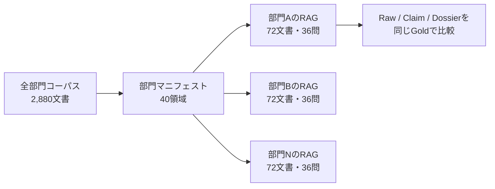

# 部門別RAGコーパスの設計と評価方法

このコーパスは、Fragrachの改善が特定の会社や文書型にだけ効いていないかを確かめるために使う。全2,880文書を一つの検索索引へ入れるのではなく、実際の企業導入に近づけて、各部門が利用できる72文書から独立したRAGを構築する。

## 評価単位

対象は8業種、各5部門の合計40領域である。一つの領域には、規程、技術仕様、企画検討、業務手順、障害・変更、契約・コンプライアンスの6目的が含まれる。各目的には3つのシナリオがあり、一つのシナリオは関係する4文書と2問のGold質問から成る。その結果、一部門あたり72文書と36問になる。



部門別に索引を分ける理由は、検索対象を不自然に広くしてFragrachを有利にしないためである。利用者が所属部門の文書を検索する通常の構成をRaw RAGの基準にし、その同じ72文書をFragrachでコンパイルした場合だけを比較する。

## 文書の難しさ

単に話題の異なる文書を増やすだけでは、検索語が一致する正解文書を拾う試験にしかならない。このコーパスでは、同じ業務対象について旧版と現行版、基本仕様と追補、提案と決定、全社手順と期限付き例外、初報と最終報、基本契約と個別契約を同居させる。

Ollamaは文書らしい背景説明を生成するが、期限、数値、採否、適用範囲、文書の効力など、採点対象の事実は生成器が固定文として挿入する。これにより文章表現を増やしながら、Goldがモデルの偶然に左右されることを防ぐ。

## 比較条件

同じ部門の同じ質問に対して、次の三条件を比較する。

| 条件 | 検索対象 | この比較で分かること |
|---|---|---|
| Raw | 調整済みの原文チャンク | 通常のRAGを適切に調整した場合の到達点 |
| Claim | Fragrachが抽出したClaimと短い原文 | 事前コンパイルが検索順位を改善するか |
| Dossier | Claim、原文、文書関係、矛盾・例外を質問に合わせて構成 | 取得した根拠を正しい回答材料へ変換できるか |

Rawは弱い初期設定のまま固定せず、チャンク構造とBM25条件を調整した結果を基準にする。埋め込みとハイブリッド検索もRaw側の候補に含め、Fragrachだけに高度な検索を許さない。

## 採点

検索段階では、根拠再現率@5、@10、@20に加えて、必要な文書関係をそろえられた割合を測る。特に、矛盾する二文書、基本文書と追補、規程と例外のように複数根拠が必要な質問は、一方だけ取得した場合を完全取得とみなさない。

回答段階は検索条件を絞った後に実施する。回答要素再現率、引用再現率、禁止結論率、Strict Passを測り、検索改善と回答生成改善を分離する。結果は次の三つの粒度で示す。

- 部門別の36問: 苦手な利用現場を発見する。
- 業種別の180問: 業種固有の文書関係に対する傾向を見る。
- 全体1,440問: 手法の総合的な差を見る。

全体値は質問数で重み付けした値に加え、40部門を同じ重みで扱うマクロ平均も残す。一部の得意部門だけで全体改善を作っていないかを確認するためである。

## 実行方法

コーパス生成と検証は次のコマンドで行う。

```powershell
npm run corpus:diverse:generate
npm run corpus:diverse:check
```

Raw RAGの部門別ベースラインは次のコマンドで測定する。

```powershell
npm run benchmark:diverse:raw
npm run benchmark:diverse:oracle
```

一部門だけを再生成または予備評価する場合は、領域IDを指定できる。

```powershell
node scripts/generate-enterprise-diverse-corpus.mjs --domains manufacturing-product-design
node tests/benchmarks/rag-comparison/run-enterprise-domain-baseline.mjs --domains manufacturing-product-design
```

Fragrachで部門をコンパイルするときは、部門ごとに独立したworkspaceへ対象ディレクトリだけをscanする。たとえば製造業の製品設計部は次のように準備できる。

```powershell
cargo run -p fragarach-cli -- init `
  target/enterprise-builds/manufacturing-product-design

cargo run -p fragarach-cli -- scan `
  --source tests/corpora/fragrach-enterprise-ja-diverse/sources `
  --workspace target/enterprise-builds/manufacturing-product-design `
  --include manufacturing/product-design/**

cargo run -p fragarach-cli -- compile `
  --workspace target/enterprise-builds/manufacturing-product-design `
  --intent tests/corpora/fragrach-enterprise-ja-diverse/intents/technical_spec.yaml `
  --provider ollama `
  --model gemma4:latest `
  --output target/enterprise-builds/manufacturing-product-design/technical-spec
```

同じ部門workspaceから6つのIntentを個別にコンパイルする。これにより、「規程を調べるRAG」と「技術仕様を調べるRAG」で目的が混ざることを防ぎ、質問の `intent_id` と対応するKnowledge Buildだけを評価できる。

領域ID、対象文書ID、質問IDは `evaluation/rag-domains.jsonl` に固定される。ClaimとDossierの評価器もこのマニフェストを読み、Rawと同じ検索範囲を使わなければならない。

## Raw RAGの初回結果

40部門、1,440問の初回評価では、Current RawのR@5は55.2%、R@10は67.4%、R@20は80.2%だった。調整済みRawはR@5が56.8%、R@10は69.3%、R@20は90.8%である。調整済みRawの関係Path再現率@10は90.2%だった。

調整済みRawの部門別R@5は52.8〜60.6%、業種平均は55.8〜57.7%に収まっている。特定の業種だけが極端に簡単または難しい状態ではない。一方、R@10でも必要根拠の約3割が上位にそろわず、関係Pathも約1割が不完全であるため、ClaimとDossierが改善できる余地は残っている。

この結果はRaw RAGの基準値であり、Fragrachの優位性を示すものではない。次の比較では、同じ40部門と同じ質問を使い、ClaimとDossierがこの基準を超えるかを確認する。

## OracleとActualの初回比較

40部門・1,440問のOracle Relation Dossierは、用途フィルタ付きRawに対してR@5を59.2%から63.8%、R@10を69.6%から83.4%、R@20を91.7%から99.5%へ改善した。Conflict両側@10も32.5%から100%になった。一方、プロフィール情報を原文へ単純付加した条件のR@5は55.4%まで低下したため、metadata加点だけを製品設計として採用しない。

Lunaで実際にコンパイルした製品設計部の規程6問では、Actual ClaimのR@5は33.3%でRawの58.3%を下回った。技術仕様6問では30.6%でRawの25.0%を上回った。Actualは12問のスモークであり全体性能とはみなせないが、Relation Dossierを発行経路へ統合する前に全40部門へActualを拡大しても、呼び出し回数に見合う情報が得られないと判断した。

条件、内訳、Conflict過検出、Lunaの時間とtoken、全実験IDは `docs/evaluations/enterprise-diverse-evaluation-2026-08-02_ja.md` に記録した。生の全順位と再現条件は `target/benchmarks/` 配下へ保存する。
