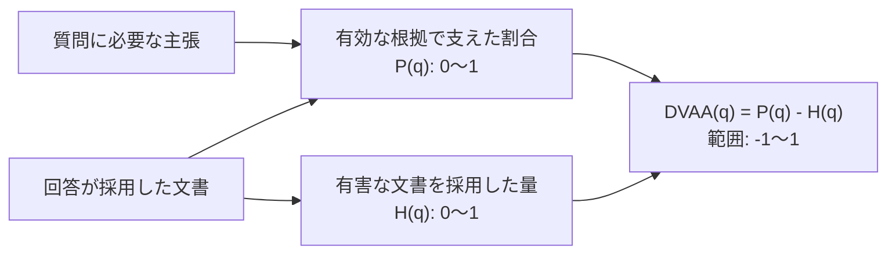

# Fragrach 精度評価 最終版（2026-08-10更新）

## 結論

DVAA（Document Validity-Aware Adoption、文書効力を考慮した根拠採用スコア）は、回答の正誤ではなく、必要な主張を質問に適用できる根拠で支えたかを測る。正答率はAccuracyで別に測る。

この定義でDVAAを計測済みの主結果は、私たちがEnterpriseRAG-Benchから選定した500文書サブセット、Enterprise Fragrach 500の125問評価である。HybridからFragrach Soft Rerank v1へ替えると、Recall@20は両方97.07%、Accuracyは55.20%から56.00%、DVAAは0.6689から0.7281になった。

実践holdout 200問ではRecallとAccuracyに加え、「正答かつ必要根拠がすべて有効」という二値の完全根拠付き正答率を計測した。これはAccuracyを合否条件に含むためDVAAではなく、参考結果として分けて掲載する。

## 3つの指標の読み方

| 指標 | 指標の説明 | 算出方法 | 数値の読み方 |
|---|---|---|---|
| Recall@k | 正答に必要な文書を検索上位k件までにどれだけ取得できたかを測る | 各質問について必要文書の取得割合を求め、全質問で平均する | 0から1。高いほど検索漏れが少ないが、回答の正しさや採用根拠の有効性は保証しない |
| Accuracy | 最終回答の値または判断が正解と一致したかを測る | 正答を1、誤答を0として全質問で平均する | 0から1。高いほど正答が多いが、根拠が有効かは分からない |
| DVAA | 必要な主張を、質問に適用できる根拠でどれだけ支え、有害な根拠を避けたかを測る | 必要主張の加重カバレッジから、有害文書の採用ペナルティを引き、全質問で平均する | −1から1。1は必要主張をすべて有効な根拠で支えた状態、0は加点も減点もない状態、負値は有害文書を根拠として採用した状態を表す |

### DVAAの定義

DVAAは、必要な主張を有効な根拠で支えた割合から、失効文書や対象外文書などを根拠として採用したペナルティを引く。計算の全体像は次のとおりである。



各記号の意味は次のとおりである。

| 記号 | 意味 |
|---|---|
| `q` | 評価対象の質問 |
| `C(q)` | 質問に答えるために必要な主張の集合 |
| `w_c` | 必要主張 `c` の重要度 |
| `A_c(q)` | 主張 `c` を独立して裏付け、版、時点、適用範囲などの条件も質問に適用できる文書の集合 |
| `D(q)` | 回答が実際に根拠として採用した文書の集合 |
| `B(q)` | 失効、対象外、未承認など、この質問の根拠として採用すると有害な文書の集合 |
| `h_d` | 有害文書 `d` に対するペナルティ |

まず、必要主張 `c` を支える有効な文書を回答が一つ以上採用していれば `I_c(q) = 1`、採用していなければ `0` とする。

```math
I_c(q)=
\begin{cases}
1 & \text{if } A_c(q) \cap D(q) \ne \varnothing \\
0 & \text{otherwise}
\end{cases}
```

必要主張の加重カバレッジ `P(q)` は、各主張の重要度を考慮して0から1に正規化する。

```math
P(q)=\frac{\sum_{c \in C(q)} w_c I_c(q)}{\sum_{c \in C(q)} w_c}
```

有害文書の採用ペナルティ `H(q)` は、回答が実際に採用した有害文書のペナルティを合計し、最大1に制限する。

```math
H(q)=\min\left(1,\sum_{d \in B(q) \cap D(q)} h_d\right)
```

質問単位のDVAAは、加重カバレッジから有害文書の採用ペナルティを引いた値である。

```math
\operatorname{DVAA}(q)=P(q)-H(q), \qquad -1 \le \operatorname{DVAA}(q) \le 1
```

同じ主張を独立して裏付け、文書間の依存関係が結論を変えない文書はOR条件とする。異なる必要主張は重み付きで加算する。版、適用範囲、承認状態、置換、例外、競合などの依存関係が結論を変える場合だけ、`A_c(q)`を質問へ適用できる文書へ限定する。Accuracyは別指標であり、DVAAの加点条件には含めない。

| 例 | Recall | Accuracy | DVAA | 理由 |
|---|---:|---:|---:|---|
| 指定文書と同じ主張を、依存関係のない別文書で正しく裏付けた | 取得契約による | 正答なら1 | 1 | 同じ主張を独立して裏付ける文書は同じ加点になる |
| 必要主張の半分だけを有効な文書で裏付けた | 取得契約による | 正誤を別採点 | 0.5 | 必要主張の加重カバレッジが半分である |
| 失効済み文書を現在の根拠として採用した | 高くなり得る | 正答になり得る | 負値になり得る | 文書の依存関係に反する有害な採用を減点する |
| 回答は正しいが、有効な根拠を採用していない | 取得済みでもよい | 1 | 0 | 正答と根拠採用を別々に測る |

## Enterprise Fragrach 500

EnterpriseRAG-Benchから選定した500文書サブセットで、Qwen Hybrid top20と、同じ20文書をFragrach roleで並べ替えるSoft Rerank v1を比較した。候補集合は変えないためRecall@20は同じである。回答器は`gpt-5.6-luna`、Accuracy judgeは`gpt-5.4`、DVAA契約は回答を見る前に`gpt-5.6-sol`で凍結した。

| 条件 | Recall@20 | Accuracy | DVAA |
|---|---:|---:|---:|
| Hybrid | 97.07% | 55.20% (69/125) | 0.6689 |
| Hybrid＋Fragrach Soft Rerank v1 | 97.07% | 56.00% (70/125) | 0.7281 |

| 評価範囲 | 条件 | Recall@20 | Accuracy | DVAA |
|---|---|---:|---:|---:|
| 先行100問 | Hybrid | 97.33% | 52.00% | 0.6645 |
| 先行100問 | Soft Rerank v1 | 97.33% | 54.00% | 0.7285 |
| 事後追加25問 | Hybrid | 96.00% | 68.00% | 0.6867 |
| 事後追加25問 | Soft Rerank v1 | 96.00% | 64.00% | 0.7267 |

125問総合ではSoft RerankがAccuracy +0.80ポイント、DVAA +0.0592である。追加25問でもDVAAは+0.0400だが、Accuracyは−4.00ポイントだった。Accuracy差は必要文書の順位が変わらない1問で生じており、回答生成の試行差を含む。

## 実践holdout 200問の参考結果

対象は未見100系列から作った200問である。T1コーパス1,988文書、Ruri 512 token・overlap 64の34,875 chunk、candidate 1,000、top-k 5、Packet最大3件、Readerは`gpt-5.6-luna`、reasoning effort `low`へ固定した。

| 条件 | Recall@5 | Accuracy | 完全根拠付き正答率 |
|---|---:|---:|---:|
| Raw-BM25 | 1.50% | 2.00% (4/200) | 0.00% (0/200) |
| Raw-Ruri-Dense | 92.75% | 78.50% (157/200) | 0.00% (0/200) |
| Raw-Fixed-Hybrid | 87.25% | 78.50% (157/200) | 1.00% (2/200) |
| Fragrach-Ruri-Packet | 97.50% | 98.50% (197/200) | 96.00% (192/200) |
| Fragrach-Fixed-Hybrid-Packet | 91.00% | 93.00% (186/200) | 90.00% (180/200) |

完全根拠付き正答率は、正答、必要根拠の完備、根拠の時点・対象範囲・承認状態・発行主体・文書関係をすべて満たした質問の割合である。Fragrach Ruri PacketとRaw Ruri Denseの差は+96.00ポイント、質問単位bootstrapの95%信頼区間は93.00–98.50ポイントだった。この値はDVAAの式で再計算していないため、DVAAの結果や比較対象には含めない。

## VersionQA外部データ評価

VersionQAでは、版が異なる技術文書から指定版本文、版一覧、明示変更、暗黙変更を答える能力を測った。公開リポジトリのcommit `2a2cbe8f285557f99dc7a79d6df7134e1e3eccff`に含まれる34文書と100問を取得し、このうち版依存の60問を回答評価へ用いた。ReaderとJudgeはLuna `gpt-5.6-luna`、reasoning effort `low`、検索件数はtop-5へ固定した。

Gold監査では、60問のうち7問について、Gold回答を配布コーパスから一意に支持できないことが分かった。これらはRawとFragrachのどちらにも採点不能であるため、理由をcase-levelに残して両条件の分母から除外した。保存済みの回答と判定を使い、検索と回答生成を再実行せず、同じ53問で再集計した結果は次のとおりである。

| 指標 | Raw Ruri Hybrid | Fragrach Query-relative Packet | 差 |
|---|---:|---:|---:|
| Accuracy | 66.04%（35/53） | 100%（53/53） | +33.96ポイント |
| Document Recall@5 | 66.25% | 100% | +33.75ポイント |
| Evidence Unit Recall@5 | 35.85% | 100% | +64.15ポイント |
| 完全根拠付き正答率 | 16.98%（9/53） | 100%（53/53） | +83.02ポイント |

質問単位では、35問に両条件が正答し、18問はFragrachだけが正答した。Rawだけが正答した質問と、両条件が誤答した質問はなかった。カテゴリ別Accuracyは、指定版本文でRaw 14/19、Fragrach 19/19、版一覧で11/20対20/20、暗黙変更で1/4対4/4、明示変更で9/10対10/10だった。Gold監査前に記録したRaw 58.3%（35/60）は採点不能な7問を誤答として含む履歴値であり、主要比較には同じ53問による66.0%を用いる。

除外した7問は、次の内部不整合を持つ。

| ID | 不整合 |
|---|---|
| `VQA-049` | GoldはNode.js 17.9.1のconstructorを`new Error(message[, options])`とするが、配布文書は`new Error(message)`である |
| `VQA-081` | Goldは17.9.1で「変更なし」とするが、配布された16.20.2と17.9.1の間で`options/cause`とsignatureが異なる |
| `VQA-082` | GoldはOpenSSL Error Codesの導入を22.14.0とするが、配布された20.19.0文書に既に該当節がある |
| `VQA-084` | Goldは`ERR_FS_CP_DIR_TO_NON_DIR`を16.20.2へ割り当てるが、文書内のAPI履歴は`added: v16.7.0`とする |
| `VQA-086` | Goldは`CallTracker`を14.21.3へ割り当てるが、文書内のAPI履歴は`added: v14.2.0`とする |
| `VQA-087` | GoldはWeakMap／WeakSet比較例を22.14.0へ割り当てるが、配布された20.19.0文書に同様の構造があり、一意の導入版を決められない |
| `VQA-088` | Goldは`partialDeepStrictEqual`を22.14.0へ割り当てるが、文書内のAPI履歴は`added: v22.13.0`とする |

この不整合にはGoldの誤記だけでなく、配布文書の欠落や、「収録スナップショットでの初出」と「API履歴上の導入版」という二つの時間軸の混同が含まれうる。そのため、外部の正史まで確認せずにGoldだけが誤りとは断定せず、VersionQAパッケージ内部で採点不能な問題として扱う。7問は版依存60問の11.7%、全100問の7.0%に当たる。2026年8月16日時点ではVersionRAG upstreamへ未報告である。

Fragrachの100%は、質問型別Packetを改善した開発集合上の適合値であり、未知データへの一般化性能ではない。VersionQAで確認できたのは、指定版の関連span、完全な版一覧、検証済み不在、比較対象二版の意味差分を、質問相対の不可分な回答資料として渡す設計が、この集合で有効だったことである。初回失敗から最終runまでの経緯は[VersionQA外部データ評価](versionqa-external-pilot-2026-08-04_ja.md)に記録した。

## 解釈上の境界

Enterprise Fragrach 500の125問値は、検索前に生成済みだった未使用accepted候補25問を全件追加した質問数頑健性確認である。追加判断は100問結果の確認後なので、先行100問と追加25問を分けて報告する。DVAA契約はSol監査であり、人手監査済みのDVAA Fullではない。

MultiHop-RAG、EnterpriseRAG-Bench diagnostic、VersionQAで計測済みの二値値も、完全根拠付き正答率として扱い、DVAAへ読み替えない。未知企業文書構造、不完全または誤ったmetadata、同一purposeで13文書超の実データ、Production-weighted trackは未評価である。

## 再現性

- 実践holdout集計JSON: `target/benchmarks/final-metrics-2026-08-09/report.json`
- bootstrap: 質問単位、20,000回、seed 20260809
- Enterprise Fragrach 500: 500文書・125問、Qwen Hybrid top20とSoft Rerank v1の対応比較。先行100問と事後追加25問を分離
- Enterprise集計: `tests/EnterpriseRAG-Fragrach-500/results/fragrach-rerank-fixed20-expanded-summary-v1/report.json`
- DVAA正本: `tests/EnterpriseRAG-Fragrach-500/DVAA_EVALUATION_ja.md`
- VersionQA Raw再採点: `target/benchmarks/versionqa/answers-evidence-unit-v3/report.json`
- VersionQA Query-relative Packet最終run: `target/benchmarks/versionqa/query-packet-answers-v4/report.json`
- VersionQA Gold監査契約: `tests/benchmarks/rag-comparison/versionqa-evidence-contracts.json`

入力artifactのhashは各集計JSONの`inputs`へ保存した。回答、採点、Goldのいずれかが変わった場合は、同じ最終値へ混ぜず、別runとして再生成する。
