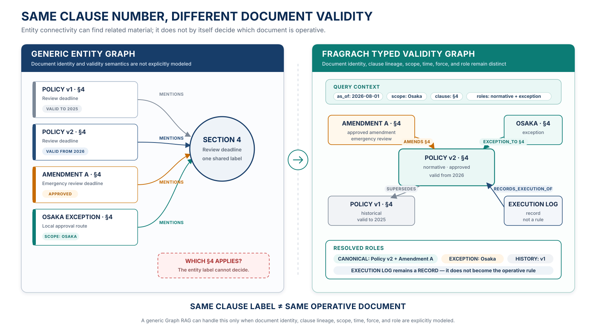
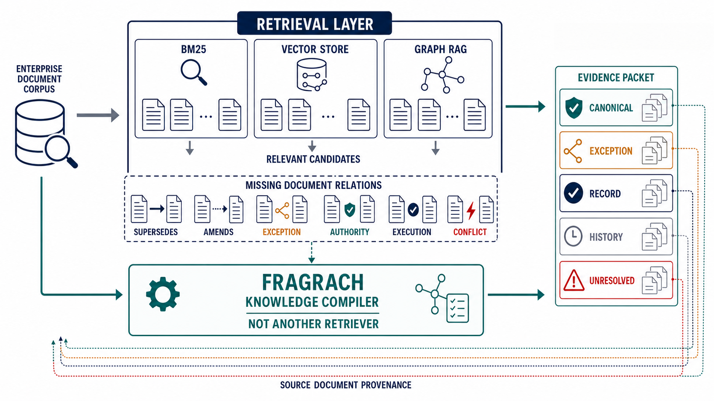
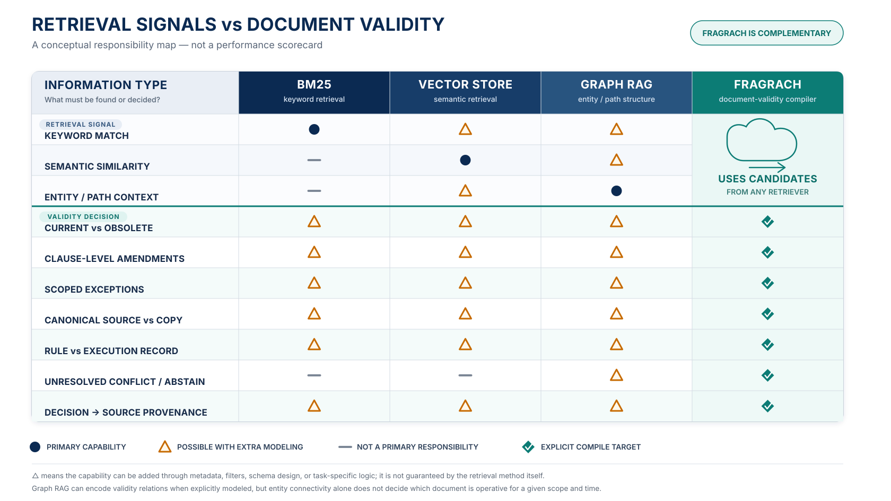

<p align="center">
  
</p>

# Fragrach: Dependency-aware Living Corpus RAG

**Dependency-aware Living Corpus RAG**

*Fragrach: Dependency-aware Living Corpus RAG*

著者: ［著者名］  
所属: ［所属］  
版: Draft 0.3（2026-08-10）

> 本稿は投稿前の技術叩き台である。主要値は保存済みartifactから集計した最終評価値であるが、異なる企業文書構造への一般化は未確定である。

## 要旨

企業内のRetrieval-Augmented Generation（RAG）では、質問に関連する文書を取得できても、その文書を回答根拠として採用すべきか決められないことがある。同じ検索領域に現行規程、旧版、未承認の草案、個別例外、FAQ、実施記録が共存すると、意味的な関連度だけでは、適用時点、権威、対象範囲、正本性、文書間の優先関係を表現できないためである。

本稿では、内容と文書間関係が継続的に変化する文書集合をLiving Corpusと呼ぶ。この問題を検索順位の改善ではなく、文書の局所的な効力を解決する問題として定式化し、RAGの前段で企業文書を用途別のKnowledge Buildへ変換するFragrachを提案する。Fragrachは原文をEvidenceとして保持したまま、文書ごとのProfileと型付きRelationを抽出し、決定的なResolverによって候補文書を`canonical`、`instance_exception`、`execution_record`、`historical`、`reference`、`excluded`、`unresolved`へ分類する。解決結果は、採用根拠だけでなく、競合する根拠、Relation path、回答時の引用・開示条件、Provenanceを含むEvidence Packetとして既存RAGへ渡される。

本方式の狙いは、あらゆる質問で検索精度を上げることではない。関連文書が複数取得された後に必要となる「どれが有効か」「例外はあるか」「規範と実績を混同していないか」「根拠不足なら停止すべきか」という判断を、生成モデルの暗黙推論から検証可能な工程へ移すことにある。DVAAを計測した主結果であるEnterprise Fragrach 500の125問では、HybridからFragrach Soft Rerank v1へ替えると、Recall@20は両方97.07%、Accuracyは55.20%から56.00%、DVAAは0.6689から0.7281になった。別指標による参考結果として、未見100系列と複合表記揺れからなる実践holdout 200問では、同じRuri Denseを入口にしたRaw RAGに対し、Fragrach PacketはRecall@5を92.75%から97.50%へ、Accuracyを78.50%から98.50%へ、完全根拠付き正答率を0.00%から96.00%へ改善した。この二値値はAccuracyを合否条件に含むためDVAAとは呼ばない。したがって、文書効力を明示的に扱う効果は支持されるが、一般的な企業RAG全体への優位は確定していない。

## 1. はじめに

RAGは、生成モデルのパラメータに保持された知識と外部の非パラメトリックな知識源を組み合わせる枠組みとして提案された [1]。その後、長文を階層的に要約するRAPTOR [2]、コーパス全体の関係をEntity GraphとCommunity Summaryで捉えるGraphRAG [3]、Proposition間の経路を探索するPropRAG [4] など、取得範囲と複数文書推論を改善する方法が発展している。

しかし、企業文書では「関連していること」と「その回答に使えること」が一致しない。たとえば、廃止された旧版は現行版と語彙がほぼ同じであり、草案は確定版より質問に近い表現を含み得る。個別例外は一般規則と矛盾して見えるが、対象範囲が一致する場合には両方を保持しなければならない。実施記録は、何を行うべきかを定める規範ではなく、何が行われたかを示す。この違いを一つの関連度スコアへ畳み込むと、質問の時点や対象が変わるたびに順位の意味も変わる。

古い情報が現行情報と共存するだけで、正しい情報が取得されていてもRAGの回答を悪化させ得ることは、HoHでも報告されている [5]。また、複数sourceの信頼性を推定して関連度と併用するRA-RAGは、source reliabilityが標準RAGの盲点であることを示した [6]。Fragrachはこれらと問題意識を共有するが、信頼度を一つの値として推定するのではなく、文書の役割、承認状態、適用範囲、時点、正本性、Relationを別々の型として保持する。

本研究の中心的な問いは次のとおりである。

> 企業文書の採否と役割を、質問時の生成モデルへ暗黙に委ねず、原文へ遡れる決定的なKnowledge Compilationとして実行すると、完全根拠付き回答と安全な判断保留を改善できるか。

本稿の貢献候補は三点である。第一に、企業文書RAGの失敗を、関連度不足ではなく文書効力の未解決として定式化する。第二に、原文Evidence、Document Profile、型付きRelation、決定的Resolver、Conflict gateを一つのKnowledge Buildへ統合する。第三に、検索の到達を測るRecall、回答値を測るAccuracyに加え、必要主張を適用可能な根拠で支え、有害な根拠を避けたかを測るDVAAを評価契約として導入する。

## 2. 問題設定

### 2.1 関連度では解けない文書集合

文書集合を \(D\)、質問を \(q\)、通常のRetrieverが与える関連度を \(r(d,q)\) とする。標準的なRAGは、おおむね \(r\) の上位文書またはpassageを生成モデルへ渡す。一方、企業文書で必要な採否は、質問の利用目的、対象範囲、基準時点、要求する文書役割、対象条項にも依存する。



**図1.** 同じ条文番号がGraph上の同じEntityとは限らないという概念例。左では、旧版、現行版、追補、地域例外がすべて`Section 4`を`mentions`するため、関係資料は見つかってもどの第4条が質問時点・対象に適用されるか決められない。右では、文書Identityと条項Lineageを保持し、`supersedes`、`amends`、`exception_to`、`records_execution_of`を異なるRelationとして適用する。GraphRAGでもこのSchemaを明示的に設計すれば表現できるが、通常のEntity接続から自動的に得られる判断ではない。

そこで、質問時の解決Contextを次の組として扱う。

\[
c_q = (intent, scope, as\_of, requested\_roles, requested\_clauses)
\]

各文書にはProfile \(p(d)\) を与える。現行実装のProfileは、文書役割、承認・強制度、適用範囲、適用期間、正本性、原文Evidence参照を持つ。また文書間には、`supersedes`、`amends`、`applies_to`、`exception_to`、`conflicts_with`、`records_execution_of`、`order_of_precedence`、`derived_from`などの型付きRelation \(E\) を置く。

求めるものは単一の勝者ではなく、候補文書ごとのDispositionである。

\[
R(c_q, D_q, P, E) \rightarrow \{(d_i, y_i, reason_i, path_i)\}
\]

ここで \(D_q\) はRetrieverが得た候補、\(y_i\) は文書の役割、\(reason_i\) は決定理由、\(path_i\) は判断に用いたRelation pathである。Dispositionは次の七種類とする。

| Disposition | 意味 |
|---|---|
| `canonical` | 質問Contextで基準となる規範・正本 |
| `instance_exception` | 対象範囲が一致する個別例外 |
| `execution_record` | 規範の実施、承認、変更などを示す記録 |
| `historical` | 旧版や過去時点の説明に必要な履歴 |
| `reference` | 判断の補助にはなるが基準ではない資料 |
| `excluded` | 草案、対象外、非正本など、回答根拠から除く資料 |
| `unresolved` | 根拠だけでは一意に解決できない競合 |

この出力形式により、一般規則と例外、規範と実績、現行版と履歴を同じ順位列へ押し込まず、回答内で異なる責任を持つ資料として保持できる。

### 2.2 Evidence Unitを失わないこと

Gold文書IDがtop-kへ入ることと、回答に必要な局所的根拠が最終Contextに残ることは同義ではない。長文の圧縮、chunk境界、重複候補、Relation展開によって、正しい文書を取得しても必要な一文が落ちる場合がある。本研究では、回答に必要な最小の原文spanとsourceの組をEvidence Unitと呼ぶ。DVAAではEvidence Unitを必要主張へ対応付け、実際に採用した適用可能な根拠の割合を主張の重みで採点する。

## 3. Fragrach



**図2.** Fragrachの位置づけ。BM25、Vector Store、GraphRAGはそれぞれ異なる表現から関連候補を取得する。Fragrachはこれらと競合する第4のRetrieverではなく、検索・索引だけでは文書効力として確定しない版、追補、例外、権威、実施記録、競合を型付きRelationへコンパイルする。Retrieverの候補とコンパイル済みRelationを統合し、役割付きEvidence Packetとして既存RAGへ渡す。

### 3.1 オフラインのKnowledge Compilation

Fragrachは文書フォルダとUsage Intentを入力とし、次の工程で用途別Knowledge Buildを生成する。

1. **ScanとEvidence化**: Markdown等の原文を走査し、位置情報と文書メタデータを持つParsed Evidenceへ変換する。内容hashにより未変更文書を再利用する。
2. **構造抽出**: LLMは原文Evidenceを参照し、Claim候補、Document Profile、Document Relationを構造化出力する。生成された仮説や要約を原文の代替にはしない。
3. **決定的検証**: Rust側がID、日付、述語、Relation endpoint、Evidence参照を検証する。存在しないEvidenceを引用する候補や不正Relationは棄却し、Diagnosticへ残す。
4. **Conflict解析**: 同じ対象に非両立な単一値Claimがある場合、時点、状態、明示された権威順位の順に解決する。更新日の新しさ、記述量、LLM confidenceだけでは真偽を決めない。
5. **Artifact発行**: Evidence、Claim、Profile、Relation、Relation Dossier、Conflict、Diagnostic、検索仕様、回答仕様、Provenanceを一つのKnowledge Buildとして発行する。

LLMは曖昧な原文から構造候補を抽出するために用いるが、公開可能性の判定と質問時の文書解決には用いない。抽出結果はEvidence参照を必須とし、同じ入力と同じ検証契約から同じBuildを再生成できる境界を設ける。モデルやPromptを変えた場合は抽出キャッシュを無効化し、権威順位や基準時点だけを変えた場合は、確定済みArtifactからLLMなしで再コンパイルできる。

### 3.2 Filter-firstと型付きRelation解決

質問時には、既存のSparse、Dense、Hybrid、rerankerなどが候補文書を取得する。FragrachはRetriever自体を置き換えない。Resolverはまず、Scope、Role、承認状態、適用時点、正本性によって候補をfilterする。その後、Contextと適用期間が一致するRelationだけを局所的に適用する。

処理順に意味がある。たとえば、`exception_to`は対象範囲が一致したときだけ個別例外を成立させる。`records_execution_of`はsourceを実施記録として残すが、規範の代替にはしない。`derived_from`が非正本copyから正本を指す場合はcopyを除外し、正本を採用する。`amends`は対象条項が一致する場合にだけ原文と追補を合成し、別条項への質問では追補を基準にしない。Relationを一様なGraph距離へ変換しないため、辺の意味を回答時まで保存できる。

### 3.3 Conflict gateと判断保留

根拠から一意に解決できないConflictは、関連度の高い側へ丸めない。競合するClaim、両側のEvidence、未解決理由、確認すべき入力を`unresolved`として返す。探索用途では競合を開示したままBuildを利用できる一方、規程案内や運用判断のように一意性が必要なIntentでは、未解決Conflictが一件でもあれば公開を停止できる。

この設計は、棄却と失敗を区別する。ある文書を`excluded`にすることは、文書や原文を削除することではない。またBuildを`failed`にしても、途中まで得たEvidence、Claim、Conflict、Diagnosticは監査可能な失敗成果物として残す。

### 3.4 Evidence Packetと回答契約

Resolverの出力は、単なる文書一覧ではなく、質問に必要なEvidence Unitを役割付きでまとめたPacketへ変換される。Packetは少なくとも、基準文書、適用例外、実施記録、競合相手、判断理由、Relation path、原文Evidenceを保持する。回答生成側には、引用必須、未解決Conflictの開示、根拠不足時の拒否などをAnswer Contractとして渡す。

原文を先に固定し、その後に生成する考え方はEvidence-First Structured Generation [7] と共通する。Fragrachの違いは、文単位の生成制約だけでなく、どの文書がどの役割でFact poolへ入るかを企業文書の効力として解決する点にある。

## 4. なぜ有効と考えられるか



**図3.** 検索信号と文書効力の責任範囲。丸は各方式の主要能力、三角はmetadata、filter、Schema、用途固有処理などの追加設計によって扱える能力、横線は主要な責任範囲ではないことを示す。GraphRAGも文書効力Relationを明示的にSchema化すれば扱えるが、Entityの接続だけでは、対象範囲と時点に対してどの文書が有効かは決まらない。Fragrachは各Retrieverの候補を利用し、後半の判断を型付きArtifactとしてコンパイルする。

第一に、Fragrachは検索と判断を分離する。Hybrid検索やrerankerは、質問に関係する候補を見つける用途には強い。しかし、旧版と現行版が同じ表現を持つ場合、関連度を改善しても両方の順位が上がるだけである。ProfileとRelationを別の判断層へ置くことで、関連度を捨てずに、関連度では表せない適用条件を追加できる。

第二に、必要な複数根拠を一つの単位として扱う。一般規則だけ、または例外だけを取得しても、質問全体には答えられない場合がある。Fragrachは「上位に何件入ったか」ではなく、「回答に必要な役割が揃ったか」をPacketの完成条件にする。これにより、重複した類似chunkがtop-kを占有し、別sourceの必要根拠を押し出す失敗を直接扱える。

第三に、文書間の意味差を保持する。版関係、追補、例外、実施記録、競合、正本系譜は、すべて「文書Aと文書Bが近い」という同じ辺ではない。型付きRelationを順序付きで解釈することで、規範の置換と実施証明を混同せず、回答へ必要な両側Evidenceを展開できる。

第四に、抽出の非決定性を実行時判断から隔離する。LLM抽出には欠落や揺らぎが残るが、その出力をEvidence付きArtifactとして検証・キャッシュし、質問時は決定的Resolverを使うことで、同じ質問Contextに対する採否の再現性を高められる。誤りが起きた場合も、Retriever、Profile、Relation、Resolver、Packet、Readerのどこで失敗したかを分解できる。

第五に、答えない条件を第一級の出力にする。未解決Conflictや不足Scopeを`unresolved`として返すため、生成モデルがもっともらしい一方を選ぶ前に停止できる。この性質は、平均的な回答正解率だけでなく、誤った断定の回避と監査可能性が重要な業務で特に意味を持つ。

これらは方式上の説明であり、性能上の証明ではない。単純で静的な文書集合ではFragrachの前処理費用が利益を上回り得る。また、候補Retrieverが必要文書を見つけられなければ、Resolverは新しい根拠を作れない。したがって評価では、強い通常RAGをBaselineにし、候補発見の改善とPacket構成の改善を分けて測る必要がある。

## 5. 評価

### 5.1 研究仮説

本稿では、次の仮説を検証する。

- **H1: 文書効力** — Relation Graph Resolverは、relevance-only、weighted metadata、filter-firstより、文書のDispositionとRelation pathを正しく復元する。
- **H2: 根拠完備性** — Fragrach Evidence Packetは、同じ候補集合・同じcontext予算の強いVanilla RAGより、質問に必要なEvidence Unitをすべて保持する割合を高める。
- **H3: 競合安全性** — Fragrachは、現行版と旧版、一般規則と例外、正本とcopyが競合する質問で、禁止誤答を減らし、解決不能時の適切なabstentionを増やす。
- **H4: 回答移転** — Packetで得た検索・解決上の改善が、完全根拠付き最終回答の改善へ移る。
- **H5: 再現性と費用** — 事前コンパイルと決定的Resolverにより、質問時LLMだけで文書関係を判断する方式より、判断の分散と質問当たりの追加費用を抑えられる。

### 5.2 比較条件

内部アブレーションでは、同じ候補文書と質問Contextに対し、次の四段階を比較する。

| 条件 | 判断材料 | 質問時処理 |
|---|---|---|
| R0 Relevance-only | Retriever score | 最高関連度を基準文書とする |
| S1 Weighted metadata | 関連度、権威、時点等 | 単一scoreへ加重統合する |
| S2 Filter-first | Profile | Scope、Role、時点等で先に除外する |
| S3 Relation graph | Profile、型付きRelation | Filter後にRelationを決定的に適用する |

End-to-Endでは、少なくともRaw Hybrid、同用途へ絞った強いRaw Hybrid、同context予算のVanilla圧縮、Fragrach Packet、Gold Contextを比較する。Reader、Prompt、top-k、候補集合、context予算を可能な限り揃え、Fragrachだけに有利な回答指示を与えない。

### 5.3 指標

| 指標 | 指標の説明 | 算出方法 | 数値の読み方 |
|---|---|---|---|
| Recall@\(k\) | 正答に必要な文書を、検索上位\(k\)件までにどれだけ取得できたかを測る | 各質問について、事前指定した正解根拠文書（Gold文書）のうち取得できた割合を求め、全質問で平均する | 高いほど必要文書の検索漏れが少ない。ただし、最終回答が正しいことは保証しない |
| Accuracy | 最終回答の値または判断が、事前に定めた正解（Gold）と一致したかを測る | 各質問を正答なら1、誤答なら0とし、全質問に占める正答の割合を求める | 高いほど正答が多い。ただし、使った根拠が有効か、必要な根拠が揃ったかは分からない |
| DVAA | 必要な主張を、質問に適用できる根拠でどれだけ支え、有害な根拠を避けたかを測る | 必要主張の加重カバレッジから有害文書の採用ペナルティを引き、全質問で平均する | −1から1。1は必要主張をすべて有効な根拠で支えた状態、0は加点も減点もない状態、負値は有害文書を根拠として採用した状態を表す |

DVAA（Document Validity-Aware Adoption、文書効力を考慮した根拠採用スコア）では、質問`q`の必要主張集合を`C(q)`、主張`c`の重みを`w_c`、その主張を独立して裏付け、依存関係上も質問へ適用できる文書集合を`A_c(q)`、回答が根拠として採用した文書集合を`D(q)`とする。

```math
I_c(q)=
\begin{cases}
1 & \text{if } A_c(q) \cap D(q) \ne \varnothing \\
0 & \text{otherwise}
\end{cases}
```

```math
P(q)=\frac{\sum_{c \in C(q)} w_c I_c(q)}{\sum_{c \in C(q)} w_c}
```

有害文書集合を`B(q)`、文書`d`のペナルティを`h_d`とすると、

```math
H(q)=\min\left(1,\sum_{d \in B(q) \cap D(q)} h_d\right)
```

```math
\operatorname{DVAA}(q)=P(q)-H(q), \qquad -1 \le \operatorname{DVAA}(q) \le 1
```

同じ主張を独立して裏付け、文書間の依存関係が結論を変えない文書はOR条件とする。版、適用範囲、承認状態、置換、例外、競合などが結論を変える場合だけ、許容文書を質問へ適用できる文書へ限定する。AccuracyはDVAAの加点条件に含めない。

### 5.4 データ分割と報告規則

開発集合で抽出契約、Relation規則、Packet生成、Reader契約を調整し、diagnostic集合で失敗原因を確認した後、方式とハイパーパラメータを凍結する。untouched holdoutは一度だけ主要評価に用いる。Holdoutを見た後に規則を変更した場合、その集合は以後開発集合へ降格する。

外部分布では、複数記事の時間・比較・推論を含むMultiHop-RAGと、大規模な企業文書ノイズ、競合、制約、不在質問を含むEnterpriseRAG-Benchを用いる。外部データのGold回答、Gold文書ID、Gold factは検索、質問分解、Packet順位づけへ渡さない。

### 5.5 DVAAを計測した主結果

主結果には、私たちがEnterpriseRAG-Benchから選定した500文書サブセット、Enterprise Fragrach 500の125問を用いた。Qwen Hybrid top20と、同じ20文書をFragrach roleで並べ替えるSoft Rerank v1を比較した。回答器は`gpt-5.6-luna`、Accuracy judgeは`gpt-5.4`、DVAA契約は回答を見る前に`gpt-5.6-sol`で凍結した。

| 条件 | Recall@20 | Accuracy | DVAA |
|---|---:|---:|---:|
| Hybrid | 97.07% | 55.20%（69/125） | 0.6689 |
| Hybrid＋Fragrach Soft Rerank v1 | 97.07% | 56.00%（70/125） | 0.7281 |

| 評価範囲 | 条件 | Recall@20 | Accuracy | DVAA |
|---|---|---:|---:|---:|
| 先行100問 | Hybrid | 97.33% | 52.00% | 0.6645 |
| 先行100問 | Soft Rerank v1 | 97.33% | 54.00% | 0.7285 |
| 事後追加25問 | Hybrid | 96.00% | 68.00% | 0.6867 |
| 事後追加25問 | Soft Rerank v1 | 96.00% | 64.00% | 0.7267 |

候補集合は同じためRecall@20は変わらない。125問総合ではSoft Rerank v1がAccuracyを+0.80ポイント、DVAAを+0.0592改善した。事後追加25問でもDVAAは+0.0400だった一方、Accuracyは−4.00ポイントだった。このAccuracy差は必要文書の順位が変わらない1問で生じており、回答生成の試行差を含む。

125問値は、先行100問の結果を確認した後、検索前に生成済みだった未使用accepted候補25問を全件追加して得た質問数頑健性確認である。このため先行100問と事後追加25問を分けて報告する。DVAA契約はSol監査であり、人手監査済みのDVAA Fullではない。

### 5.6 実践holdout 200問の参考結果

別指標による参考評価には、既観測200系列とは別の100系列から作った`practical_holdout` 200問を用いた。質問には送り仮名、英字とカタカナ、大小文字と空白、業務同義語、略語、拠点番号、句読点、語順、疑問文形式の変換を複数重ねた。T1コーパスは1,988文書、検索面はRuri tokenizerによる512 token・overlap 64の34,875 chunkである。全条件でcandidate 1,000、top-k 5、Packet最大3件、Readerを`gpt-5.6-luna`、reasoning effort `low`へ固定した。

| 条件 | Recall@5 | Accuracy | 完全根拠付き正答率 |
|---|---:|---:|---:|
| Raw BM25 | 1.50% | 2.00%（4/200） | 0.00%（0/200） |
| Raw Ruri Dense | 92.75% | 78.50%（157/200） | 0.00%（0/200） |
| Raw固定Hybrid | 87.25% | 78.50%（157/200） | 1.00%（2/200） |
| Fragrach Ruri Packet | 97.50% | 98.50%（197/200） | 96.00%（192/200） |
| Fragrach固定Hybrid Packet | 91.00% | 93.00%（186/200） | 90.00%（180/200） |

完全根拠付き正答率は、正答、必要根拠の完備、根拠の時点・対象範囲・承認状態・発行主体・文書関係をすべて満たした質問の割合である。同じRuri Denseを入口にした対応あり比較では、Fragrach Packetの差はRecallで+4.75ポイント（95% CI 1.75–8.00）、Accuracyで+20.00ポイント（14.50–26.00）、完全根拠付き正答率で+96.00ポイント（93.00–98.50）だった。信頼区間は質問単位20,000回のpercentile bootstrapである。この二値値はAccuracyを合否条件に含むため、DVAAの値や比較対象には含めない。

Raw Denseは回答値を157問で正解したが、有効かつ完全な根拠で支えた正答は0問だった。Fragrach Packetは197問で正答し、そのうち192問が完全根拠付き正答の条件を満たした。主な効果は単一の関連文書を見つけることより、現行版、例外、実施記録、台帳を一つの検証可能な回答資料として揃え、正答を有効な根拠へ結び付けたことにある。

### 5.7 解釈上の境界

外部分布のMultiHop-RAG、EnterpriseRAG-Bench diagnostic、VersionQAで計測済みの二値値は、Accuracyを合否条件に含む完全根拠付き正答率であり、DVAAへ読み替えない。現在のDVAAによる外部分布性能は未計測である。

未知の企業文書構造、不完全または誤ったmetadata、同一purposeで13文書を超える実データ、実際の質問分布で重み付けしたProduction-weighted trackは未評価である。質問単位の3指標、信頼区間、入力hash、外部分布の区分は[最終評価レポート](../evaluations/final-metrics-2026-08-09_ja.md)と機械可読な`target/benchmarks/final-metrics-2026-08-09/report.json`へ保存した。Compile工程の診断値と運用費用は方式検証には使うが、最終精度表には混ぜない。

## 6. 関連研究との位置づけ

FragrachはGraph RAGそのものを新規性としない。GraphRAG [3] はコーパス全体に対するglobal sensemakingを主対象とし、PropRAG [4] は文脈を保持したProposition pathによってmulti-hop Evidence取得を改善する。FragrachのGraphは、企業文書の局所的な採否と役割を決めるためにRelation種類を限定し、質問Contextに対してDispositionを返す。

RA-RAG [6] はsource reliabilityを推定し、関連度と組み合わせて情報を統合する。Fragrachは、authority、approval、scope、time、official recordを独立した入力として扱い、単一のreliabilityへ還元しない。HoH [5] は古い情報の共存が取得と生成の両方を悪化させることを示す。Fragrachは版系列と適用期間を明示するが、現行実装の時間モデルは主として単一の有効期間である。観測時点と事実の有効時点を分けるATOMのdual-time表現 [8] は、今後取り込むべき要件である。

Evidence-first生成 [7] は、生成前に根拠を固定して事後的な引用付与を防ぐ。Fragrachも原文Evidenceを生成前に確定するが、その前段で、どの文書が基準、例外、記録、履歴、未解決としてFact poolへ入るかを解決する。したがって、FragrachはRetrieverまたはReaderの代替ではなく、両者の間に文書ガバナンスの型付き中間表現を置く方式として位置づけられる。

## 7. 制限

第一に、Fragrachは候補発見の上限を超えられない。必要文書がRetriever候補に存在しない場合、ResolverとPacket compilerだけでは回復できない。第二に、ProfileとRelationの抽出にはLLMを使うため、欠落Relationが複数質問へ波及し得る。決定的Resolverは抽出後の揺らぎを抑えるが、誤った構造を自動的に真にするものではない。

第三に、Relation catalogは企業文書の代表的な関係へ意図的に限定しており、一般的なKnowledge Graphの表現力を持たない。第四に、現行の時間モデルは有効期間を中心とし、観測時点、発行時点、取引時点を完全には分離していない。第五に、用途ごとのKnowledge Buildは監査と再利用に向く一方、Source単位のLLM抽出を必要とし、初回コンパイル費用が生じる。

最後に、構造化されたAnswer ContractがReader一般に効く場合、その改善をFragrach固有の効果として数えてはならない。評価では同じ回答契約をVanilla条件にも与え、文書効力の解決と一般的なPrompt改善を分離する。また、現時点の結果は固定コーパスと固定モデルによる開発時評価であり、実運用での性能保証ではない。

## 8. 再現性

現行プロトタイプはRust workspaceとして実装されている。Knowledge Buildには、入力Manifest、Usage Intent、Evidence、Claim、Profile、Relation、Conflict、Diagnostic、抽出Provider、モデル条件、Prompt指紋、Schema版、Artifact hashを保存する。抽出キャッシュは検証済みClaimではなくLLMの生応答を保持するため、Rust側の検証処理を変更した場合に再抽出せず再検証できる。

本稿の最終値は、実践holdout集計`target/benchmarks/final-metrics-2026-08-09/report.json`、Enterprise集計`tests/EnterpriseRAG-Fragrach-500/results/fragrach-rerank-fixed20-expanded-summary-v1/report.json`、DVAA正本`tests/EnterpriseRAG-Fragrach-500/DVAA_EVALUATION_ja.md`から再確認できる。実践holdoutの信頼区間は質問単位20,000回、seed 20260809のbootstrapで求めた。入力artifactのhashは各集計JSONの`inputs`に保存しており、回答、採点、Goldのいずれかを変更した場合は別runとして再生成する。

論文用の公開再現パッケージでは、さらに次を固定する予定である。

- コーパス版とsplitのhash
- Usage IntentとResolution Context
- Retriever、Embedding、Reader、Judgeの版と設定
- Profile / Relation抽出Prompt、Schema、述語catalogの指紋
- Resolver実装版とRelation適用順
- Evidence Unit定義、Gold監査記録、採点コード
- 質問単位の候補、Packet、回答、引用、判定理由
- 失敗runを含む実験台帳

## 9. おわりに

Fragrachは、企業文書RAGに残る「関連文書は見つかったが、どれを採用すべきか決められない」という問題を、文書効力のKnowledge Compilationとして扱う。原文をEvidenceとして保持し、Profileと型付きRelationを追加し、質問Contextに対して決定的なDispositionを返すことで、検索と生成の間に監査可能な判断境界を設ける。

この設計が効果を持つ理由は、検索精度を無条件に上げるからではない。現行版、例外、実施記録、履歴、未解決競合を、それぞれ異なる責任を持つ回答資料へ変換し、必要根拠が揃う前の生成を防げるからである。Enterprise Fragrach 500では同じ候補集合の並べ替えによりDVAAが改善し、別指標による実践holdoutでもRecall、Accuracy、完全根拠付き正答率が改善した。ただし、現在のDVAAによる外部分布性能とProduction-weightedな平均効果は今後の検証課題である。

## 参考文献

[1] Patrick Lewis et al. “Retrieval-Augmented Generation for Knowledge-Intensive NLP Tasks.” *NeurIPS*, 2020. https://arxiv.org/abs/2005.11401

[2] Parth Sarthi et al. “RAPTOR: Recursive Abstractive Processing for Tree-Organized Retrieval.” *ICLR*, 2024. https://proceedings.iclr.cc/paper_files/paper/2024/hash/8a2acd174940dbca361a6398a4f9df91-Abstract-Conference.html

[3] Darren Edge et al. “From Local to Global: A Graph RAG Approach to Query-Focused Summarization.” 2024. https://www.microsoft.com/en-us/research/publication/from-local-to-global-a-graph-rag-approach-to-query-focused-summarization/

[4] Jingjin Wang and Jiawei Han. “PropRAG: Guiding Retrieval with Beam Search over Proposition Paths.” *EMNLP*, 2025. https://aclanthology.org/2025.emnlp-main.317/

[5] Jie Ouyang et al. “HoH: A Dynamic Benchmark for Evaluating the Impact of Outdated Information on Retrieval-Augmented Generation.” *ACL*, 2025. https://aclanthology.org/2025.acl-long.301/

[6] Jeongyeon Hwang et al. “Retrieval-Augmented Generation with Estimation of Source Reliability.” *EMNLP*, 2025. https://aclanthology.org/2025.emnlp-main.1738/

[7] Shaurya Gupta and Jatin Bedi. “EFSG: Evidence-First Structured Generation for Multilingual RAG Report Generation.” *RAG4Reports @ ACL*, 2026. https://aclanthology.org/2026.rag4reports-1.14/

[8] Yassir Lairgi et al. “ATOM: AdapTive and OptiMized Dynamic Temporal Knowledge Graph Construction Using LLMs.” *Findings of EACL*, 2026. https://aclanthology.org/2026.findings-eacl.49/
