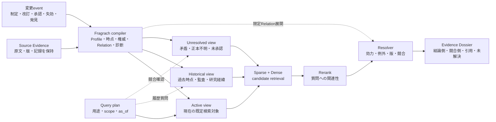

  

# Fragrach要件分析：動的な企業知識

文書区分: 要件分析  
文書体系: 2 / 3  
基準日: 2026-08-04  
根拠文書: [Fragrach要件根拠：RAG技術の現状評価](01-rag-technology-assessment_ja.md)  
後続文書: [Fragrach要件定義：システム要件と評価基準](03-fragrach-requirements-definition-and-evaluation_ja.md)

## 本書の位置づけと問い

本書は、Fragrachの正式な要件文書群において、外部研究から製品・システム要件を導く第二文書である。[RAG技術の現状評価](01-rag-technology-assessment_ja.md)で整理した一般的な文献状況を根拠としながら、Fragrachが解こうとしている問題設定を批判的に検討する。本書は仮説、反証可能性、設計上の選択を整理し、後続の要件定義へ判断根拠を渡す。

中心となる仮説は、企業の文書集合は固定された知識庫ではなく、基準の制定・改廃、個別例外、実施記録、新しい研究成果、障害から得られた知見などによって継続的に状態が変わる、というものである。その結果、文書の検索上の関連性が変わらなくても、業務判断に使用できるか、どの範囲で優先されるか、現在の質問へ答える根拠になるかは変化する。

同時に文書数は増え続ける。Dense retrievalは大きく異質な索引で意味的なfalse positiveを増やし得るため、導入時に調整した検索精度が時間とともに維持される保証はない。Fragrachは、この二つの変化を文書Profile、適用時点、権威、状態、版系列、例外、矛盾などとしてコンパイルし、Hybrid RAGが検索する対象と回答に使用する根拠を制御する役割を担う、という構想である。

この構想には十分な合理性がある。しかし、そのままでは「文書の有効度」「不要文書の削除」「納入時が最高精度」「Hybrid RAGのmetadata」という表現が問題を単純化しすぎる。Fragrachの必要性を立証するには、これらを反証可能な設計仮説へ言い換える必要がある。

## 問題を三つに分ける

Fragrachの問題設定には、性質の違う三つの変化が含まれている。

第一は、規程、標準、契約、手順、設計仕様のような規範的文書の変化である。新版が旧版を置き換え、追補が一部条項だけを変更し、期限付き指示や顧客別契約が一般規則への例外になる。この場合、「何が正しいか」は文書の新しさだけでは決まらず、対象時点、適用範囲、承認状態、権威、文書間の優先関係から決まる。

第二は、研究、障害分析、品質調査、実験結果のような認識的知識の変化である。新しい証拠によって従来仮説が弱まり、原因説明が修正され、暫定対策が恒久対策へ置き換わる。ここでは新版が旧版を単純に無効化するとは限らない。古い研究結果も、当時の判断、再現条件、否定された仮説を説明する証拠として残る。

第三は、コーパス規模と構成の変化である。内容が正しい文書であっても、似た表現を持つ別部門、別製品、別時点の文書が増えると、固定top-kの候補へ入りにくくなる。これは文書の有効性とは別の、検索空間の希釈と候補競合の問題である。

三つを一つの「文書有効度score」へまとめると、どこで判断を誤ったか分からなくなる。Fragrachが扱うべきなのは、単一の有効度ではなく、質問に対してその文書をどの役割で使用できるかという、時点・範囲・関係に依存した適格性である。

## 文献は動的知識の問題をどこまで支持するか

### 古い情報は、現行情報と共存するだけでも害になる

[HoH: A Dynamic Benchmark for Evaluating the Impact of Outdated Information on Retrieval-Augmented Generation](https://aclanthology.org/2025.acl-long.301/) は、ACL 2025の査読論文である。現実の事実変化から時系列QAを作り、旧情報がknowledge baseへ残ると、現行情報も取得されているにもかかわらず回答精度が低下し、有害な回答へ誘導される場合があると報告した。問題は更新情報を追加するだけでは解決せず、retrieverとgeneratorの双方が旧情報の共存に弱かった。

これはFragrachの問題設定を直接支える。企業文書でも、新版を追加しただけで旧版、FAQ、共有copy、過去の実施記録が同じ候補集合へ残れば、LLMにどれを採用すべきか委ねることになる。検索Recallが高くても、使用してはいけない根拠が一緒に入れば回答品質は下がり得る。

[When Facts Change: Temporal Knowledge Conflict Resolution in LLMs](https://aclanthology.org/2026.findings-acl.103/) は、モデル内部の知識と新しいcontextが時間的に衝突する場合を調べたFindings of ACL 2026の論文である。モデルは変化した事実に対して時間的な説明を生成することがあっても、その認識が最終予測へ安定して反映されない。したがって、根拠を取得できればLLMが自然に新旧を解決する、という前提は弱い。

### 時間は関連度とは別の検索信号である

[Re³: Relevance & Recency Retrieval for Mitigating Temporal Hallucination](https://aclanthology.org/2026.acl-long.1180/) は、ACL 2026で、意味的関連性と時間的適合性のずれ、旧版文書の干渉を別々の問題として扱った。time-aware relevanceと、競合する旧事実を抑制するrecency filterを組み合わせている。この研究は、通常のsimilarity scoreだけでは時間的に正しい文書を選べないというFragrachの前提と整合する。

ただし、企業文書ではrecencyだけでも足りない。新しいdraftより古い承認済み標準が有効な場合、最新の会議メモより正式な契約が優先される場合、期限付き例外が一般規則を一時的に上書きする場合がある。Fragrachは「新しい文書を上げる仕組み」ではなく、時点、状態、権威、範囲、優先関係を分離する必要がある。

### 継続的なknowledge driftはvanilla RAGにも残る

[RAG or Learning? Understanding the Limits of LLM Adaptation under Continuous Knowledge Drift in the Real World](https://aclanthology.org/2026.findings-acl.546/) は、時間順に変化する現実のeventを用いたFindings of ACL 2026の評価で、vanilla RAG、continual fine-tuning、knowledge editingのいずれも継続的なknowledge driftで苦戦すると報告した。提案baselineのChronosは、取得した証拠をEvent Evolution Graphとして段階的に整理する。

この結果は、Fragrachを単なる検索精度向上器ではなく、知識の変化過程を保存する仕組みとして捉える根拠になる。一方、同論文の対象は一般世界のeventであり、企業文書の権威体系、承認、例外、監査要件を直接評価したものではない。Fragrach固有の価値は別に実証しなければならない。

[Respecting Temporal-Causal Consistency: Entity-Event Knowledge Graph for Retrieval-Augmented Generation](https://aclanthology.org/2026.eacl-long.90/) は、EACL 2026で、通常RAGは時間構造を持たず、一般的なKnowledge Graphはentityの異なる時点の状態を一nodeへ潰しやすいと指摘した。EntityとEventを別graphとして保持するE²RAGは、ChronoQAの時間・因果質問で改善した。この問題設定は、文書と版だけでなく、提案、承認、実施、失効、訂正といったeventを別に持つべきだというFragrachの設計と近い。

### 矛盾は取得後のLLMだけでは安定して解けない

[ConfRAG](https://aclanthology.org/2026.acl-long.11/) は、1,814件の現実の質問と異種Web文書を使ったACL 2026のbenchmarkで、57.2%の質問に明示的な矛盾が含まれる。GPT-4.1やClaude 3.7 Sonnetでも、矛盾する回答の整理、網羅、理由説明に大きな余地が残った。[MAGIC](https://aclanthology.org/2025.findings-emnlp.466/) も、複数context間の矛盾を検出し、その発生源を特定することが、特にmulti-hop条件で難しいと報告する。

これらは、競合文書を無加工でLLMへ渡し、自然言語推論だけで解決させる設計への反証になる。ただし、Fragrachが抽出したRelationが誤っていれば、誤りを構造化して強く適用する危険もある。構造化は自動的に安全なのではなく、誤Relationを検出し、決められない場合に`unresolved`へ落とせる場合に限って利点になる。

## 中心仮説への批判

### 「文書の有効度は都度変わる」は正しいが、有効度は一つではない

企業文書の使用可能性が変化するという観察は正しい。しかし、一つの文書に単一の有効・無効を付けると、現在の業務判断と過去の監査を両立できない。

たとえば、失効した規程は現在の手続きを決める根拠には使えないが、過去の事故時点でどの規則が適用されていたかを答えるには必要である。却下された研究仮説は、現在の結論には使えないが、なぜその実験を行ったかを説明する証拠になる。共有copyは正本ではないが、誰がどの情報を見ていたかを調べる記録として価値を持つ。

したがって、Fragrachが保持すべきなのは少なくとも、文書の役割、適用範囲、valid time、記録された時点、承認状態、正本性、権威、版系列、例外関係、実施関係である。最終的な採否は質問の`as_of`、対象組織、製品、契約、用途と組み合わせて決める。文書単独の「有効度」ではなく、質問に対する使用資格を計算する必要がある。

ただし、これらをすべて同列の出力属性としてLLMに抽出させる必要はない。企業の文書管理情報に文書番号と版があればそれを決定的なidentityとして採用し、細かな日付、対象、承認記述、変更理由は原文Evidenceとchunkに残せる。Compilerの主要な中間表現は、文書Aに対して文書Bが現在の判断を置き換える`dominates`、条件内だけ変更する`conditional`、判断を変更しない`non_effective`、採用側を確定できない`unresolved`の四つへ縮約する。この四値は文書品質の単一scoreではなく、対象時点とscopeを伴う文書間の位置づけである。

この縮約により、検索・回答時のLLMへ多数の独立属性から優先関係を再構成させずに済む。一方、Compilerが四値を誤れば影響が広がるため、判定は必ず文書ID、相手文書、原文Evidence、条件を参照可能にしなければならない。文書番号が存在しない場合も、ファイルパス由来の内部IDを企業文書IDの代用品として断定せず、identity不足として扱う。

### 「動的関係を考慮して検索する」は、検索前・検索後に分解すべきである

Relationを考慮すること自体は妥当だが、すべてをretrieval scoreへ混ぜるべきではない。対象外の部門、未承認draft、指定時点外の文書は、候補生成前のfilterで除ける。SparseとDenseは、残った範囲から質問に関係する文書を広く見つける。`supersedes`、`amends`、`exception_to`、`conflicts_with`の展開は、検索で見つけた文書の相手側を補うために検索後へ置ける。最後にResolverが、回答へ使う側、比較のために示す側、履歴としてのみ使う側を分ける。

この分解が必要なのは、関連性と効力が別の判断だからである。旧版は質問と非常に関連していても現在の結論には使えず、例外通知は一般語彙では質問と遠くても特定設備には最優先になる。単一scoreで両者を混ぜると、weight調整でしか振る舞いを説明できなくなる。

### 「文書が増えるのでDense精度は落ち続ける」は必然ではない

前の調査で扱った[BM25 Wins at Scale](https://arxiv.org/abs/2607.26497) と[When More Documents Hurt RAG](https://arxiv.org/abs/2606.11350) は、規模拡大によるDenseの劣化とHybridでさえ起こる検索希釈を支持する。ただし、文書が一件増えるごとにDense精度が単調に下がる、という法則ではない。新しい文書が質問coverageを増やして精度を上げることもあり、domain scoping、metadata filter、embedding更新、hard-negative学習、candidate depth、rerankerによって劣化率は変わる。

より正確な仮説は、「静的に調整されたretrieval pipelineは、コーパスの規模と構成が変わると、候補分布が変化して校正を失う」である。Fragrachが解くべきなのはDenseそのものの限界ではなく、異なる時点・範囲・役割の文書を一つの平坦な候補空間へ混ぜる必要を減らし、検索器が識別すべき集合を保守可能にすることである。

### 「不必要な文書のダイエット」は削除ではなく検索階層化と考えるべきである

古い文書を物理的に削除すれば、現在の質問に対するnoiseは減る。しかし、監査、訴訟、事故調査、過去時点のQA、研究経緯の説明に必要な証拠も失う。さらに、何が不要かをFragrachが誤判定した場合、rerankerやfallbackで救えなくなる。

したがって、文書ダイエットはsourceの廃棄ではなく、active retrieval viewからの退避として設計する方が安全である。現行・承認済み文書を既定laneへ置き、失効・却下・参考・重複文書をhistoricalまたはarchive laneへ移す。未解決矛盾や正本不明はquarantine laneへ置き、通常回答では断定に使わない。過去時点、変更履歴、監査の質問ではarchiveを明示的に再参加させる。原文Evidenceは保持し、検索への参加資格だけを変える。

### 「納入時が最高精度」は警告として有効だが、事実としては強すぎる

RAGでは通常、文書追加のたびにモデルをfine-tuneするわけではない。ここで起きるのはfine-tuningの劣化というより、chunking、BM25設定、fusion重み、metadata、reranker、top-k、質問分布に対する校正の劣化である。「納入時がファインチューンにより最高精度」という表現は、モデル学習とretrieval tuningを混同する。

また、納入後に良質な文書や利用feedbackが増えれば精度が向上する可能性もある。したがって、納入時が必ず最高とは言えない。批判すべきなのは、初回benchmarkだけで品質を保証し、その後の文書増加、版変更、関係抽出の遅延、索引driftを測らない運用である。

Fragrachが示すべき価値は、「初期精度を固定する」ことではなく、変更が入ってから新しいKnowledge Buildが安全に公開されるまでの時間を制御し、時間経過による品質低下を観測して回復できることである。製品KPIも導入時の最高点ではなく、継続運用中の最低品質、更新追従時間、誤った旧版使用率で定義した方がよい。

## Fragrachをcompilerと呼ぶための条件

「Hybrid RAGへmetadataを付ける」という説明では、Fragrachの役割を小さく見積もりすぎる。一方、LLMで文書へtagを付けるだけならcompilerという表現は強すぎる。compilerと呼ぶには、入力、変換規則、中間表現、検証、成果物、失敗条件が再現可能でなければならない。

Fragrachの役割は、原文を別の知識へ置き換えることではない。変化するsource corpusから、用途と時点に応じた検索可能なviewを生成し、そのviewがどの原文と変換規則から作られたかを追跡可能にすることである。少なくとも次の性質が必要になる。

- 原文Evidenceを不変の根拠として保持し、ClaimとRelationから必ず戻れる。
- 文書Profile、valid time、scope、authority、statusと、文書間Relationを型付きの中間表現にする。
- LLM抽出結果をそのまま採用せず、schema、Evidence参照、日付、scope、relation endpointを決定的に検証する。
- 変更された文書と、その文書に依存するProfile、Claim、Relation、Dossierだけを失効させる。
- 未解決Conflict、Relation欠落、正本不明をscoreで推測せず、診断とともに公開停止または限定公開できる。
- 同じsource、用途、規則、model条件から同じBuildを再現し、変更差分を説明できる。
- 旧Buildを残し、指定時点の判断と、その判断に使われた根拠を再現できる。

この境界を守るなら、FragrachはHybrid RAGのmetadata generatorではなく、検索対象と回答可能性を制御するknowledge compilerと呼べる。逆に、Relation抽出が非決定的で、更新のたびに全件を再抽出し、誤りを検証できず、最終的にはLLMへ丸投げするなら、複雑なGraph前処理との差は小さい。

## 提案する動的Knowledge Build

Fragrachの構想を、全面Graph RAGではなくHybrid RAGのcontrol planeとして表すと、次のようになる。

この構成では、SparseとDenseは関連文書を探す責務を保つ。Fragrachはembeddingを置き換えず、検索対象のpartition、候補へ付く文書役割、候補間の関係、回答時の採否を供給する。Graphは全質問の主索引ではなく、版、追補、例外、実施、矛盾を解決する限定的な依存関係として使う。

重要なのは、Buildを継続的に更新できることである。新しい文書が入ったとき、source全体を再コンパイルするのではなく、同じ文書系列、参照先、競合候補、Dossierを影響範囲として再評価する。新Buildは検証が完了してから原子的に公開し、それまでは直前の安全なBuildを使う。更新失敗を理由に不完全なindexへ切り替えない。

## この構想の主要な失敗条件

最も大きい危険は、Fragrachが検索誤りを減らす代わりに、compile誤りをsystem-wideな規則として固定することである。誤った`supersedes`は正しい現行文書をarchiveへ追い出し、誤った`exception_to`は一般規則を不当に無効化する。Raw RAGの誤りが質問単位で起きるのに対し、誤Buildは多数の質問へ伝播し得る。

第二の危険は、企業内に判定可能なmetadataが存在しないことである。施行日、承認状態、正本、対象製品が原文にも管理台帳にもなければ、compilerは正解を生成できない。Fragrachは不完全な組織運用を推測で補う製品ではなく、不足を診断し、人に確認を要求する必要がある。

第三の危険は、知識の変化をすべて版系列として扱うことである。研究知見は複数仮説が並存し、信頼度が段階的に変わる。規程向けの`current`対`superseded`を研究文書へ適用すると、科学的な不確実性を消してしまう。規範的文書、記録、研究、提案では、異なる状態遷移とResolverが必要になる。

第四の危険は、更新遅延と費用である。Relation抽出に時間がかかり、文書追加から公開まで数時間または数日遅れるなら、通常RAGへ即時追加する方が新鮮な場合がある。Raw Evidenceの即時laneと、検証済みBuildのlaneを分け、未コンパイル文書をどう扱うかを明示しなければならない。

第五の危険は、Fragrachの効果とscope縮小の効果を混同することである。利用目的や部門で12文書へ絞れば、それだけで検索は改善する。Relation compiler固有の価値を主張するには、同じscope、同じHybrid、同じrerankerを使い、Profile、Relation、Resolverだけを追加した比較が必要である。

## 仮説を反証可能にする評価

Fragrachの評価は、一回の固定corpusで最高精度を測るだけでは足りない。文書が時間順に追加・改訂される過程を再現し、各時点で同じ質問群と新しい質問群を実行する必要がある。

比較条件は段階的に分ける。

| 条件 | 構成 | 分離して測る効果 |
|---|---|---|
| B0 | 全文書に対するTuned Hybrid＋同一reranker | 静的な強い通常RAG |
| B1 | B0＋部門・用途・製品scope | 検索空間を絞る効果 |
| B2 | B1＋時点・承認状態・文書Roleのfilter | Profile metadataの効果 |
| B3 | B2＋版・追補・例外・正本Relation | Relation compilerの増分 |
| B4 | B3＋active／historical／unresolved view | 文書ダイエットを削除せず行う効果 |
| B5 | B4＋incremental compile、Build Gate、Dossier | 継続運用全体の効果と費用 |

コーパスは、初期納入時、文書追加後、規程改訂後、期限付き例外の発行・失効後、研究仮説の反証後、誤Relation訂正後というsnapshotに分ける。質問も、現在のルール、指定時点のルール、変更理由、例外、実施済みか提案段階か、矛盾が未解決かを含める。

主要指標は、通常のRecall@kだけでは不十分である。

| 評価軸 | 指標例 | 検証すること |
|---|---|---|
| 現在正確性 | Current Strict Pass、旧版使用率、禁止誤答率 | 現行判断を誤らないか |
| 履歴保持 | As-of Strict Pass、履歴Evidence recall | archive化で過去を失わないか |
| 変更追従 | source変更から安全なBuild公開までの時間 | 納入後も品質を回復できるか |
| 関係品質 | Relation precision／recall、誤Relation影響質問数 | compile誤りを制御できるか |
| 不確実性 | 正本不明・競合時のabstention、誤断定率 | 不足を推測で埋めないか |
| 規模耐性 | snapshot別candidate Recall、nDCG、不要候補率 | 文書増加による希釈を抑えたか |
| 効率 | 再処理文書数、LLM tokens、索引量、query latency | 全件Graph化より持続可能か |
| 再現性 | 同一入力Build hash、差分説明率、rollback成功 | compilerとして監査可能か |

この評価でB1がほぼすべての改善を生み、B3以降の増分がないなら、必要なのはFragrachではなく適切なmetadata scopingである。B3が版・例外質問だけを改善するなら、Fragrachの価値は限定Relation compilerにある。B4が現在QAを改善しても履歴QAを壊すなら、文書ダイエットの設計は失敗である。B5の更新遅延が大きく、古いBuildを長く使うなら、静的精度が高くても動的システムとしては成立しない。

## 現在のFragrach実測が示すこと

Fragrach内では、この構想の一部に初期証拠がある。[文書有力度Resolver Oracle比較](../research/document-validity-oracle-comparison_ja.md) では、28問の固定候補に対し、関連度のみのDecisionは11.4%、metadataの単一加重は22.8%、scope・role・承認・時点を順に扱うFilter-firstは84.8%、Oracle Relationを使うResolverは100%だった。少なくとも評価上は、効力判断をrelevance scoreへ混ぜるより、filterとRelationへ分ける方が適していた。

[Document Profile・Relation抽出比較](../research/document-profile-extraction-comparison_ja.md) では、Goldではなく実際に抽出したProfileとRelationを使い、同じ開発28問で100%を再現した。ただし、この集合を使ってprompt、normalizer、resolverを改善した後の値であり、未知文書への一般化ではない。別評価ではRelation欠落や誤接続が残っており、compiler誤りが現実の主要リスクであることもすでに見えている。

[Relation Dossier Actual評価](../evaluations/relation-dossier-actual-evaluation-2026-08-02_ja.md) では、同じgovernance scopeに絞ったRaw Tuned + Purposeに対し、Relation Dossierが検索R@5を58.3%から83.3%、引用再現率を50.0%から75.0%へ改善した。一方、入力tokensと待ち時間は大幅に増え、Relationの一件取りこぼし、回答slotへの変換失敗もあった。これはcompilerの可能性と、複雑性による損失の双方を示す結果である。

現段階で示せていないのは、時間順に更新される大きなcorpusで、FragrachがHybridの劣化を継続的に抑えることである。現在の評価は固定snapshot、小規模集合、開発に使用したValidity問題を多く含む。したがって、「動的企業知識のcompiler」という製品仮説は合理的だが、まだ実証済みの製品価値ではない。

## 検討結果

Fragrachの中心的な問題設定は妥当である。企業RAGの難しさは、質問に似た文書を見つけることだけではなく、増え続ける文書の中から、その時点、その対象、その用途で使用できる根拠を選び、旧版、例外、研究経緯、未解決矛盾を失わずに扱うことにある。時間的knowledge drift、旧情報の干渉、矛盾推論の不安定さを扱う近年の研究も、この問題が通常のsemantic retrievalだけでは解けないことを支持している。

ただし、Fragrachの主張は次のように絞る方が強い。

> FragrachはDense retrievalを置き換えたり、文書に一つの有効度を付けたりするものではない。変化する企業文書から、原文と履歴を保ったまま、用途・対象・時点ごとの検索view、文書間の効力関係、未解決事項を再現可能にコンパイルし、強いHybrid RAGが誤った文書を使用する確率を継続的に下げる。

この定義なら、Fragrachの競争相手は一般的なGraph RAGではない。静的なvector indexを納入して終わるRAG運用と、metadataを人手で保守する検索基盤が比較対象になる。Fragrachが必要であることを示す決定的な証拠は、初回の検索最高点ではなく、文書が増え、規則が変わり、例外が失効する複数snapshotを通じて、current QAとhistorical QAを同時に維持し、更新遅延と誤Relationを制御できることである。
