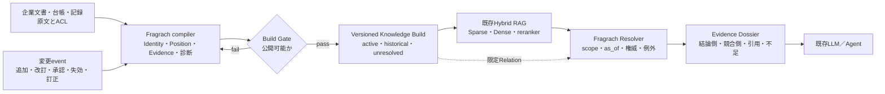

  

# Fragrach要件定義：システム要件と評価基準

**Dependency-aware Living Corpus RAG**

文書区分: 要件定義・検証基準  
文書体系: 3 / 3  
基準日: 2026-08-04  
要件根拠: [Fragrach要件根拠：RAG技術の現状評価](01-rag-technology-assessment_ja.md)  
要件分析: [Fragrach要件分析：動的な企業知識](02-dynamic-enterprise-knowledge-requirements-analysis_ja.md)

本書では、法律、社内基準、新しい発見などによって、文書の有効性と相互関係が変わり続ける集合をLiving Corpusと呼ぶ。Dependency-awareは、文書を単体で扱うのではなく、改訂、失効、例外、根拠、適用範囲などの関係を明示的に扱うことを表す。

## 本書の位置づけ

本書は、Fragrachの正式な要件文書群における第三文書であり、システムが満たすべき要件と、その成立を判定する評価基準を規定する。[動的な企業知識に対する要件分析](02-dynamic-enterprise-knowledge-requirements-analysis_ja.md)で得た判断を、実装と検証が参照できる要求へ落とす。必須要件と評価基準について前二文書と表現が異なる場合は、本書を規定側として扱い、前二文書はその根拠として参照する。

Fragrachが何を解くのか、そのために何を必須要件とするのか、既存技術とどこが同じでどこが異なるのか、差別化が本当に成立したかを何で測るのかを、本書で一つにつなぐ。

Fragrachの前提は、企業文書を固定された検索対象として扱えないことである。規程の改廃、追補、期限付き例外、承認、実施記録、新しい研究結果によって、同じ文書の回答上の役割は変化する。同時に文書数が増え、意味的に似ているが対象・時点・権威が異なる文書が検索候補を希釈する。

したがって、Fragrachの目的は新しいretrieverを作ることではない。変化する文書集合を、原文と履歴を失わずに、用途・対象・時点ごとの検索viewと判断可能な根拠へ変換し、既存のHybrid RAGへ供給することである。

> Fragrachは、企業文書の状態と関係を検証可能なKnowledge Buildへ変換し、強いHybrid RAGが「関連しているが使用してはいけない文書」を回答根拠に採用する確率を継続的に下げるKnowledge Compilerである。

この定義には、「Graphを作る」「metadataを付ける」「古い文書を除く」以上の要件が含まれる。

## 中心指標：文書効力考慮根拠採用スコア（DVAA）

Fragrachの差を最も直接に表す指標を、**Document Validity-Aware Adoption（DVAA、文書効力考慮根拠採用スコア）**とする。DVAAは、回答の正誤ではなく、回答が必要な主張を質問に適用できる根拠で支えたかを測る。回答値の正しさはAccuracyで別に測る。

### 指標の出自

直接の出発点は、Kimらの2026年の論文「[Program-Verifiable Evaluation for Temporal QA: Metrics for Evidence Validity](https://doi.org/10.1109/ACCESS.2026.3679691)」が示した、回答正解とEvidence validityを同一視しない考え方である。同論文が主に時間区間を扱うのに対し、DVAAは時間に加えてscope、承認状態、権威、置換、追補、例外、競合などの文書依存関係を扱う。ただし、Accuracyとは結合せず、根拠採用の指標として独立させる。

### Recall、Accuracy、DVAA

| 指標 | 指標の説明 | 算出方法 | 数値の読み方 |
|---|---|---|---|
| Recall@k | 必要な文書を検索上位k件までにどれだけ取得できたかを測る | 質問ごとの必要文書取得割合を全質問で平均する | 0から1。高いほど検索漏れが少ないが、回答の正しさや根拠採用の妥当性は保証しない |
| Accuracy | 最終回答の値または判断が正解と一致したかを測る | 正答を1、誤答を0として全質問で平均する | 0から1。高いほど正答が多いが、使った根拠が有効かは分からない |
| DVAA | 必要な主張を適用可能な根拠でどれだけ支え、有害な根拠を避けたかを測る | 必要主張の加重カバレッジから有害文書の採用ペナルティを引き、全質問で平均する | −1から1。1は必要主張をすべて有効な根拠で支えた状態、0は加点も減点もない状態、負値は有害文書を根拠として採用した状態を表す |

### 定義

質問 \(q\) の必要主張集合を \(C(q)\)、主張 \(c\) の重みを \(w_c\)、その主張を独立して裏付け、依存関係上も質問へ適用できる文書集合を \(A_c(q)\)、回答が根拠として採用した文書集合を \(D(q)\) とする。

\[
I_c(q)=
\begin{cases}
1 & A_c(q)\cap D(q)\neq\varnothing\\
0 & \text{otherwise}
\end{cases}
\]

\[
P(q)=\frac{\sum_{c\in C(q)}w_c I_c(q)}{\sum_{c\in C(q)}w_c}
\]

質問に対する有害文書集合を \(B(q)\)、文書 \(d\) の採用ペナルティを \(h_d\) とする。

\[
H(q)=\min\left(1,\sum_{d\in B(q)\cap D(q)}h_d\right)
\]

質問単位のDVAAは次である。

\[
\operatorname{DVAA}(q)=P(q)-H(q),\qquad -1\leq\operatorname{DVAA}(q)\leq1
\]

評価集合 \(Q^*\) のDVAA-Grossは、\(\operatorname{DVAA}(q)\) の算術平均とする。必要主張に個別の重みを定めていない場合は等重みとする。AccuracyはDVAAの加点条件に含めない。

### 許容文書と依存関係

同じ主張を独立して裏付け、文書間の依存関係が結論を変えない文書はOR条件とする。異なる必要主張は重み付きで加算する。版、適用範囲、承認状態、置換、追補、例外、競合などの依存関係が結論を変える場合だけ、\(A_c(q)\) を質問へ適用できる文書へ限定する。

明示されていない文書はneutralとして扱い、加点も減点もしない。harmfulに分類するのは、その文書を正しい根拠として採用すると回答が具体的に間違う場合だけである。旧版、草案、対象外、競合文書という属性だけで自動的に減点しない。過去時点を問う質問では旧版がacceptableになることもある。

| 状態 | DVAAの扱い |
|---|---|
| 指定文書と同じ主張を、依存関係のない別文書で独立して裏付けた | 同じ主張のacceptable文書として同じ加点を与える |
| 必要主張の一部だけを裏付けた | 主張の重みに応じて部分点を与える |
| 失効済み文書を現在の根拠として採用した | harmful契約に該当する場合はペナルティを引く |
| 無関係な文書を採用した | neutralとして0。ノイズや効率は別の診断値で見る |
| 回答は正しいが有効な根拠を採用していない | Accuracyは1になり得るがDVAAの加点は0 |

### 評価契約と採点可能性

評価契約は、方式の回答を見る前に、質問、Gold回答、原文Evidence、全方式で共通の候補文書から次を凍結する。

- 必要主張とその重み
- 主張ごとの許容文書集合
- 版、scope、承認、置換、例外、競合などの依存関係制約
- neutral文書とharmful文書
- harmful文書ごとのペナルティ

Gold側の回答または必要主張を原文から支持できない質問は`disputed`として残し、Recall、Accuracy、DVAAの分母から除外する。複数の文書が同じ主張を正当に裏付ける場合は、単一文書IDへ固定せず許容集合を持つ。Fragrachの出力に合わせて契約を後付けしてはならない。

DVAA Fullは、必要主張、許容文書集合、依存関係制約、neutral／harmful分類、ペナルティ、回答による文書採用、引用の実在性を人が確認した値である。Solが契約を凍結した値は`DVAA-Gross(sol)`と表記する。計算式は同じである。

通常RAGとの比較では、同じ質問、候補budget、reader、回答形式、引用要件を使う。通常RAGも必要主張を適用可能な根拠で支えれば同じ点を得る。Fragrach固有の内部ラベルがなければ採点できない指標にはしない。

## Fragrachが解く範囲

Fragrachが対象とするのは、検索関連度だけでは決められない文書の採否である。

- 旧版と現行版のどちらを現在の回答へ使うか。
- 基本文書と追補をどのように合成するか。
- 一般規則と顧客・設備・期間限定の例外をどう併記するか。
- 提案、承認、実施記録を区別し、実施済みかをどう判断するか。
- 正本、共有copy、FAQ、研究メモの役割をどう区別するか。
- 矛盾を解けないとき、どちらかを推測で採用せず、何が不足しているかをどう返すか。
- 現在の回答精度を上げながら、過去時点の監査と研究経緯をどう保持するか。

語彙差、言い換え、一般的なsemantic similarityだけが問題なら、Tuned BM25、Dense、Hybrid、rerankerを先に改善する。Fragrachはその代替ではなく、それらが見つけた候補の使用資格と関係を扱う。

## 必要要件

必要要件は、個別機能ではなく、動的文書を安全にRAGへ渡すための契約として定義する。現在の実装状況は、既存資料と評価に基づく2026年8月5日時点の整理であり、製品保証ではない。

| ID | 必要要件 | 必要な理由 | 現在の状態 |
|---|---|---|---|
| R1 | 原文Evidenceと位置の不変保持 | 要約・Claim・Relationが誤っても原文へ戻り、引用と監査を成立させる | 実装済み。EvidenceとprovenanceをBuildへ保存 |
| R2 | 文書identityの保持 | 文書番号と版をファイルパス由来の内部IDから分離し、改名後も変更系列を結べるようにする | `document_id`と`revision`をProfileへ追加。文書管理システムとの永続対応は未実装 |
| R3 | 文書間の位置づけへの縮約 | 詳細属性を回答時に再推論せず、`dominates`、`conditional`、`non_effective`、`unresolved`で採否を表す | 四値SchemaとDossier出力を実装。50系列の明示metadata 90件を90件再現し、100件の詳細Gold Relationを四値へ写像できた。明示metadataがない文書の推論は未解決 |
| R4 | 質問相対のResolverと回答資料契約 | 文書単独の有効度ではなく、用途・scope・`as_of`に対する使用資格を決め、結論本文と効力を確定する台帳を一つの回答資料として渡す | VersionQAでは質問型別Packet、MultiHop-RAGではobligation別source diversityと不可分原文Packetが有効。EnterpriseRAG-Benchでは検索1位を全文保護し、質問型別に残りの縮約量とReader checklistを決めるPosition Dossierを実装したが、同予算の強いVanillaに完全根拠付き正答率で勝たず、性能差別化は未成立 |
| R5 | active／historical／unresolved view | 現在QAのnoiseを減らしながら、履歴・監査・未解決Conflictを失わない | 設計要件。物理的なview運用は未完成 |
| R6 | Usage IntentをBuild identityにする | 同じ原文から、現行手順、監査、研究調査など異なる品質契約を作る | 基本Schemaあり。対象scope、期待Relation、回帰基準は拡張が必要 |
| R7 | 決定的検証とBuild Gate | LLM抽出をそのまま公開せず、参照、型、日付、Conflict、欠落を検査する | 実装済み。四値Position、確認台帳Evidence、判断chunkのscale gateを追加。一般コーパス向け完全性規則とACL gateは未完了 |
| R8 | 不確実性と棄却 | 正本不明、Relation不足、矛盾時に誤ったcanonicalを選ばない | `unresolved`と失敗Buildは対応。質問時の一貫適用は改善中 |
| R9 | 差分コンパイルと影響追跡 | 文書追加のたびに全件LLM処理せず、依存するArtifactだけ更新する | `scan`の追加・編集・削除検出、Source単位のClaim抽出cache、現在Manifestからの新Build生成、Build間の検索レコード差分exportを実装。未変更レコードを省き、追加・更新を`upsert`、消失IDを`delete`として出力し、適用結果と対象Buildのフルexportが一致する回帰テストを追加した。Profile抽出はコーパス全体で無効化され、Relation依存closureと問単位checkpointは未完成。`recompile`はSource変更の反映手段ではない |
| R10 | 原子的公開、版管理、rollback | 不完全なBuildを検索へ出さず、過去回答を再現する | Buildの原子的公開と旧Build保持を実装。差分exportには`base_build_id`、`target_build_id`、Source Manifest hash、操作件数を持つ`commit`を実装した。個別index adapterでのstaging transaction、current Build切替、rollback自動化、安全消去は未整備 |
| R11 | 検索基盤からの独立 | BM25、Dense、reranker、Vector DBを置き換えず、既存RAGへ接続する | JSONL／YAML出力あり。主要基盤adapterは利用者側 |
| R12 | 権限の継承と非拡大 | compileやDossierによって、原文より広い閲覧権限を作らない | 必須要件だが、企業向けACL伝播は未実装 |
| R13 | 文書種別別の状態モデル | 規程の失効と研究仮説の反証を同じlifecycleで処理しない | 一部role分離あり。domain別状態遷移は未整備 |
| R14 | 継続評価 | 初回精度だけでなく、文書増加と改訂を通じた品質を測る | T0 838文書／T1 988文書の二段階scale trackを実装し予備評価済み。実ログ分布とT2以降は未完成 |
| R15 | 必要根拠被覆付きDossier縮約 | 全文を渡さず、必要根拠の組を壊さない範囲だけを不可分にする | `rank1-complex-10`で必要根拠の保持を改善し、平均66,886字を50,735字へ削減。ただし完全根拠付き正答率はBaseで同予算Vanillaと39.6%の同率、共通ChecklistではVanilla 44.0%対Fragrach 42.9%で、回答優位へ変換できていない |

R1、R7、R8、R10、R12は安全性の境界である。検索精度が高くても、原文へ戻れない、未解決を断定する、権限を広げる、不完全Buildを公開するならKnowledge Compilerとしては不合格になる。

R4の社内診断trackでは、同じfresh Buildのdense-onlyに対しDecision Packet laneが完全根拠付き正答率を43.3%から98.3%へ改善した。同じ汎用構造を外部VersionQAへ適用するとAccuracy 52.8%、完全根拠付き正答率32.1%に留まった。そこで`content`、`inventory`、`change`ごとの質問相対Packetを実装し、原文矛盾7問を除く53問でAccuracyと完全根拠付き正答率が100%となった。Positionだけでは不十分であり、質問型に応じて指定版本文、完全な版一覧、意味差分、不在証明を不可分な回答資料にすることがR4の実装要件である。ただしVersionQAは改善に使った開発集合なので、R4の一般化完了は凍結方式を別データセットで再現するまで保留する。

外部分布では、MultiHop-RAGのuntouched holdoutで質問obligationごとに異なる記事と選択chunkを不可分にしたPacketの完全根拠付き正答率は26.7%だった。一方、EnterpriseRAG-Benchでは開発集合でBM25がBM25 top-50内のRuri候補再順位づけ、obligation RRF、四種の選択ゲートを上回った。このRuri実験は全コーパスDenseでもANNでもないため、Dense一般の棄却根拠にはしない。強いVanillaとの同時比較では完全根拠付き正答率がBaseで同予算Vanillaと39.6%の同率、共通ChecklistではVanilla 44.0%対Fragrach 42.9%、Full Vanilla 46.2%だった。Checklistは全方式を改善しFragrach固有ではない。したがってR4の制御・監査上の設計価値と、通常RAGに対する性能優位を分離する。現実装の性能差別化は未成立であり、強い通常検索を保持しつつ、質問型別構造が追加した根拠を回答成功へ変換できるまで改善が必要である。

## システム上の位置

Fragrachは検索器とLLMの間へ新しい万能層を置くのではなく、検索前のcontrol planeと、検索後のgovernance resolutionを一つのBuild契約で接続する。

この境界では、Hybrid RAGが質問への関連性を担当し、Fragrachが文書の使用資格と回答資料の構成を担当する。Graphは全コーパスの主検索方式ではなく、版、追補、例外、実施、矛盾を解決する限定Relationとして使う。

今回の評価で明確になった責任境界は、通常RAGが検索後のLLMへ暗黙に委ねている判断を、Fragrachが検証可能な中間成果物へ移すことである。通常RAGでは、取得文書から現行版を選び、基本規則と例外を合成し、旧版・draft・却下案を退け、管理台帳を効力証明に加え、解決不能な競合では断定を避けるところまで、readerが毎回本文から再推論する。Fragrachはこの部分を、`Document Identity → Position → Decision Packet → 根拠用途`として構造化する。

この構造化は、最終回答をすべてルールベースに置き換えることを意味しない。意味的な候補発見と自然言語回答には、引き続きDense・Sparse検索とLLMを使う。Fragrachが引き受けるのは、その間にある「どの文書を、どの質問条件で、なぜ判断根拠として使ってよいか」という制度的な採否である。LLMの役割をなくすのではなく、LLMに任せる判断範囲を狭め、再現可能な構造と原文Evidenceで囲うことが設計上の差になる。

## 差別化ポイント

### 1. temporalではなくinstitutional validityを扱う

時刻が新しい事実を選ぶだけなら、recency-aware retrievalやTemporal Knowledge Graphでも扱える。企業文書では、新しいdraftより古い承認済み標準が優先され、期限付き例外が一部scopeだけ一般規則を上書きし、実施記録は規程を変更しない。Fragrachは、時間に加えて文書role、承認、拘束力、scope、正本性、優先関係を扱う。

ここが最も重要な差別化仮説である。時間窓付きfact graphを作るだけではFragrachにならない。

### 2. Graphではなく公開可能なBuildが成果物である

Graph RAGやTemporal KGは、graphを継続的に更新し、query時に探索する。Fragrachの成果物はgraphそのものではなく、特定Usage Intentに対して検証され、版付けされ、公開可否が決まったKnowledge Buildである。Buildには原文Evidence、Profile、Relation、Conflict、診断、検索条件、回答契約、provenanceを含む。

同じ入力と規則からBuildを再現し、前版との差を説明し、危険なら公開を止められることが差になる。

### 3. 自動失効より、解決不能を保持する

新しいfactが古いfactと矛盾したとき、自動的に旧factを失効させる方式は高速である。しかし企業文書では、情報が新しいことと権威が高いことは一致しない。Fragrachは、適用期間、承認、scope、宣言された優先関係で決まる場合だけ採用側を決め、決まらなければ両側を`unresolved`として残す。

これは精度を上げるためだけでなく、誤った自動解決の波及を抑える設計である。

### 4. 文書ダイエットを非破壊で行う

Fragrachは旧版や却下文書をsourceから削除しない。既定検索からactiveでない文書を退避し、過去時点、変更理由、監査の質問ではhistorical viewから再参加させる。正本不明や未解決Conflictはunresolved viewへ分離する。

このため、現在QAの候補希釈を抑えることと、履歴を再現することを同時に評価できる。

### 5. 強いHybrid RAGを前提にする

Fragrachは、弱いDense baselineに対してGraphで勝つことを価値にしない。Tuned Sparse、Dense、fusion、reranker、scopeを使ったbaselineで残る、版、例外、正本、実施、矛盾の失敗だけを対象にする。Fragrachを外した方が良い質問では通常RAGを使えることも製品設計に含める。

### 6. Knowledge品質をCIの対象にする

一般的なRAG評価はquery時のRecallや回答精度を測る。Fragrachはcompile時にも、Rawで見えていたEvidenceを落としていないか、必要Relationが欠けていないか、新しいConflictが発生したか、ACLが維持されたかをGateできる。文書変更をコード変更のように差分検査し、危険なBuildを検索へ公開しないことが差別化になる。

## 差別化にならないもの

次の機能は重要だが、それだけでは既存技術に対する差にならない。

- BM25とDenseを組み合わせること。
- Graphを持つこと。
- factやedgeへvalid timeを付けること。
- 原文provenanceを保存すること。
- 増分更新すること。
- query時にmetadata filterを使うこと。
- Claimを抽出して検索すること。
- Agentへ構造化contextを渡すこと。

たとえば[Graphiti](https://github.com/getzep/graphiti)は、Temporal Context Graph、factのvalidity window、episode provenance、incremental update、current／historical query、semantic＋keyword＋graphのHybrid retrievalを提供する。したがって、「動的なtemporal graph」はFragrach固有ではない。

Fragrachの差は、それらを企業文書のinstitutional validity、Usage Intent別のCompile Contract、決定的なBuild Gate、未解決時の公開制御、可搬Artifactとして結び付けられるかにある。Graphitiもcustom ontologyで同様のRelationを表現できるため、差はデータモデルの表現能力ではなく、既定の品質契約と運用単位として実証しなければならない。

## 他技術との違い

| 技術 | 主な役割 | 動的変化の扱い | Fragrachとの関係・違い |
|---|---|---|---|
| Sparse／Dense RAG | 質問に関連するchunkを取得する | 再索引で新文書を追加する | Fragrachは置き換えず、対象viewと候補の使用資格を与える |
| Hybrid RAG＋reranker | lexicalとsemanticの候補を統合し、上位根拠を選ぶ | corpus driftは再調整・filterで対応 | Fragrachの必須baseline。関連度では決められない効力を後段で解く |
| Scoped RAG／metadata filter | 部門、製品、日付などで検索範囲を絞る | metadata更新で追従する | Profileだけで解ける範囲はこの方式で十分。追補、例外、正本、実施関係がFragrachの追加領域 |
| [Microsoft GraphRAG](https://microsoft.github.io/graphrag/) | entity communityとsummaryによるglobal sensemaking | 主にbatch index再構築 | global summarizationが中心。Fragrachは文書効力とBuild公開を中心にする |
| Temporal RAG／recency-aware retrieval | 新旧factの時間整合性を改善する | recency、time-aware embedding、conflict filter | Fragrachはrecencyに加え、承認、権威、scope、文書roleを決定規則として扱う |
| Temporal KG／Graphiti | evolving fact、validity window、provenance、incremental graph | 連続episodeをgraphへ統合し、現在・履歴を検索 | 最も近い。Fragrachはdocument-governance Build、Usage Intent、Gate、未解決公開制御、可搬成果物を差とする |
| Agentic RAG | 検索、分解、tool利用、統合を質問時に行う | 毎queryで動的に探索する | FragrachはAgentへ渡す候補空間と根拠契約を事前検証し、Agentの全文探索を減らす |
| Ontology／Semantic Layer | 企業概念、DB、metric、relationを統合する | ontologyとdata sourceを継続管理する | [AWS Context Ontology Accelerator](https://github.com/aws/context-ontology-accelerator)などの方が全社data federationに広い。Fragrachは文書BuildとRAG品質に限定する |
| 文書管理・Records Management | 承認workflow、版、保存期間、アクセス権を管理する | 正式なdocument lifecycleとして管理する | Fragrachのsource of truthになり得る。Fragrachはその情報を検索viewと回答契約へ変換する |
| fine-tuning／knowledge editing | model parameterへ知識や振る舞いを反映する | 再学習・編集で更新する | Fragrachは外部Evidenceを更新し、原文と判断時点を再現する。model内部の知識更新とは別 |

Fragrachは、文書管理システムやOntology基盤を代替しない。それらが持つ承認、正本、scope、ACLを入力として受け、RAGが利用できるBuildへ変換する位置に置く方が明確である。

## 通常のRecall@kだけでは測れないもの

通常RAGとの比較では、まず一般的な検索指標である`Recall@k`をそのまま報告する。質問`q`に関係するGold文書集合を`G_rel(q)`、検索上位`k`件を`R_k(q)`とすると、次である。

`Recall@k = (1 / |Q|) Σ_q |G_rel(q) ∩ R_k(q)| / |G_rel(q)|`

Recall@kが測るのは、必要な文書を検索候補へ入れられたかである。必要文書を取り逃す検索失敗は分かるが、取得した文書のうち何を最終判断へ使うべきかは測らない。正しい現行版と例外文書を取得できていれば、同じ上位候補に失効した旧版、別scopeの規則、未承認draftが混ざっていてもRecall@kは100%になり得る。

たとえば、特定設備に対する指定日時の停止条件を問う質問で、上位4件が次のようになったとする。

| 検索文書 | 質問との関連 | 判断根拠としての効力 |
|---|---|---|
| 承認済みの基本基準 | 関連あり | 基本規則として使用可能 |
| 期間・設備限定の例外 | 関連あり | この質問では基本基準に優先 |
| 失効した旧版 | 関連あり | 現在判断には使用不可 |
| 未承認の次期改訂案 | 関連あり | 判断根拠として使用不可 |

基本基準と例外がGoldなら、この検索結果のRecall@4は100%である。旧版やdraftまで話題上の関連文書としてGoldに含めても、4件をすべて取得しているためやはり100%になる。しかし、回答が旧版や改訂案を採用すれば企業判断としては誤りになる。PrecisionやnDCGを追加しても、文書の効力を単なる関連度labelとして事前に表現しない限り、例外が基本規則へ優先することや、新しいdraftが古い承認済み基準へ優先しないことまでは評価できない。

同じ検索結果から正答文字列が偶然一致した場合でも、case単位の採点は次のように分かれる。

| 回答が採用した根拠 | Recall@4 | Accuracy | DVAA |
|---|---:|---:|---:|
| 失効した旧版 | 100% | 100% | −1.0 |
| 承認済み基本基準＋該当例外 | 100% | 100% | 1.0 |

この差が、通常のRAG評価に対してDVAAを追加する理由である。

この不足を回答側で補うのがDVAAである。独立した中心評価は次の三つに限定する。

| 評価値 | 測るもの | 役割 |
|---|---|---|
| `Recall@k` | 必要な関連文書が上位`k`件に入ったか | 通常RAGと共通の検索評価 |
| `Accuracy` | Goldの判断labelと回答値が正しいか | 根拠と説明文を採点しない回答slot評価 |
| `DVAA` | 必要主張を、時間、scope、承認状態、権威、Relationを満たす根拠でどれだけ支え、有害な根拠を避けたか | 文書効力を考慮した根拠採用スコア |

Compiler内部のProfile精度、Relation精度、Build再現性は開発時の原因調査に使い得るが、本評価資料の正式指標には含めない。失敗時は必要主張の未採用、依存関係制約、有害文書の採用をcase単位で確認する。

## 評価プロトコル

固定corpus一回では、動的Knowledge Compilerを評価できない。主実験は、初期文書集合`D0`と追加後の文書集合`D1 = D0 ∪ ΔD`からなる二段階セットにする。既存文書を削除・書換えずに追加だけで`D1`を作ることで、検索対象の増加と文書効力の変化を再現し、初回調整済みRAGがどこまで保つかを分離する。

### 二段階データセット

| 段階 | 文書集合 | 追加内容 | 評価目的 |
|---|---|---|---|
| `T0` | `D0` | 承認済みの基本規則、初期の研究知見、既存の実施記録 | 全方式を同じ条件で初回調整し、導入時の上限を測る |
| `T1` | `D0 ∪ ΔD` | 新版、追補、期限・scope限定例外、例外の失効通知、反証Evidence、未承認draft、別部門の類似文書、共有copy、未解決Conflict | 文書追加後の検索希釈、効力変更、履歴保持、再調整依存を測る |

質問には、`T0`と`T1`で答えが変わるものだけでなく、答えは同じでも採用すべき根拠が変わるものを必ず含める。後者では通常のAccuracyが変わらない一方、旧版を現在の根拠として採用するバニラRAGのDVAAは有害文書ペナルティによって下がるため、本指標の必要性が明確に現れる。

| 質問群 | `T1`で起きること | DVAAが検出する失敗 |
|---|---|---|
| `Q_changed` | 新版・追補・例外により正答が変わる | 旧知識のまま答える |
| `Q_same_answer` | 正答文字列は同じだが、現在の根拠が変わる | 正答を旧版や対象外文書で正当化する |
| `Q_scoped` | 部門、製品、設備、期間により適用文書が分かれる | 意味的に近い別scopeの文書を採用する |
| `Q_history` | 過去時点または変更理由を問う | 文書ダイエットで旧根拠を失う |
| `Q_unresolved` | 競合はあるが優先関係が確定しない | 新しい方を自動採用して断定する |

`ΔD`の追加パターンと質問群の件数を均等化した**Validity Challenge track**を主実験にする。このtrackは一般的な質問分布の再現ではなく、文書効力を解決できるかを識別する診断用benchmarkであり、DVAAの差が大きく出るよう設計する。ただし、これだけで全社質問に同じ改善幅があるとは主張しない。実ログから抽出した質問分布で重み付けする**Production-weighted track**も別に報告し、実務上の平均効果を確認する。

各段階で、開発質問とholdout質問を分離する。`T1`の最終値には、初回調整にも再調整にも使っていないholdoutを用いる。文書の効力、許容回答、必要根拠、禁止根拠、許容Relation pathは、システム出力を見る前にGoldとして固定する。

### 初回調整と再調整を分離する実験

ここでいう「調整」は、modelのfine-tuningに限らない。chunking、BM25設定、Dense index、fusion weight、取得件数、reranker threshold、metadata filter、回答promptなど、初期コーパスの開発集合を見て決めるRAG設定全体を指す。

| 条件 | `T0`で許可すること | `T1`で許可すること | 測るもの |
|---|---|---|---|
| `V-Frozen` | `D0-dev`でバニラHybrid RAGを初回調整 | `ΔD`を同じchunkingで索引へ追加するだけ。設定とpromptは固定 | 初回調整済みRAGの自然劣化 |
| `V-Retuned` | `V-Frozen`と同じ | `D1-dev`を使い、検索・rerank・promptを再調整 | バニラRAGが再調整で回復できる量と費用 |
| `F-Compile` | `D0-dev`でFragrach＋同一Hybrid RAGを初回調整 | `T0`で固定したschema、Compile Contract、Resolver規則による差分compileとBuild公開だけ。retriever、reader、promptは固定 | 文書関係の更新だけで維持できる品質 |
| `F-Retuned` | `F-Compile`と同じ | 差分compileに加え、`D1-dev`でCompile Contract、検索、promptを再調整 | Fragrach側にも再調整が必要かを確認する上限 |

`V-Frozen`にも新文書を検索する機会を与え、`F-Compile`だけが`ΔD`を見られる比較にはしない。一方、差分compileは無作業ではないため、処理時間、LLM call、検証工数、公開遅延をすべて記録する。

バニラRAGに二度目の調整が必要だと結論できるのは、次がholdoutで観測された場合である。

1. `V-Frozen`の`T1 DVAA`が`T0 DVAA`から実質的に低下する。
2. `V-Retuned`が`V-Frozen`より`T1 DVAA`を実質的に回復する。
3. その差が複数seedまたはbootstrap信頼区間で安定し、AccuracyだけでなくDVAAにも現れる。
4. `F-Compile`がreaderやretrieverを再調整せず、`V-Frozen`より高い`T1 DVAA`を示す。

「大きな差」は結果を見てから決めない。主実験の暫定判定基準を、Validity Challenge trackにおける`F-Compile − V-Frozen`のDVAAが15 percentage point以上、かつ質問単位のpaired bootstrapによる95%信頼区間の下限が10 pointを上回ることとする。バニラRAGの再調整依存は、`V-Retuned − V-Frozen`が10 point以上で信頼区間の下限が0を上回ることを暫定基準にする。また、`T0`の両方式のDVAA差は絶対5 point以内を目安とし、導入時の方式差ではなく更新後に差が開いたことを確認する。これらは一般標準ではない研究上の実用差であり、sample size設計前に確定し、結果を見て変更しない。

報告表では、中心値を次の形で並べる。更新作業時間と費用は精度指標ではないため、別の運用表に分ける。

| 条件・段階 | Recall@k | Accuracy | DVAA |
|---|---:|---:|---:|
| `V-Frozen / T0` | 測定値 | 測定値 | 測定値 |
| `V-Frozen / T1` | **通常検索の主要比較値** | 測定値 | **文書追加後の主要比較値** |
| `V-Retuned / T1` | 測定値 | 測定値 | **再調整後の回復値** |
| `F-Compile / T0` | 測定値 | 測定値 | 測定値 |
| `F-Compile / T1` | 測定値 | 測定値 | **Fragrach主要値** |
| `F-Retuned / T1` | 測定値 | 測定値 | 上限確認値 |

「測定値」は表の形式を示すplaceholderであり、実験前に差を数値で仮定しない。大きな差を主張する場合は、`F-Compile`対`V-Frozen`のDVAA差を絶対percentage point、95% bootstrap信頼区間、質問群別内訳とともに示す。

二段階の主実験で差を確認した後、必要なら`T2`以降に文書追加を繰り返す。その場合も新しい指標を増やさず、各時点のRecall@k、Accuracy、DVAAを同じ形式で追う。Fragrachも変化の蓄積によって再調整が必要になる時点を、この推移から確認する。

実装済みのValidity Challenge scale trackは、T0の838文書へT1で150文書を追加し、100問を文書系列単位で開発40問とholdout 60問に分ける。これは識別力を確認する診断用であり、実務上の平均改善幅はProduction-weighted trackで別に測る。初回測定と床効果の監査は`docs/evaluations/dynamic-validity-scale-pilot-2026-08-04_ja.md`に記録する。

比較の公平性を保つため、全条件で質問、候補budget、reranker、reader、回答形式、answer token budgetを揃える。FragrachだけにGold Relationを与えず、同じ原文と利用可能なmetadataからBuildする。内部アブレーションでは、Profileまで、Relation追加後、active／historical／unresolved view追加後を同じDVAAで比較する。これにより、metadata filterだけで十分なのか、Relation compilerに追加価値があるのかを、新しい指標を作らずに判断できる。

## 差別化が成立したと判断する条件

Fragrachの価値は、次を同時に満たしたときに成立する。

1. `T0`ではFragrachと強いHybrid RAGが同程度のAccuracyとDVAAを持ち、弱い初期baselineを利用した差ではない。
2. `T1`では`F-Compile`が`V-Frozen`をValidity Challenge trackのDVAAで大きく上回り、必要主張、依存関係制約、有害文書採用から差の原因を説明できる。
3. `V-Retuned`が`V-Frozen`よりDVAAを回復することで、バニラRAGに二度目の調整が必要だったことを示す。同時に、その工数と費用を`F-Compile`の差分compileと比較する。
4. バニラRAGとFragrachのRecall@kが同程度でもDVAAに差が生じ、case-level判定により、完全根拠取得と取得後の文書効力解決を混同せず説明できる。
5. 依存関係制約の内訳で、時間だけでなくscope、承認・権威、Relationに固有の改善が現れる。
6. 過去時点と`unresolved`の質問群でもDVAAを維持し、旧版削除や新文書の自動優先による見かけの改善ではない。
7. DVAAの改善が、差分compile、再調整、query、storageに要する時間と費用に見合う。

Profileまでの条件でほぼ同じDVAAが得られるなら、必要なのはFragrachではなく良いmetadata運用である。`V-Frozen`が`T1`でもDVAAを維持するなら、バニラRAGの再調整必須という主張は棄却する。`V-Retuned`が低コストで同等品質へ戻るなら、Fragrachの価値は再調整との差額を超えない。Recall@kとAccuracyだけが改善し、DVAAが改善しない場合も「動的Knowledge Compiler」という主張は成立しない。

## 現時点の説明

現状のFragrachには、Evidence保持、Profile、Relation、Conflict、診断、Usage Intent、Build Manifest、provenance、cache、原子的公開というcompilerの骨格がある。評価では、関連度だけよりFilter-firstとRelation Resolverが有利になる上限と、Relation Dossierが強いRaw baselineを一部上回る初期結果も得ている。

一方、Relation欠落・誤接続、Dossier組立の揺れ、処理cost、固定snapshot中心の評価が残る。active／historical／unresolved view、細粒度な依存無効化、ACL伝播、時系列benchmarkも必要要件として未完成である。

したがって、現在説明できる差別化は完成済みの優位性ではなく、次の検証可能な製品仮説である。

> 既存のHybrid RAGやTemporal Graphが関連性と時間変化を扱うのに対し、Fragrachは企業文書の制度的な効力をUsage Intentごとの検証済みBuildへ変換し、現在QA、履歴QA、未解決Conflict、更新追従を一つの品質契約として管理する。

この仮説をまず、Kimらの時間的Evidence validity評価を企業文書の制度的効力へ拡張したDVAAで実証する。二段階セットでは、初回調整後のバニラRAGが文書追加によってDVAAを落とすか、再調整でどこまで戻るか、Fragrachが差分compileだけでどこまで維持するかを同じholdoutで比較する。Recall@kが同程度でもDVAAに差が出ることを示せれば、通常の関連文書検索だけでは解けない問題をFragrachが扱っていると説明できる。

## 指標の主要出典

Beomseok Kim, Hoan-Suk Choi, Namhyun Yoo, and Jinhong Yang, “[Program-Verifiable Evaluation for Temporal QA: Metrics for Evidence Validity](https://doi.org/10.1109/ACCESS.2026.3679691),” *IEEE Access*, vol. 14, pp. 56652–56664, 2026. 本書のDVAAは同論文の掲載指標ではない。同論文が示した回答正解と時間的Evidence validityの分離を、企業文書の時間、scope、承認状態、権威、Relationへ拡張し、根拠採用として独立に採点する提案指標である。
