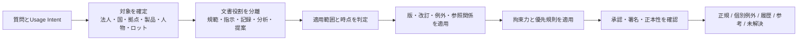

# 企業文書の有力度を決める関係と業種・部門別活用ケース

調査日: 2026-08-01  
目的: Fragrachが企業文書の「どれを採用し、どれを併記し、どれを履歴として残すか」を判断するために、現行の時点・権威性・版・矛盾という観点で十分かを検証する。

## 結論

現行の`authority`、`status`、`valid_from`、`valid_to`、`conflicts_with`は必要だが、企業文書全般を扱うには足りない。

最大の不足は、文書の有力度を一つの順位や点数として扱っていることである。企業では、法令、社内規程、契約、個別指示、作業記録、分析報告が別の役割を持つ。患者別オーダー、ロット別逸脱承認、工事変更指示は一般手順より具体的に見えるが、指定された患者、ロット、工区にしか効かない。実績記録は「何をすべきか」を定める文書より強い証拠になり得るが、手順自体を変更するものではない。

したがってFragrachは、全文書を共通の権威順へ並べるのではなく、最初に質問と適用対象を確定し、次に文書の役割、拘束力、時点、適用範囲、例外、真正性を評価する必要がある。判断できない場合は、検索スコアで一方を選ばず未解決Conflictと確認事項を残す。



本書の業種別ケースは、製品要件とテストコーパスを設計するための代表例であり、個別企業や法域に対する法的助言ではない。法令、契約、労働協約などの優先関係は、対象法域と各文書の明示条項から構成し、Fragrachへ固定値として組み込まない。

## 「有力度」を構成する判定軸

ISO 15489は、記録、metadata、責任、業務Context、記録統制を一体で扱う。[ISO 15489-1:2016](https://www.iso.org/standard/62542.html) ISO 9001のDocumented Information guidanceも、文書を情報伝達、計画した行為の証拠、知識共有など複数の目的で捉えている。[ISO 9001 documented information guidance](https://www.iso.org/iso/documented_information.pdf) この違いをFragrachでは次の軸へ分解する。

| 判定軸 | 問うこと | 例 | 現行モデル |
|---|---|---|---|
| 文書役割 | 規則、指示、記録、説明、提案のどれか | 規程と作業実績は競争関係にない | 不足 |
| 拘束力 | 守る義務があるか、推奨か、参考か | `shall`、推奨、FAQ | `authority`だけでは不足 |
| 発行主体 | 誰が発行する権限を持つか | 規制当局、取締役会、部門長 | 一部対応 |
| 承認状態 | 正式承認、署名、発行が完了したか | Draft、承認済み、配布済み | `status`を拡張 |
| 適用対象 | 誰・何に適用するか | 法人、拠点、製品、設備、患者 | 不足 |
| 法域 | どの国・地域・自治体で効くか | EU、国内、県、工場所在地 | 不足 |
| 時点 | いつ効くか、いつ記録されたか | 発行日、施行日、取引日 | 有効期間だけ一部対応 |
| 版・改訂 | 全文置換か一部修正か | v3、追補、正誤表 | Relation不足 |
| 具体性 | 一般規則と個別条件のどちらか | 全社手順と顧客別SOW | 不足 |
| 例外権限 | 誰がどの範囲を例外化できるか | Waiver、Deviation、緊急許可 | 不足 |
| 契約上の優先 | 契約が定めるOrder of Precedence | 本文、別紙、提案書 | 不足 |
| 組込み参照 | 別文書を規範の一部にするか | 法令がService Bulletinを参照 | 不足 |
| 正本性 | どのRepository・記録が正本か | 署名済み契約、価格Master | 不足 |
| 完全性 | 改変、欠落、切り貼りがないか | Audit trail、電子署名 | 不足 |
| 派生経路 | どの原データや規則から作ったか | リスク報告とSource data | Evidence参照だけでは不足 |
| 条件・Trigger | どの状況で規則が起動するか | 重大障害時だけの手順 | Claim条件を拡張 |
| 利用目的 | 現在の行動、監査、履歴のどれか | 現行手順と当時の手順 | Usage Intentで一部対応 |
| 鮮度要求 | 何時間・何日以内の情報が必要か | 当番表、運航情報 | 有効期間と別に必要 |
| Access | 利用者が閲覧してよいか | 人事、患者、輸出管理情報 | 有力度と分離して不足 |

重要なのは、これらを加重平均しないことである。対象外の文書は権威が高くても候補から外れる。未承認の改訂案は新しくても現行規程を置き換えない。個別Deviationは対象ロットでは効くが、標準手順全体を更新しない。この非単調性を単一の`authority_score`で表すと誤る。

## 業種だけでなく業態で関係が変わる

同じ業種でも、価値提供と業務実行の単位が違えば、中心となる文書が変わる。コーパスには会社の業種ラベルだけでなく、次の業態特性を記録する。

| 業態 | 判断の単位 | 有力度を左右しやすい文書 | 特有の関係 |
|---|---|---|---|
| 見込量産 | 製品型式、Revision、Lot、Serial | Released図面、BOM、工程標準、製造記録 | ECO切替、Lot境界、Deviation |
| 受注生産 | 顧客、注文、個別構成 | 顧客仕様、Quote、注文書、承認図 | Customer override、構成適合 |
| Project型・EPC | 契約、工区、Work package | 契約、SOW、Drawing、RFI、Change order | 局所precedence、部分変更、As-built |
| Subscription・SaaS | Tenant、Plan、Release、期間 | MSA、Order form、Entitlement、Release note | Tenant override、Feature flag、移行期間 |
| Marketplace・Platform | 取引、出品者、購入者、地域 | Platform terms、Seller terms、Order record | 当事者Role、Transaction snapshot、地域差 |
| Franchise・多店舗 | Brand、法人、店舗、営業日 | 本部Policy、Franchise agreement、店舗通知 | 本部標準、現地法、店舗限定運用 |
| Professional service | Client、Engagement、成果物 | Engagement letter、SOW、作業計画、受入記録 | Client approval、成果物版、守秘範囲 |
| Asset operation・24時間運用 | Asset、現在状態、Shift | License、運転手順、Log、当直指示 | 構成依存、鮮度、緊急指示、解除 |
| 規制License型 | License holder、施設、認可範囲 | 法令、License、承認申請、当局条件 | 法域、認可Scope、当局変更 |
| Supply chain・Outsourcing | 委託範囲、Supplier、Shipment | 委託契約、品質契約、Flow-down、受入記録 | 責任分界、要求伝達、Traceability |
| Research・探索型 | Study、仮説、Dataset、Run | Protocol、Notebook、Raw data、Analysis | 未確定仮説、再現性、Ethics approval |
| M&A・組織再編中 | 法人、旧新組織、移行期間 | 統合方針、移行計画、旧規程、暫定Delegation | 法人境界、暫定優先、Sunset |

たとえば「最新の価格」は、量販店では店舗・会員・販促期間、SaaSでは契約PlanとRenewal、受託業では見積と変更契約に依存する。`document_type: price_list`だけでは適用文書を決められないため、業務Instanceを特定するEntityとRelationが必要になる。

## 必要な文書関係

企業文書では、単なる`conflicts_with`以外の関係が判断を変える。

| 関係 | 意味 | 解決への作用 |
|---|---|---|
| `supersedes` | 旧版を全面的に置き換える | 指定時点以降の通常質問で旧版を降格 |
| `amends` | 一部条項だけを修正する | 未修正部分は元文書を維持 |
| `corrects` | 誤記や数値を訂正する | 訂正対象だけ正誤表を優先 |
| `incorporates_by_reference` | 別文書を規範の一部にする | 参照版を含めて一体として取得 |
| `implements` | 上位方針を手順へ具体化する | 矛盾しなければ下位手順を行動回答に使用 |
| `interprets` | 規則の意味を説明する | 規則を置換せず解釈根拠として併記 |
| `derived_from` | 原データや設計から派生する | Lineageをたどって検証 |
| `records_execution_of` | 指示の実施結果を記録する | 実績質問では記録を優先、規範質問では分離 |
| `approved_by` | 正式な承認を結びつける | 承認権限と時点を検証 |
| `signed_by` | 署名済み状態を示す | 契約・記録の成立条件として使用 |
| `applies_to` | 対象を限定する | 法人、製品、設備、患者、ロットでFilter |
| `exception_to` | 上位規則の個別例外 | 範囲と期限内だけ例外を優先 |
| `deviation_from` | 実施時の一時逸脱 | 標準を失効させず対象Instanceだけ変更 |
| `waives` | 権限者が要求を免除する | 権限、対象、期限を満たす場合だけ有効 |
| `subject_to` | 上位条件に従属する | 下位文書単独で断言しない |
| `order_of_precedence` | 同一契約内の明示優先順 | 契約単位の局所規則として解決 |
| `conflicts_with` | 同じ対象・条件で両立しない | 自動解決根拠がなければ両方保持 |
| `contradicts_observation` | 規則と実績が食い違う | 規則変更ではなく不遵守・異常候補 |
| `duplicates` | 内容が同一・近似 | 正本へ束ね、Copyはprovenanceを残す |
| `translated_from` | 翻訳関係 | 正式言語・認証翻訳の規則で扱う |
| `supplied_under` | 契約・注文・案件に属する | 顧客・案件のScopeを継承 |
| `depends_on_configuration` | 特定構成でのみ成立する | Software版、設備構成、機体番号でFilter |
| `event_before` / `event_after` | Event順序 | 当時の状態と因果経路を復元 |

これらはすべて同じ優先関係ではない。`records_execution_of`は規範を置換せず、`amends`は対象条項だけを変更し、`exception_to`は対象Instanceだけに効く。Relationには対象Clause、Scope、時点、Evidenceを持たせる。

## 全社共通部門

業種にかかわらず、管理部門では法令、契約、社内方針、個別記録の役割が交差する。

| 部門・場面 | 判断したいこと | 主な文書 | 有力度を変える関係・条件 | 期待する扱い |
|---|---|---|---|---|
| 取締役会・経営企画 | 施策が正式決定されたか | 取締役会決議、稟議、経営会議議事録、企画案 | 決裁権限、決議成立、条件付き承認、後続取消 | 企画案と正式決定を分離する |
| 法務 | 契約上の義務は何か | 基本契約、個別契約、SOW、注文書、変更契約、交渉記録 | 契約内の優先条項、署名、適用法人、変更成立 | 交渉メールで署名済み契約を上書きしない |
| Compliance | 現在の遵守要求は何か | 法令、規制、当局決定、Guidance、社内規程 | 法域、拘束力、施行日、対象事業、社内採択 | 法令と非拘束Guidanceを区別する |
| 人事 | 対象社員に適用する勤務条件は何か | 労働法、労働協約、雇用契約、就業規則、Handbook、上司メール | 法域、雇用区分、個別契約、正式改定、周知 | 世界共通の優先順を仮定しない |
| Payroll | 支給額の根拠は何か | 雇用条件、給与Master、勤怠、承認済み例外、給与明細 | 対象社員、対象月、締め時点、承認 | 規程と実際の支給記録を別Slotにする |
| Procurement | 購入条件と受入条件は何か | 購買規程、RFP、Supplier提案、注文書、契約、検収記録 | 契約優先条項、案件Scope、変更注文、検収 | 提案書が契約へ組み込まれた範囲だけ採用 |
| Finance | 数値の正本は何か | 会計方針、元帳、補助簿、予算、見込、決算報告 | 会計期間、締め状態、修正仕訳、連結範囲 | 見込と確定実績を競合扱いしない |
| Internal Audit | 当時何が要求され、何が行われたか | 当時版規程、証跡、例外承認、監査調書、是正記録 | Transaction time、記録真正性、標本Scope | 現行版へ置換せず当時版を復元する |
| Privacy・情報管理 | 利用・共有してよいか | 法令、Consent、Privacy notice、処理記録、保持規程 | Data subject、目的、法域、同意撤回、保持期間 | Access判定を内容の正しさと分ける |

契約では、文書種別だけで優先順を決められない。契約本文が個別のOrder of Precedenceを定める場合があり、英国政府のShort Form Contract guidanceでも、契約部品の優先順とSupplier tenderの扱いを契約内で定義している。[UK Short Form Contract Guidance](https://assets.publishing.service.gov.uk/media/68b03bbc23468ce937e0e8f4/Buyer_Guidance_-_Short_Form_Contract_v1.5A_2025.pdf) Fragrachは「契約 > SOW > 注文書」のような世界共通規則ではなく、契約単位の局所precedenceを抽出する。

## 製造業・自動車・産業機械

| 部門・場面 | 判断したいこと | 主な文書 | 有力度を変える関係・条件 | 期待する扱い |
|---|---|---|---|---|
| 設計 | 製品をどの仕様で作るか | 要求仕様、図面、BOM、設計計算、ECR/ECO、承認図 | Release状態、Revision、対象製番、ECO施行点 | 最新日ではなくReleased構成を選ぶ |
| 生産技術 | どの工程条件を使うか | Process spec、作業標準、Control plan、設備Recipe、変更通知 | 製品型式、工程、設備、ロット切替、承認 | 切替前後のLot境界を保持する |
| 製造 | このLotをどう処理するか | 製造指図、Traveler、作業手順、Deviation、Rework指示 | Lot / Serial、期限、承認者、完了状態 | Lot限定Deviationを標準へ一般化しない |
| 品質保証 | 合否・出荷可否をどう決めるか | 検査規格、測定記録、NCR、Waiver、顧客承認、出荷判定 | Acceptance criteria、対象Lot、例外権限 | 不適合記録を規格変更と解釈しない |
| 保全 | 現在の設備構成と保全方法は何か | 設備Manual、保全標準、Work order、改造記録、校正証明 | Asset ID、構成、完了時点、有効校正 | Generic manualより現設備構成を先にFilter |
| Supplier Quality | 購入品の要求は何か | Purchase spec、図面、Supplier datasheet、承認Deviation、受入記録 | 注文・製品Scope、顧客Flow-down、契約組込み | Supplier資料だけでBuyer要求を上書きしない |

ここでは「設計の正本」「製造の指示」「製造した結果」を分離する必要がある。FDAの旧QMS trainingも、設計履歴、製造の手順・仕様、個別製造の履歴を異なる記録群として説明している。[FDA Documents, Change Control and Records](https://www.fda.gov/media/118203/download) この区別は規制対象外の製造業でも有用なテスト構造になる。

## 医薬品・医療機器

ICH Q10は、製品・工程Knowledgeを開発から終売まで管理し、Change managementとQuality risk managementへ結びつける。[ICH Q10](https://database.ich.org/sites/default/files/Q10%20Guideline.pdf) 2026年2月に有効となったFDA QMSRはISO 13485:2016を組み込み、米国法令と競合する場合には米国法令・規則が支配すると明示する。[FDA QMSR](https://www.fda.gov/medical-devices/postmarket-requirements-devices/quality-management-system-regulation-qmsr) これは`incorporates_by_reference`と上位規範の例である。

| 部門・場面 | 判断したいこと | 主な文書 | 有力度を変える関係・条件 | 期待する扱い |
|---|---|---|---|---|
| Regulatory Affairs | 承認範囲内で何を製造・表示できるか | 承認申請、当局承認、Variation、Commitment、Label | 国、製品、適応、承認日、Variation状態 | 社内計画より当局承認範囲を優先 |
| Quality Assurance | 変更・逸脱を許可できるか | SOP、Change control、Deviation、CAPA、Risk assessment | 承認権限、製品・Batch、期限、再発性 | 一回のDeviationと恒久変更を分離 |
| Manufacturing | BatchをReleaseできるか | Master Batch Record、Executed record、試験結果、Deviation、Release記録 | Batch、真正なRaw data、承認、未完了逸脱 | Masterは指示、Executedは実績として扱う |
| Clinical Development | Trialで何が有効か | Protocol、Amendment、Ethics approval、Consent form、Site instruction | Study、Site、Country、承認、被験者登録時点 | 未承認Amendmentを現場指示にしない |
| Labeling | 使用説明・表示の正本は何か | Label master、Artwork、IFU、承認Label、変更注文 | 市場、製品、Language、Revision、承認 | 二次文書への影響をChange relationでたどる |
| Pharmacovigilance | 報告対象と期限は何か | 規則、SOP、Safety case、Follow-up、当局通信 | 国、Case、seriousness、Clock start | Case記録と一般SOPの時点を分ける |

電子Raw dataがBatch releaseなどの判断根拠になる場合があり、EMAは元データと処理変更の科学的根拠、DeviationとChangeの区別を重視している。[EMA GMP/GDP Q&A](https://www.ema.europa.eu/en/human-regulatory-overview/research-development/compliance-research-development/good-manufacturing-practice/guidance-good-manufacturing-practice-good-distribution-practice-questions-answers) Fragrachには文書だけでなく、記録のLineageと真正性を表す必要がある。

## 医療・介護

臨床では、一般Guidelineをそのまま患者へ適用できるとは限らない。WHOはGuidelineを現地の資源、組織、制度へContextualizeする必要を示している。[WHO guideline contextualization handbook](https://www.who.int/publications/i/item/9789289060028) さらに、患者別の医師指示やCare planは一般Protocolとは別の適用単位を持つ。

| 部門・場面 | 判断したいこと | 主な文書 | 有力度を変える関係・条件 | 期待する扱い |
|---|---|---|---|---|
| 診療 | この患者へ何を実施するか | Clinical guideline、院内Protocol、医師Order、Care plan、同意 | Patient、Encounter、Order状態、禁忌、署名 | 有効な患者別Orderを中心に組み立てる |
| Nursing | 現在のケア内容は何か | Care plan、指示、観察記録、Shift handoff | Patient、時刻、更新、実施済み状態 | Handoffだけで正式Orderを変更しない |
| Pharmacy | 使用薬・用量は何か | Formulary、Order set、処方、変更・中止Order、投薬記録 | Patient、時刻、処方者、停止状態 | 最新の有効Orderと投薬実績を分離 |
| Laboratory | 結果をどう解釈するか | 検査Manual、機器Reference、患者結果、訂正報告 | 機器・試薬Lot、基準範囲、訂正、採取時点 | 訂正結果を元結果とRelationで結ぶ |
| Medical Records | 診療事実を証明できるか | 診療記録、Late entry、Addendum、署名、Audit trail | 作成者、認証、記録時刻、診療時刻 | 後日追記を元時点の記載として偽装しない |
| Revenue Cycle | 請求根拠は何か | 診療記録、Coding guideline、Claim、支払者Policy | Service date、契約、支払者、Coding版 | 現在Policyで過去Claimを再解釈しない |

医療記録では記載の完備、日時、認証が重要であり、患者OrderやProtocolにも日付・時刻・認証が要求される例がある。[CMS hospital interpretive guidance](https://www.cms.gov/Medicare/Provider-Enrollment-and-Certification/SurveyCertificationGenInfo/downloads/SCLetter08-12.pdf) したがって`approved`だけでなく、誰がどのRoleで認証したかを保持する。

## 金融・保険

| 部門・場面 | 判断したいこと | 主な文書 | 有力度を変える関係・条件 | 期待する扱い |
|---|---|---|---|---|
| Risk Management | 経営報告の数値を信頼できるか | Source data、計算仕様、Model、Risk report、調整表 | Data lineage、Cut-off、Entity範囲、Model版 | 報告値から原データまで追跡する |
| Compliance | 取引を許可できるか | 法令、監督規則、解釈、社内Policy、Control procedure | 法域、商品、顧客区分、施行日 | Guidanceと拘束規則を分離する |
| Front Office | 顧客へ提示できる条件は何か | Product terms、価格表、顧客契約、承認例外、Quote | 顧客、商品、日時、承認Limit | Generic termsと顧客別条件を混ぜない |
| Credit | 与信判断の根拠は何か | Credit policy、申請、財務情報、Score model、承認記録 | 顧客時点、Model版、委任権限、Override | Model出力と人のOverrideを両方残す |
| Insurance Underwriting | 引受条件は何か | Underwriting manual、商品認可、申込、特約、承認例外 | 州・国、商品版、被保険者、期間 | 特約を契約対象外へ一般化しない |
| Claims | 支払可否は何か | 保険約款、Endorsement、事故記録、査定、和解 | 事故日、契約期間、対象Risk、最終合意 | 現行約款で過去事故を判定しない |
| Regulatory Reporting | 提出値を再現できるか | 規制定義、Mapping、元帳、調整、提出File | 報告期間、法人、Taxonomy版、再提出 | 最新値だけでなく提出時Snapshotを保持 |

BCBS 239は、正確で完全かつ適時なRisk dataと報告を要求し、2026年の実装整理でもData lineage、法域横断、変化する事業環境が課題とされている。[BCBS 239](https://www.bis.org/publ/bcbs239.htm)、[2026 implementation newsletter](https://www.bis.org/publ/bcbs_nl36.htm) SECの電子記録規則も、元記録の再現を可能にするAudit trailを選択肢としている。[SEC electronic recordkeeping requirements](https://www.sec.gov/investment/amendments-electronic-recordkeeping-requirements-broker-dealers) 金融ケースでは、文書の発行者だけでなく、数値のLineageと提出時Snapshotが有力度を左右する。

## Software・SaaS・通信

| 部門・場面 | 判断したいこと | 主な文書 | 有力度を変える関係・条件 | 期待する扱い |
|---|---|---|---|---|
| Product | 何を提供すると決めたか | Roadmap、PRD、承認済みScope、Feature flag、Release note | Release、Tenant、Plan、Feature state | Roadmapを提供済み機能と答えない |
| Architecture | 現在の設計判断は何か | ADR、RFC、設計書、Code、Config、Migration plan | Accepted / Superseded、System版、Deployment | 採択案と検討案を分離する |
| Development | 実装契約は何か | API schema、Interface spec、Test、Code、Wiki | Branch、Release tag、生成元、互換期間 | 実行版を確定してから文書を選ぶ |
| SRE・運用 | 障害時に何を実行するか | Runbook、Alert、Incident command、Chat、Status page | Service、Region、Severity、緊急指示、時刻 | Commanderの一時指示を事後標準化しない |
| Security | 何を必須Controlとするか | Policy、Standard、Baseline、Procedure、Exception、Risk acceptance | System classification、期限、承認者 | Exceptionを対象Systemと期限へ限定する |
| Support | 顧客へ何を案内できるか | Knowledge article、Known issue、Release note、契約Entitlement | Product版、Tenant、Plan、公開状態 | 古いFAQを現行挙動より優先しない |
| Customer Success | 顧客への約束は何か | MSA、SLA、Order form、Success plan、Email | 顧客法人、契約期間、署名、変更合意 | 一般Product docsと契約約束を分離する |
| Network Operations | どの構成変更を実行するか | MOP、Config、Topology、Change ticket、Emergency change | Device、Region、Maintenance window、承認 | MOPと現在Configの差を異常候補にする |

NIST CSFのOrganizational Profileは、共通Frameworkを事業要件、Risk tolerance、資源に合わせてCurrent / Targetへ具体化する。[NIST CSF Profiles](https://www.nist.gov/cyberframework/profiles) ここでも外部Frameworkをそのまま社内必須規則とみなさず、正式採択されたProfile、Policy、Standard、Procedureへの`implements`関係が必要になる。

SoftwareではCodeやConfigが実状態の正本でも、契約義務や承認手順の正本とは限らない。質問が「今動いている値」ならRuntime config、「許可された値」ならPolicyとChange approval、「なぜそうしたか」ならADRとDecision recordを使い分ける。

## 建設・設備工事・EPC

| 部門・場面 | 判断したいこと | 主な文書 | 有力度を変える関係・条件 | 期待する扱い |
|---|---|---|---|---|
| Contract Management | 契約上どの要求が優先するか | Agreement、Conditions、Specification、Drawing、Proposal | 契約内Order of Precedence、変更契約 | 文書種別の一般順位で解決しない |
| Design | 現場で使える図面はどれか | Design basis、計算書、Drawing、RFI回答、Shop drawing | IFC状態、Revision、Discipline、承認 | 最新DraftでIssued for Constructionを上書きしない |
| Site Construction | この箇所をどう施工するか | Method statement、IFC drawing、Field instruction、RFI、Permit | Location、Work package、時刻、承認 | Field instructionの範囲を限定する |
| Change Control | 変更が価格・工期・設計へ反映済みか | Change request、Change order、Revised drawing、Schedule | 署名、影響範囲、契約反映、Effective date | 変更提案と成立済み変更を分離する |
| HSE | 作業を開始できるか | 安全規程、Job hazard analysis、Permit to work、Toolbox talk | 作業、区域、Shift、Permit期限 | 作業別Permitを一般安全規程の例外と混同しない |
| Handover | 完成状態は何か | As-built、Inspection record、Punch list、Completion certificate | System、Completion state、未完項目 | Design intentと完成実態を別に答える |

建設契約には明示的な文書優先条項があり、承認されたDeviationだけが競合要求へ優先するなど局所条件を持つ例がある。[FHWA P3 contract example](https://www.fhwa.dot.gov/ipd/p3/toolkit/usdot/sep15/sep15_txtoll/application_01.aspx) `order_of_precedence`はCorpus全体の配列ではなく、契約ID、条項、対象工事に結びつける。

## 航空・交通・物流

| 部門・場面 | 判断したいこと | 主な文書 | 有力度を変える関係・条件 | 期待する扱い |
|---|---|---|---|---|
| Aviation Maintenance | 必須整備は何か | Airworthiness Directive、Service Bulletin、Maintenance Manual、Work card | 機種、Serial、適用条件、法域、参照組込み | Bulletin単独とAD組込み後を区別する |
| Flight Operations | 運航可能か | Operations manual、MEL、NOTAM、Flight release、Weather | 機体、空港、Route、時刻、期限 | 高鮮度情報を静的Manualと別枠にする |
| Rail・Fleet | 車両を運用できるか | Maintenance plan、Defect record、Restriction、Dispatch order | Vehicle ID、Route、状態、解除記録 | 個体RestrictionをFleet全体へ広げない |
| Warehouse | 危険物をどう扱うか | SDS、保管手順、品目Master、現品Label、Incident notice | 物質、Lot、Container、現場表示 | Generic SDSと現品識別を結びつける |
| Shipping | 何をどの条件で運ぶか | Booking、Shipping paper、Dangerous goods declaration、Carrier rule | Shipment、Mode、Route、時刻、署名 | Shipment記録を中心に規制情報を添える |
| Customs | 申告根拠は何か | Invoice、Packing list、Origin certificate、Tariff ruling、Entry | Shipment、原産地、品目、申告時点 | 将来の分類変更で過去申告を置換しない |

FAAではAirworthiness Directiveが特定Service Bulletinを組み込んで履行を要求する場合があり、参照文書が規則の一部になる。[FAA Incorporation by Reference](https://www.faa.gov/aircraft/air_cert/continued_operation/ad/type_incorp) したがって発行元だけでなく、規範からの`incorporates_by_reference`をたどる必要がある。

危険物輸送では、Shipping paperと緊急対応情報をShipmentへ対応づけ、輸送中に利用可能にすることが重要になる。[PHMSA Hazmat Transportation Requirements](https://www7.phmsa.dot.gov/sites/phmsa.dot.gov/files/docs/training/hazmat/69186/hazmat-transportation-reqmts-web-final.pdf) 高鮮度情報は「最新版の文書」ではなく、現在進行中のShipmentや運航に適用するSnapshotとして扱う。

## Energy・Utilities・原子力

| 部門・場面 | 判断したいこと | 主な文書 | 有力度を変える関係・条件 | 期待する扱い |
|---|---|---|---|---|
| Control Room | 現在の運転継続条件は何か | License、Technical Specification、Operating procedure、Log | Unit、Mode、LCO、時刻、設備状態 | 状態条件に合うActionを選ぶ |
| Grid Operations | 切替を実行できるか | Network code、Switching order、Single-line diagram、Outage plan | 設備、系統状態、時間帯、Dispatcher承認 | 事前Planと当日Orderを区別する |
| Maintenance | 設備を隔離・復旧できるか | Work order、Isolation certificate、Procedure、Test result | Asset、Work boundary、Permit、完了状態 | 対象設備の隔離状態を必須にする |
| Engineering | 一時変更を継続できるか | Design basis、Temporary modification、Evaluation、Expiry | Unit、構成、期限、承認 | 期限切れTemporary changeを警告する |
| Regulatory | どの要求がLicense basisか | Law、Regulation、Order、License condition、Guidance | Facility、License、施行、組込み | GuidanceをLicense conditionと同格にしない |

NRCは規制、License、Oversightを別の仕組みとして扱い、Technical SpecificationのLimiting Conditionを満たさない場合のActionを定める。[NRC Operability Guidance](https://www.nrc.gov/reactors/operating/licensing/techspecs/operability-guidance) このケースでは、質問時の設備状態と運転Modeがなければ文書を一意に選べない。Fragrachは不足情報を確認質問として出す必要がある。

## 小売・EC・食品・外食

| 部門・場面 | 判断したいこと | 主な文書 | 有力度を変える関係・条件 | 期待する扱い |
|---|---|---|---|---|
| Merchandising | 現在の販売価格は何か | Price master、Promotion、店舗通知、Shelf label、取引記録 | SKU、店舗、Channel、期間、会員条件 | 全国価格と店舗限定Promotionを分離 |
| Store Operations | 今日の運用は何か | SOP、Daily bulletin、Manager note、System setting | 店舗、営業日、Emergency status、承認 | Daily bulletinの期限後利用を防ぐ |
| Customer Service | 返品・補償条件は何か | Terms、Return policy、Campaign terms、顧客購入記録 | 購入日、Channel、商品、会員契約 | 現行Policyで過去購入条件を上書きしない |
| Food Safety | 製造・提供してよいか | Recipe master、Allergen matrix、Supplier spec、Lot record、Recall | 商品、店舗、Ingredient lot、時点 | RecipeとLot-specific recallを結びつける |
| Quality・Recall | 対象商品を止める範囲は何か | Recall notice、Distribution list、Lot trace、Store inventory | Lot、期限、配送先、回収状態 | 類似商品全体へ過剰一般化しない |
| E-commerce | 表示と実際のOfferは何か | Catalog、Inventory、Price、Promotion、Order confirmation | User segment、Region、Timestamp、在庫 | 検索時点と注文成立時点を分ける |

この業種では有効期間が短く、同じ商品でも店舗、Channel、会員、在庫、購入時点によって答えが変わる。`valid_from / valid_to`だけでなく、ScopeとTransaction snapshotが必要になる。

## 公共・教育・研究

法令では文書種別に拘束力の差があり、たとえばEUではRegulation、Directive、Decisionが拘束的である一方、RecommendationとOpinionは非拘束である。[EUR-Lex legal instruments](https://eur-lex.europa.eu/EN/legal-content/glossary/eu-legal-instruments.html) また、上位・下位の法規範が存在する。[EU hierarchy of norms](https://eur-lex.europa.eu/legal-content/EN/TXT/?uri=legissum%3Anorms_hierarchy) この種の外部関係も、内部文書と同じ単純な更新日順にはできない。

| 部門・場面 | 判断したいこと | 主な文書 | 有力度を変える関係・条件 | 期待する扱い |
|---|---|---|---|---|
| Government Policy | 実施義務があるか | Statute、Regulation、Order、Guidance、FAQ | 法階層、権限、施行、対象者 | 非拘束Guidanceを法的義務と答えない |
| Grants | 支出・成果物条件は何か | 公募要領、Award、Grant agreement、Amendment、報告 | Recipient、年度、Award条件、承認変更 | 一般公募より成立済みAwardを具体条件に使う |
| Public Procurement | 調達条件は何か | Regulation、Tender、契約、Variation、Acceptance | 調達案件、署名、優先条項 | 入札回答の契約組込み範囲を確認する |
| University Affairs | 学生へ適用する規則は何か | 学則、履修要項、Course syllabus、個別承認 | 入学年度、Program、Course、特例 | 現年度要項で旧年度学生を誤案内しない |
| Research Ethics | 実施可能なProtocolは何か | Protocol、Amendment、IRB approval、Consent、Deviation | Study、Site、Participant、承認時点 | Draft Amendmentを有効としない |
| Laboratory | 実験を再現できるか | SOP、Notebook、Instrument method、Dataset、Analysis script | Sample、Run、Software版、Calibration | 手順、Raw data、解析結果のLineageを保持 |
| Records Management | どれをOfficial recordとして保存するか | Draft、決裁、最終発行、Record copy、Retention schedule | Record designation、Disposition hold、移管 | 最新Copyではなく指定Recordを正本化 |

NARAの電子記録要件は、電子記録のLifecycleとChange logを含む管理を扱う。[NARA Universal ERM Requirements](https://www.archives.gov/records-mgmt/policy/universalermrequirements) Fragrachは検索に便利なCopyと、保存・監査上のOfficial recordを区別する。

## Usage Intentによって正規文書が変わる

同じ資料群でも、質問目的が変われば優先するEvidenceが変わる。これは文書自体の権威が変化したのではなく、答えるべき命題が違うためである。

| Intent | 主に答える命題 | 中心Evidence | 古い文書の扱い |
|---|---|---|---|
| Current action | 今何をすべきか | 現在有効な規範 + 対象別指示 | 原則降格、履歴参照は可能 |
| Historical audit | 当時何が要求され、何をしたか | 当時版規範 + 実績記録 + 例外承認 | 必須Evidence |
| Contract obligation | 誰が何を約束したか | 署名済み契約一式 + 優先条項 | 契約期間ごとに保持 |
| Operational state | 今どうなっているか | System of Record、Log、現場記録 | 古いSnapshotは時系列として保持 |
| Design rationale | なぜ決めたか | Decision record、比較案、根拠 | 不採用案も必要 |
| Compliance | 何を満たし、証明できるか | 適用規範 + Control + Evidence | 当時の適用関係が必要 |
| Incident response | 直ちに何をするか | 現行Runbook + 現場状態 + 指揮命令 | 類似事例は参考であり命令ではない |
| Learning / onboarding | 標準的な理解は何か | 現行の説明資料 + 正式規程への参照 | 旧資料は通常除外 |
| Investigation | 何が起きた可能性があるか | Raw record、Timeline、仮説、反証 | 未確定情報も状態付きで保持 |

このため、`authority_precedence`をCorpus全体へ一つだけ設定する設計は限定的である。優先規則は、Usage Intent、対象Scope、文書役割、関係Graphへ依存する。

## 現行Fragrachモデルの不足

現行モデルは、単純な「同じClaimの新旧版」には対応しやすい。一方、今回のケース群から次の不足が分かった。

| 現行要素 | 対応できること | 不足すること |
|---|---|---|
| `authority` | 発行元・文書種別の粗い順位 | 法域、拘束力、承認権限、局所precedence |
| `status` | active / superseded等 | Draft→Approved→Issued→Withdrawn、実績状態との区別 |
| `valid_from/to` | 有効期間 | 発行・承認・記録・取引・観測時点、鮮度SLA |
| `Conflict` | 両立しないClaim | 規範対実績、一般対例外、提案対決定の非Conflict関係 |
| `Evidence` | 原文への遡及 | 正本性、署名、Audit trail、System of Record |
| `authority_precedence` | 一つの明示順位 | 契約・法域・Intent・Scopeごとの局所規則 |
| Claim | 正規化した命題 | 条件、modality、対象Instance、Clause単位の改訂 |

## 推奨するKnowledge IR

すべてを一つのDocument metadataへ押し込まず、役割を分ける。

```yaml
document:
  id: doc-123
  role: instruction       # normative / instruction / record / analysis / proposal / communication
  document_type: work_instruction
  issuer: production_engineering
  repository: controlled_qms
  official_record: true
  language_status: original

force:
  modality: mandatory     # mandatory / recommended / informative
  authority_basis: delegated_by_qms_policy
  approval_state: issued
  approvers:
    - actor: qa_manager
      role: quality_approval
      signed_at: 2026-04-10T09:00:00+09:00

scope:
  jurisdictions: [JP]
  legal_entities: [aobane_industries]
  sites: [tokyo_plant]
  products: [ax-40]
  assets: []
  parties: []
  instances:
    lot_from: AX40-260501

time:
  issued_at: 2026-04-10
  effective_from: 2026-05-01
  effective_to: null
  recorded_at: 2026-04-10T09:03:00+09:00
  observed_at: null
  freshness_ttl: null

assertion:
  subject: ax40.final_inspection
  predicate: sampling_rate
  value: 100_percent
  modality: mandatory
  conditions:
    - lot >= AX40-260501

relations:
  - type: supersedes
    target: doc-098
    target_clauses: ["4.2"]
  - type: implements
    target: quality-policy-7
```

`authority_basis`は自由な肩書きではなく、誰がその文書種別を承認できるかという委任関係へつなぐ。`official_record`もRepository名だけで自動決定せず、Corpus設定またはEvidence付き規則から付与する。

## 解決処理

文書有力度の判定は、次の順で行う。後段の点数で前段の不適合を救わない。

1. 質問からIntent、対象、時点、必要な文書役割を抽出する。
2. 対象法人、法域、拠点、製品、Instanceに適用しない文書を除外する。
3. 規範、個別指示、実績記録、分析、提案を別の回答Slotへ分ける。
4. Draft、未承認、期限切れ、Withdrawnを用途に応じて除外または履歴化する。
5. `amends`、`corrects`、`supersedes`をClause単位で適用する。
6. `exception_to`、`deviation_from`、`waives`の権限、対象、期限を検証する。
7. 法令・契約・社内委任から得た局所precedenceを適用する。
8. 正本性、署名、Audit trail、Lineageが足りなければ確信度ではなく診断を下げる。
9. 解決不能な同一命題だけをConflictとして残す。
10. 採用、個別例外、履歴、参考、未解決と、その理由をDossierへ出す。

Retrieval scoreは候補を集めるために使えるが、手順2～8の代わりにはしない。

## 必要な診断

Compilerは矛盾以外にも次を警告する。

- 適用法人、法域、製品、Instanceが不明で候補を絞れない。
- 発行日しかなく施行日が分からない。
- Review dueを過ぎているが、失効か継続かを判断できない。
- 新版がDraftまたは未承認で、旧版が現在も有効である。
- Amendmentが変更対象Clauseを特定していない。
- 参照文書の版が固定されておらず、組込み内容が変動する。
- Exception / Deviationの承認権限、対象、期限が欠けている。
- 契約文書が競合するがOrder of Precedenceがない。
- Official record候補が複数あり、正本Repositoryを決められない。
- 記録の署名、Audit trail、原データLineageが欠けている。
- 翻訳が原文と競合し、どちらが正式言語か不明である。
- 規範と実績が食い違い、不遵守、記録誤り、規範未更新を判定できない。
- 問い合わせに必要な時点または対象がなく、回答が条件依存になる。

矛盾と同様、WarningでBuildを生成するかErrorで公開を止めるかをUsage Intentごとに選ぶ。医療の患者指示、製造のBatch release、運転安全のような用途では、不明なScopeや未承認文書をErrorへ昇格できる必要がある。

## コーパスへ追加する評価ケース

現行の青羽精機コーパスは、規程、FAQ、旧版、時系列、矛盾を持つが、次の関係を追加すると企業文書の代表性が上がる。

| 優先度 | Archetype | 最小ケース | 正解で測ること |
|---|---|---|---|
| P0 | 文書役割 | 手順、実績記録、分析報告が同じ値を記載 | 規範と実績を混ぜない |
| P0 | Scope | 全社規程と拠点・製品限定手順 | 対象一致を権威より先に適用 |
| P0 | 個別例外 | 標準 + Lot限定Deviation + 期限切れDeviation | 対象内だけ例外を採用 |
| P0 | 部分改訂 | 元規程 + 一条だけのAmendment | 未改訂条項を維持 |
| P0 | 承認状態 | 新しいDraftと古いApproved版 | 更新日だけでDraftを採用しない |
| P0 | 契約優先 | MSA、SOW、提案、明示precedence | 契約単位の優先順を適用 |
| P0 | 正本性 | Controlled repositoryと古い共有Copy | 正本を採用しCopyも追跡 |
| P1 | 組込み参照 | 上位規程が特定版手順を参照 | 参照先を一体取得 |
| P1 | Dual time | 後日訂正された当時記録 | Event時点と記録時点を分離 |
| P1 | Lineage | 集計報告、変換仕様、原データ | 数値を原データまで追跡 |
| P1 | Local adaptation | 外部Guideline、社内採択版、未承認翻訳 | 採択と翻訳を区別 |
| P1 | System configuration | Manual、改造記録、現在Config | 対象構成に合う文書を採用 |
| P1 | Emergency order | 通常Runbookと期限付き緊急指示 | Incident中だけ指示を優先 |
| P1 | Access | 正しいが閲覧権限外のEvidence | 検索品質と開示可否を分離 |

各Archetypeには、現在質問、過去時点質問、対象外質問、監査質問を用意する。同じ文書を使って答えが変わるため、単純なGold Source IDだけでなく、期待するRole、Scope、Relation path、Resolution reasonをGoldに加える。

## 評価指標への追加

R@kとConflict completeだけでは、この判断を評価できない。次を追加する。

- Applicability precision: 採用Evidenceが対象Scopeへ適用する割合。
- Role separation accuracy: 規範、指示、記録、提案を正しいSlotへ置けた割合。
- Temporal resolution accuracy: 質問時点に対応する版・記録を選べた割合。
- Exception scope accuracy: 例外を対象外へ一般化しなかった割合。
- Clause patch accuracy: Amendmentを正しいClauseだけへ適用できた割合。
- Provenance completeness: 採用値から正本と原データへたどれる割合。
- Resolution reason accuracy: 正しい文書だけでなく、正しい規則で選んだ割合。
- Abstention / clarification accuracy: 対象・時点不足時に断言を避けた割合。
- Access leakage rate: 許可されないEvidenceを回答・引用へ出した割合。

これにより、偶然正しい文書を上位取得した結果と、企業文書の関係を正しく解決した結果を区別できる。

## 設計判断

今回の洗い出しから、Fragrachの文書関係モデルは次の方針へ広げるべきである。

1. `authority`を廃止するのではなく、発行主体、拘束力、委任根拠へ分解する。
2. `authority_precedence`は既定の補助規則に留め、Scope・Intent・契約ごとの局所precedenceを追加する。
3. 文書を規範、指示、記録、分析、提案へ分類し、異なる役割をConflictにしない。
4. 法域、法人、拠点、製品、設備、人物、案件、Lotなどの`applies_to`を第一級Relationにする。
5. 時点を発行、承認、施行、記録、観測、取引へ分ける。
6. `supersedes`だけでなく、部分改訂、訂正、参照組込み、例外、逸脱、実施記録を表す。
7. Retrievalの関連度と、Compilerの採否判断を別の結果として保存する。
8. 判断結果には採用理由と不採用理由をEvidence付きで残す。
9. 正本性、署名、Audit trail、Lineageを、LLMの確信度ではなく外部metadataと検証規則で扱う。
10. Access controlは有力度と別レイヤーにし、正しいが開示できないEvidenceを明示的に扱う。

この拡張により、Fragrachは「どの文書が一番強いか」を決めるCompilerではなく、「この利用目的、この対象、この時点で、各文書がどの役割と効力を持つか」をコンパイルする仕組みになる。
