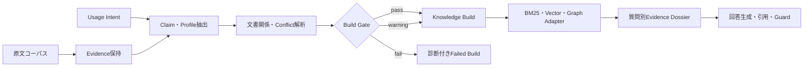
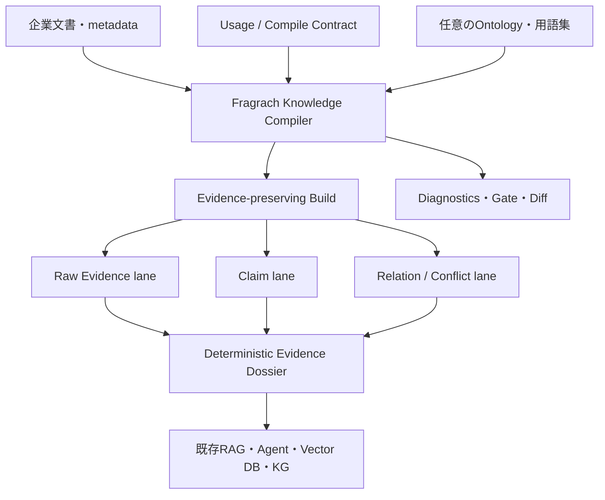

# Fragrachの方式整理と差別化戦略

調査日: 2026-08-02

本書は、現行Fragrachの方式、実測済みの強みと弱み、単純RAGとの差をさらに広げる施策を整理する。比較対象は、調整済みのRaw RAG、[AWS Context Ontology Accelerator公式サイト](https://aws.github.io/context-ontology-accelerator/)と[公式リポジトリ](https://github.com/aws/context-ontology-accelerator)、[AI Powered Knowledge Graph Generator](https://github.com/robert-mcdermott/ai-knowledge-graph)である。

比較対象の公開資料は今後変わり得る。本書では、2026年8月2日時点の公式リポジトリと公式ドキュメントから確認できた機能だけを事実として扱う。「中心機能として確認できない」は、その機能が存在しないことの証明ではない。

## 結論

Fragrachは、汎用Knowledge Graph生成器や企業全体のOntology基盤として競争するべきではない。最も明確な位置づけは、次である。

> Fragrachは、原文コーパスを利用目的に合わせて検査・編成し、RAGへ投入可能なEvidence Buildを発行するKnowledge Compilerである。

三つの比較対象は、担当する境界が異なる。

- 単純RAGは、質問時に関連チャンクを探す。
- AI Powered Knowledge Graph Generatorは、一つの文書から探索・可視化用のSPOグラフを作る。
- AWS Context Ontology Acceleratorは、構造化・非構造化データをAWS上のOntology、Metric、Knowledge Graphへ統合し、実行時にAgentへ提供する。
- Fragrachは、文書の原文を残したまま、利用目的、権威、版、適用時点、文書間関係、矛盾、回答制約を事前にコンパイルし、公開可能かを判定する。

現行評価では、この方向に検索品質上の効果がある。30問の同一回答モデル比較で、Actual Relation Dossierは調整済みRaw RAGに対してR@5を58.3%から75.0%、引用再現率を56.7%から80.0%、監査後Strict Passを23.3%から53.3%へ改善した。ただしR@20は90.0%から88.9%へ低下し、回答入力は3.21倍、平均待ち時間は3.99倍だった。したがって、「通常RAGより常に高精度」とはまだ言えない。

差別化を製品価値へ変えるには、Relationを増やすだけでは不十分である。次の四点をFragrachの中心契約にする必要がある。

1. 原文を失わないEvidence-preserving IR
2. 利用目的ごとのCompile Contract
3. 関係欠落、矛盾、時点不明、Raw Recall低下を検出するBuild Gate
4. 同じBuildと質問から同じDossierを作る決定的な回答資料組立

この四点がそろうと、Fragrachの価値は「検索を少し改善する前処理」から、「RAGの入力品質をCIで検査できるBuild System」へ広がる。

## 主要ターゲットとスイートスポット

Fragrachの主要ターゲットは、Hybrid検索とrerankerを十分に調整しても、関連度だけでは正しい回答資料を決められないRAGである。語彙差やchunk順位だけが問題なら、強いHybrid RAGを先に採用する。Fragrachは、検索候補に必要な原文が含まれていても、旧版、草案、FAQ、個別例外、実施記録、矛盾を回答時に毎回解釈し直す必要がある場合に追加価値を出す。

対象文書は、規程、仕様、手順、企画・提案、FAQ、承認記録、障害・変更記録など、追加と改訂が続く企業内文書である。静的なFAQ数件より、文書の役割と有効性が時間とともに変わるコーパスに適する。更新を再コンパイルし、前Buildとの差分と新しいConflictを検査できることが、質問時検索だけを調整する方式との差になる。

導入単位のスイートスポットは、全社セマンティック基盤ではなく、一つの部門または業務チームがRAGへ登録しようとしている文書フォルダである。フォルダをSource corpusとして走査し、部門の利用目的ごとにKnowledge Buildを作り、既存のHybrid RAGへ登録する。対象が狭すぎればCompile費用に見合わず、全社横断で巨大すぎればアクセス制御、Ontology、データ連携を担う別基盤が必要になる。その中間にある、担当者が文書の意味と運用責任を把握できる部門コーパスを狙う。

現在の評価設計はこの仮説に沿っている。企業文書テストコーパスは40部門を独立した検索領域とし、一部門あたり72文書・36問で構成する。全2,880文書を一つの索引へ入れてFragrachを有利にしてはいない。一方、Lunaで実際にコンパイルして回答まで測った詳細評価は5評価群、用途ごと12文書、合計30問である。したがって、「部門フォルダがスイートスポット」は設計と初期結果に支えられた製品仮説だが、実企業に対する推奨文書数や性能保証ではない。

| 適合度 | コーパスの状態 | 推奨方針 |
|---|---|---|
| 低い | 少数、静的、正本が明確 | Raw/Hybrid RAGを調整する |
| **高い** | 部門単位、継続更新、旧版・例外・記録・矛盾が混在 | **Fragrachで目的別にコンパイルし、Hybrid RAGへ接続する** |
| 低い | 全社横断の巨大なデータ資産、DB federation、厳密なRBACが必要 | 企業セマンティック基盤を使い、必要ならFragrachを文書前処理へ限定する |

## Fragrachが現在行っていること

### 入力と成果物

Fragrachの入力は、単なる文書フォルダではない。

| 入力 | 役割 |
|---|---|
| 原文コーパス | 規程、仕様、提案、記録、FAQ、報告書など |
| Usage Intent | 目的、利用者、業務、想定質問、根拠・時点・矛盾の要求 |
| Corpus設定 | 権威順位、文書状態、適用期間、パス規則 |
| Compile policy | 基準日、未解決矛盾を許すか、WarningまたはErrorの扱い |
| Provider設定 | OllamaまたはCodex App Server、モデル、抽出条件 |

Knowledge Buildは、現在次の主要Artifactを出力する。

| Artifact | 内容 | 下流での用途 |
|---|---|---|
| `evidence.jsonl` | 原文本文、位置、Source、時点、権威 | 引用、原文検索、監査 |
| `claims.jsonl` | Usage Intentに関係する正規化ClaimとEvidence参照 | Claim検索、質問との意味照合 |
| `document-profiles.jsonl` | role、拘束力、承認、scope、時点 | 文書効力の判定 |
| `document-relations.jsonl` | `supersedes`、`amends`、`conflicts_with`、`records_execution_of`など | 版、例外、競合、実績の展開 |
| `relation-dossiers.jsonl` | 関係と両側の短い原文を一単位にした検索資料 | 複数文書質問、引用 |
| `conflicts.jsonl` | 解決済み・未解決の矛盾と両側根拠 | 警告、回答抑止、公開判定 |
| `diagnostics.jsonl` | 抽出棄却、不足、判断不能の理由と対応案 | 修正、CI、監査 |
| `retrieval-profile.yaml` | Intent、時点、権威順位 | 検索Adapterの設定 |
| `answer-contract.yaml` | 引用と未解決Conflict開示の要求 | 回答生成・検証 |
| `provenance.json` | Provider、モデル、Prompt指紋、Intent hash | 再現性、差分追跡 |
| `build-manifest.json` | 状態、件数、LLM利用量、cache、Artifact hash | Build管理 |

### コンパイルの層



処理は四層に分けて考えると分かりやすい。

| 層 | 現在の処理 | LLMと決定的処理の境界 |
|---|---|---|
| Compile | Evidence、Claim、Profile、Relation、Conflictを作る | LLMが候補を抽出し、Rustが参照、型、日付、Conflict、公開可否を検証する |
| Retrieve | ClaimとRelation Dossierを検索し、必要時にEvidenceへ戻る | 検索器は交換可能。現在の評価では文字2-gram BM25を主に使用する |
| Assemble | 質問をAnswer Contractのslotへ分け、根拠をDossierへまとめる | 現状はLLM生成Planが含まれ、試行ごとの揺れが残る |
| Answer | 構造化slotを自然文へ変換し、引用と禁止結論を確認する | 現行評価ではLunaが回答、Gemmaが採点する |

Fragrachは、Claimで原文を置き換える設計ではない。検索向けの短い表現と、回答・引用向けの原文を併存させる。無効な文書も単純に消去するのではなく、`historical`、`reference`、`excluded`、`unresolved`などの役割を付け、質問の目的に応じて採否を決める方向を採っている。

### 現在のConflict処理

同じ対象と単一値の述語に異なる値があれば、FragrachはConflict候補として比較する。版の適用期間、基準日時点の有効性、承認状態、宣言済み権威順位で決定的に解決できない場合は、両方のClaimとEvidenceを残す。Usage Intentが未解決Conflictを許さない場合は、Knowledge Buildの公開を止められる。

ここで重要なのは、LLMのconfidence、文書の新しさ、説明量だけで勝者を決めないことである。企業文書では、最新のメモより古い正式規程が有効な場合も、新しい改訂規程が旧規程を失効させる場合もある。効力は一つの関連度スコアではなく、文書役割、承認、scope、時点、関係によって決める必要がある。

### Relationと文書解決の意味

現行IRは、すべてのedgeを同じ`related_to`へ潰さない。Relationごとに回答上の扱いを変える。

| Relation | 意味 | 回答資料への作用 |
|---|---|---|
| `supersedes` | 新文書が旧文書を置き換える | 現行と履歴を分け、両側原文を保持する |
| `amends` | 一部条項を追補・変更する | 基本文書と変更条項を合成する |
| `applies_to` | 特定scopeへ適用する | 対象外文書をcanonical候補から外す |
| `exception_to` | 一般規則に対する個別例外 | 一般規則を消さず、該当scopeだけ例外を優先する |
| `conflicts_with` | 同じ対象について両立しない | 両側をConflict laneへ入れ、無理に一意化しない |
| `records_execution_of` | 計画・指示に対する実施記録 | 規範と実績を分け、実施済みかを判断する |
| `order_of_precedence` | 契約・規程などの優先順 | 宣言済みの根拠がある場合だけ採用順位へ使う |
| `derived_from` | 別文書を根拠に作られた | 正本と派生物、copy、要約を区別する |

Resolver IRは候補文書を`canonical`、`instance_exception`、`execution_record`、`historical`、`reference`、`excluded`、`unresolved`へ分類し、その理由とRelation pathを返せる。これは「最もscoreが高い一件」を返す設計とは異なる。ただし、全Relation Dossier検索からこのResolver判断、回答資料までを一つの既定製品経路として安定運用する部分は、まだ改善中である。

## 現在実証できていること

主要比較基準は、Raw側にも利用目的を与えた`Raw Tuned + Purpose`である。最大1,024文字の調整済みchunkingと文字2-gram BM25を用い、対象用途の12文書へ絞っている。Fragrachだけが用途を知る弱いBaselineではない。

| 指標 | Raw Tuned + Purpose | Actual Relation Dossier | 差 |
|---|---:|---:|---:|
| 根拠再現率R@5 | 58.3% | **75.0%** | +16.7pt |
| 根拠再現率R@10 | 72.8% | **82.8%** | +10.0pt |
| 根拠再現率R@20 | **90.0%** | 88.9% | -1.1pt |
| 回答資料の根拠再現率@5 | 58.3% | **73.3%** | +15.0pt |
| 引用再現率 | 56.7% | **80.0%** | +23.3pt |
| 回答要素再現率 | 93.9% | **95.0%** | +1.1pt |
| 監査後Strict Pass | 23.3% | **53.3%** | +30.0pt |
| 入力tokens | 318,041 | 1,021,062 | 3.21倍 |
| 平均回答待ち時間 | 10.10秒 | 40.33秒 | 3.99倍 |

この結果が支持するのは、「文書関係を事前コンパイルすると、正しい根拠を上位へ集め、引用とStrict Passを改善しやすい」という仮説である。支持しないのは、「必要情報を欠落させず、全領域で常にRawを上回る」という仮説である。

領域別には、製品設計の数値仕様とSREの変更・実施記録で効果が大きかった。一方、医療・品質薬事ではFAQの競合と版更新を取りこぼし、Strict PassがRawと同率、R@10と回答根拠はRaw未満だった。Relation Dossierの効果は、関係抽出Recallを上限とする。

詳細な条件、質問群別結果、実験Artifactは[Actual Relation Dossier + Luna拡張評価](../evaluations/expanded-luna-evaluation-2026-08-02_ja.md)を正とする。

## 新規性をどこに置くか

個々の構成要素には先行技術がある。Claim・proposition検索、Knowledge Graph、Temporal KG、Conflict-aware RAG、source reliability、Ontology validation、回答検証は、それぞれ既存研究・製品に存在する。したがって、「目的別Compile」だけを抽象的に述べて全面的な技術的新規性を主張するのは弱い。

一方、製品としては、次の組合せに差別化余地がある。

1. Usage Intentをquery parameterではなくBuild identityと品質契約にする。
2. 原文、正規化Claim、文書効力Relation、Conflict、回答制約を一つの可搬Buildとして発行する。
3. 正しい情報を追加できたかだけでなく、Rawで見えていた必要Evidenceを落としていないかをCompile Gateで測る。
4. 更新差分を、文書だけでなくRelation、Conflict、回答slot、回帰指標まで追跡する。
5. 検索・回答基盤を固定せず、既存RAGの前段で動く。

これは学術上の新規性や特許性を確定する記述ではない。差別化の強さは、この組合せを実装し、実データでRaw Recall Gate、Strict Pass、更新影響分析の有効性を実証できるかに依存する。

## Fragrachの強み

### 利用目的をBuild入力にする

一般的なRAGは、同じ索引に対して質問時のqueryだけが変わる。Fragrachでは、利用者、業務、想定質問、時点、根拠要件、矛盾許容方針をUsage IntentとしてCompile入力にする。これにより、同じ原文から「現行手順を答えるBuild」と「監査のために履歴を答えるBuild」を分けられる。

### 原文と正規化表現を分離する

Claimは検索に有利だが、要約で断言の強さ、例外条件、数値、引用可能性を弱める場合がある。FragrachはEvidenceを常設し、ClaimとRelation Dossierから原文へ戻れる。これはSPOだけを成果物にする方式より、回答監査と引用に向く。

### 関連度と文書効力を分ける

「質問に似ている」と「現在の正式な答えとして採用できる」は別問題である。Fragrachは、role、force、scope、time、版、例外、実施記録、Conflictを型として保持する。Raw RAGのrerankerへすべてを一つのscoreとして押し込まない。

### 未解決を成果物にできる

矛盾を無理に解決せず、両側根拠、判断不能理由、確認事項を残せる。厳格用途ではBuildを失敗させられる。これは回答時に偶然上位へ来た一文書を採用するRAGより、企業の規程・安全・監査用途に適する。

### RAG基盤を置き換えない

成果物はJSONL、YAML、JSONを中心とし、検索APIやVector DBを固定しない。既存のBM25、Dense検索、reranker、Graph基盤の前段へ導入できる。npmからRust実行物を扱う配布形態は、Python中心のRAG環境以外にも組み込みやすい。

### Raw基準と同じ質問で継続評価する

Graphのnode数やedge数ではなく、R@5、R@10、R@20、Conflict両側取得、引用、禁止誤答、Strict Pass、token、待ち時間で評価する。Knowledge Buildが増やした意味表現が、実際のRAG品質へ移ったかを測れる。

## Fragrachの弱み

### Relationの欠落と誤接続が情報欠落になる

現行Actualでは、`conflicts_with`、`supersedes`、提案と現行仕様の関係を取りこぼした。異なるscenarioへRelationを接続した例もある。無効文書を検索から除く価値があっても、必要なRelationを作れなければ、Rawでは見えていた原文が回答経路から見えにくくなる。

### Dossier組立がまだ決定的ではない

同じ質問でも、Lunaが作るDossier Planによって取得根拠とStrict Passが変化した。Buildが決定的でも、質問時の資料組立が揺れると製品全体の再現性は得られない。

### コストが高い

現行ActualはRawに対して入力tokenが3.21倍、平均待ち時間が3.99倍である。Compile時にもSource単位のLLM呼び出しが文書数に近く発生する。cacheは試行錯誤に有効だが、PromptやSchema変更時は正しく失効させる必要がある。

### 正式なOntologyと企業アクセス制御を持たない

現在のProfileとRelationはFragrach固有IRであり、OWL、RDF、SHACL、SPARQLの完全なOntology環境ではない。namespace、RBAC、列単位制御、SQL Firewall、構造化DB federationも提供しない。この領域ではAWS Context Ontology Acceleratorの方が広く、強い。

### 評価は合成コーパス中心である

現在の詳細E2E評価は30問で、企業コーパス全体は自作の合成文書である。業種差の初期反例は得られたが、実企業の改訂履歴、表、添付、曖昧な命名、アクセス制御を含む一般化は未確認である。

### 「目的別Compile」の仕様がまだ薄い

Usage Intentは存在するが、現行Schemaはgoal、users、tasks、questionsと三つの要求が中心である。回答slot、対象scope、正規文書の判定規則、期待Relation、禁止結論、Recall基準まで宣言できるCompile Contractにはなっていない。

## AWS Context Ontology Acceleratorとの比較

### AWS側の中心価値

AWS Context Ontology Acceleratorは、Knowledge Graph、Formal Ontology、rule-based system、AIを組み合わせたAWS向けsemantic context layerである。公式READMEは処理を`Scan → Model → Serve`と説明し、データソース接続、schema発見、非構造化文書取込、Ontology induction、Metric定義、統合semantic graph、SPARQL federation、Knowledge Graph traversal、MCP提供を一つの基盤にまとめている。[公式README](https://github.com/aws/context-ontology-accelerator)

OntologyはOWL/Turtleで保存され、Neptuneへmaterializeされる。自動inductionはBedrockでschemaとsemantic relationを推定し、既存Ontologyへのgrounding、proposalの人手review、accept前のconsistency・quality validationを持つ。[Ontologyガイド](https://github.com/aws/context-ontology-accelerator/blob/main/external-docs/content/ontologies.md)

Serve層は、定義済みMetric、VKGまたはNL-to-SQL、Vector検索とGraph traversalの順に解決する。REST、Playground、MCPを提供し、CedarとSQL Firewallでnamespace、table、column、Metricへのアクセスを制御する。[Serveガイド](https://github.com/aws/context-ontology-accelerator/blob/main/external-docs/content/serve.md) Metricは再利用可能なSQL計算として定義し、保存前に構文やschema参照を検証する。[Metricsガイド](https://github.com/aws/context-ontology-accelerator/blob/main/external-docs/content/metrics.md)

### AWS側が強い領域

- DB、Catalog、文書をまたぐ企業semantic layer
- Formal Ontology、RDF/OWL、reasoner、SPARQL、VKG
- Governed MetricとNL-to-SQL
- Neptune、OpenSearch、AthenaなどAWSサービスとの統合
- namespace、RBAC、Cedar、SQL Firewall
- Agentへ実行時Contextを配るREST、MCP、Playground
- Ontology inductionのproposal review、validation、accept lifecycle

この領域を短期にFragrachへ複製するのは合理的ではない。

### Fragrach側が差別化できる領域

| 観点 | AWS Context Ontology Accelerator | Fragrachの狙い |
|---|---|---|
| 主対象 | 企業の構造化・非構造化data semantics | RAGへ入れる文書Evidenceの品質 |
| 製品境界 | AWS上のScan・Model・Serve基盤 | RAG前段のlocal/CI compiler |
| 主要成果物 | Ontology、Metric、KG、query service | 原文付きKnowledge Build、診断、回答契約 |
| 利用目的 | namespace、Ontology、Metric、queryで表現 | Usage IntentをBuild identityへ含める |
| 文書効力 | Ontology ruleへモデル化可能 | role、force、scope、time、版、例外、実績を標準IRにする |
| 矛盾 | Ontology consistency検証は明示 | 原文Claim間の業務Conflictと両側EvidenceをBuild Gateにする |
| 実行時依存 | AWSサービスとServe層が中心 | 生成後Artifactはbackend非依存を目指す |
| 品質KPI | semantic query、governance、business logic | Raw RAGとの差分、Recall、引用、Strict Pass |

AWS側にもvalidationとfail-loudな設計があるため、「Build時に検査するのはFragrachだけ」とは主張しない。差は検査対象である。AWS側はOntology proposal、datatype、mapping、Metric SQL、query accessを検証する。Fragrachは、特定のRAG用途に必要な原文Evidenceが欠けていないか、旧版やFAQを現行規則と混同しないか、矛盾を隠さないか、回答が必要な引用と禁止結論を守れるかを検査対象にする。

### 競争ではなく接続も可能である

両者は相補的に使える。AWS Context Ontology Acceleratorからdomain vocabularyやOntologyを取得し、Fragrachの述語・entity正規化へ使うことが考えられる。逆に、Fragrachが発行したEvidence、Claim、Relation、ConflictをRDF/JSON-LDへexportし、AWS側のdocument/KG sourceへ渡せる。

この接続には、RDF/PROV-OまたはJSON-LD export、Fragrach RelationとOntology propertyのmapping、source excerptとprovenanceの保持、namespaceへの対応が必要である。いずれも現時点では提案であり、実装済みではない。

## AI Powered Knowledge Graph Generatorとの比較

### AI Knowledge Graph側の中心価値

このプロジェクトは、一つの非構造化text documentをchunkへ分け、LLMでSubject-Predicate-Object tripletを抽出し、interactive Knowledge Graphとして可視化する。entity standardization、LLMとruleによるrelationship inference、community検出を持ち、Ollama、LM Studio、OpenAI、vLLM、LiteLLMなどOpenAI-compatible endpointを利用できる。[公式README](https://github.com/robert-mcdermott/ai-knowledge-graph)

推論では、transitive relation、離れたcommunity間、community内、lexical similarityから、原文へ明記されていないlogicalまたはplausibleな関係も追加する。元のedgeと推論edgeは可視化上で区別される。出力はinteractive HTMLとJSON graphであり、関係探索と全体像の把握に向く。

### AI Knowledge Graph側が強い領域

- 一つのtextから簡単にSPO Graphを作れる
- entity名を文書内で統一できる
- disconnected community間を含む関係候補を発見できる
- community、centrality、edge種別をinteractiveに可視化できる
- OpenAI-compatible providerを広く交換できる
- Python CLIとして小さく試しやすい

### Fragrach側が差別化できる領域

| 観点 | AI Powered Knowledge Graph Generator | Fragrach |
|---|---|---|
| 主目的 | Graph生成、探索、可視化 | RAG入力の検査、編成、公開判定 |
| 入力 | 一つの非構造化text | 複数文書、metadata、Usage Intent、policy |
| 基本表現 | SPO triplet | Evidence、Claim、Document Profile、typed Relation、Conflict |
| 推論関係 | Graph完全性のためplausible relationを追加可能 | 原文で支持された関係と運用判断を分離する方向 |
| 原文引用 | README上の中心成果物ではない | Evidence ID、source excerpt、位置を主要成果物にする |
| 権威・承認 | 中心契約ではない | role、force、authority、approved |
| 時点・版 | 中心契約ではない | valid period、supersedes、amends |
| 矛盾 | 中心契約ではない | conflicts、未解決開示、公開停止 |
| RAG評価 | Graph統計と可視化が中心 | Raw RAGとRecall・引用・Strictを比較 |
| 出力 | HTML visualization、JSON graph | backend非依存Knowledge Buildと診断 |

AI Knowledge Graphの推論Relationは探索には有用だが、企業の規程回答でsource truthと混ぜると危険である。Fragrachでは、次の三つを別laneとして保持すべきである。

1. `asserted`: 原文に明記され、位置を引用できる事実・関係
2. `derived`: 宣言済みの決定規則から再現可能に導出した関係
3. `hypothesized`: LLMや類似度が提案した未承認の関係

`hypothesized`は検索拡張や人手レビュー候補には使えるが、正式回答の根拠や文書失効判定には直接使わない。このTrust Laneは、探索用Graphと意思決定用Evidence Compilerの違いを明確にする。

## 単純RAGとの差をさらに広げる施策

単純RAGに勝つために検索器を複雑化するだけでは、Dense、reranker、GraphRAGとの追随競争になる。Fragrachは、Raw RAGでは質問時に毎回推測する情報を、再利用可能で検査可能なBuildへ変えるべきである。

### 1. Usage IntentをCompile Contractへ拡張する

現行Usage Intentへ、次の項目を追加する。

```yaml
compile_contract:
  target_scope:
    jurisdiction: JP
    department: quality-regulatory
  as_of_policy: question_or_build_time
  required_document_roles: [normative, record]
  expected_relations: [supersedes, conflicts_with]
  answer_slots: [current_rule, effective_date, exceptions, conflicts]
  forbidden_conclusions:
    - choose_one_side_of_unresolved_conflict
  quality_gates:
    raw_recall_at_20_delta_min: 0.0
    conflict_pair_recall_at_10_min: 1.0
    orphan_normative_documents_max: 0
```

これにより、「目的別に抽出する」というPrompt上の工夫を、検証可能な製品契約へ変えられる。Build IDはContract hashを含み、同じ原文でも用途が違えば別Buildになる。

### 2. Evidence-preserving IRへ不変条件を設ける

ClaimやRelationを作れなかった原文が、検索不能になってはならない。次をCompiler invariantにする。

- すべてのClaimとRelationは一つ以上のEvidenceへ戻れる。
- EvidenceはClaim抽出の成否に関係なく保存される。
- 除外した文書は削除せず、理由とDispositionを持つ。
- Relation欠落時もRaw Evidence laneへ到達できる。
- Dossier引用は正規化文だけでなく短い原文を含む。
- inferred relationはasserted relationと同じ権限を持たない。

これが実装できれば、現行評価でR@20がRawを下回った問題に直接対処できる。

### 3. Raw Recall GateとRelation Coverage Gateを追加する

Fragrach Build単独の件数チェックだけでは、情報欠落を検出できない。同じ質問setをRawとBuildに流し、次をCI gateにする。

| Gate | 検出する問題 | 初期基準案 |
|---|---|---:|
| Raw Recall Gate | Compile後に必要Evidenceが見えなくなった | Build R@20がRaw未満なら失敗 |
| Relation Coverage Gate | 期待Relationの欠落 | relation kind別Recall 95%以上 |
| Scope Integrity Gate | 異なるscenario、site、productへの誤接続 | 重大誤接続0件 |
| Conflict Pair Gate | 競合の片側しか取得できない | 両側@10 100% |
| Orphan Gate | normative、amendment、recordが孤立 | Contractで許可しない孤立0件 |
| Citation Closure Gate | ClaimやDossierから原文へ戻れない | 100% |
| Determinism Gate | 同じ入力でPlanやDossierが変わる | Artifact hash一致 |

Goldがない導入初期でも、草案があるのに`proposes_change_to`がない、改訂文書があるのに`supersedes`または`amends`がない、FAQと正式規程の値が違うのにConflictがない、といった構造検査はできる。

### 4. Dossier Planを決定的なArtifactにする

Answer Contractから既定slotと検索routeをRustで生成し、`dossier-plan.json`としてBuildまたはquery cacheへ保存する。LLMは未定義slotの提案だけを別枠で行う。同じBuild、質問、Adapter版なら、取得Unit、slot、引用候補が同じになるようlockする。

これにより、現行governance評価でStrict Passが試行ごとに変わった原因を除ける。回答モデルは「資料を探して正解を考える」のではなく、「検証済みslotを自然文へ変換する」役割へ狭められる。

### 5. Trust LaneとConflict Laneを検索順位から分離する

一つのtop-kへ全部を混ぜず、次の枠を持つEvidence Dossierにする。

- canonical evidence
- applicable exception
- execution record
- conflict counterpart
- historical/reference evidence
- hypothesized relation for review only

各laneへ最低枠を割り当てることで、Conflictの片側や例外が関連度順の下へ沈むことを防ぐ。単純RAGとの差は、上位scoreではなく「回答に必要な役割をそろえる」点に生まれる。

### 6. Incremental CompilerとBuild Diffを製品価値にする

企業文書は逐次更新される。変更Sourceだけを再抽出し、影響Relation、Conflict、Dossier、評価質問だけを再計算する。前Buildとの差分として次を表示する。

- 追加・削除・変更されたClaim
- canonicalからhistoricalへ変わった文書
- 新しく発生・解消したConflict
- 影響を受けるUsage Intentと回答slot
- Raw/Build Recallの増減
- 公開可否の変化

これは、一度Graphを作るだけのツールや、毎回同じ索引を検索するRAGとの差を大きくする。Fragrachを`knowledge build`, `knowledge test`, `knowledge diff`, `knowledge publish`の開発体験へ近づける。

### 7. Ontologyを置き換えず、import/exportする

Fragrach固有IRだけでは企業の既存semantic modelと接続しにくい。次をAdapterとして追加する。

- RDF/JSON-LD export
- PROV-Oに対応したSource・Evidence・derivation表現
- SHACLまたはFragrach ruleからの構造検査
- 既存Ontologyのclass/propertyを正規化catalogとしてimport
- AWS Context Ontology Accelerator向けexport/import profile

Formal Ontology reasoning自体はAWS側などへ任せ、FragrachはEvidence provenance、文書効力、RAG品質Gateを担当する。この分業の方が、AWS基盤と真正面から競争するより導入価値を説明しやすい。

### 8. Graph可視化を診断UIとして限定導入する

AI Knowledge Graphのinteractive visualizationは、Fragrachにも有用である。ただし中心成果物を「大きなGraph」にしない。次を確認するCompiler diagnostic viewとして使う。

- 文書の版系列
- amendment、exception、execution recordの接続
- Conflictの両側と優先根拠
- scopeをまたぐ疑わしいedge
- 原文支持のあるedgeと仮説edgeの区別
- 前Buildとの差分

可視化から原文excerpt、Profile、Diagnostic、修正対象へ移動できれば、Graphの見栄えではなくBuild修正時間を短縮できる。

## 三者を含む総合比較

`○`は中心的な製品契約、`△`は部分的・構成可能・今後の提案、`—`は公開資料または現行実装で中心契約として確認できないことを表す。

| 能力 | 調整済みRaw RAG | AI Knowledge Graph | AWS Context Ontology Accelerator | 現行Fragrach | 差別化後Fragrach |
|---|---:|---:|---:|---:|---:|
| 関連passage取得 | ○ | — | ○ | ○ | ○ |
| 利用目的をBuild identity化 | — | — | △ | △ | ○ |
| 複数文書の原文Evidence保持 | ○ | △ | ○ | ○ | ○ |
| Claimの正規化と原文引用の併存 | — | △ | △ | ○ | ○ |
| 文書role・force・approval | metadata依存 | — | Ontologyで構成可能 | ○ | ○ |
| 版・時点・例外・実績Relation | metadata依存 | 汎用edge | Ontologyで構成可能 | ○ | ○ |
| 原文Claim間Conflictの両側保持 | — | — | ruleで構成可能 | ○ | ○ |
| 未解決Conflictで公開停止 | — | — | rule/lifecycleで構成可能 | ○ | ○ |
| Raw Recall低下をBuild失敗にする | — | — | — | — | ○ |
| 質問別Dossierの決定性 | ○ | n/a | tier依存 | — | ○ |
| Formal Ontology reasoning | — | — | ○ | — | Adapter |
| DB federation・NL-to-SQL | — | — | ○ | — | — |
| RBAC・列単位access control | 基盤依存 | — | ○ | — | 外部基盤依存 |
| Graph探索・可視化 | △ | ○ | ○ | — | 診断用途△ |
| backend非依存Artifact | ○ | ○ | — | ○ | ○ |
| Raw RAGとの品質回帰 | 評価系次第 | — | — | 開発評価あり | ○ |
| Incremental Build Diff | index依存 | — | lifecycleあり | cacheのみ | ○ |

## 打ち出せるメッセージと避けるべき表現

### 現時点で打ち出せる

- 「RAGに入れる前に、原文を利用目的別のEvidence Buildへコンパイルする」
- 「原文を残したまま、権威、版、時点、矛盾、文書関係をRAG用Artifactへ変換する」
- 「矛盾を隠して一意に決めず、Warning付きBuildまたは公開停止を選べる」
- 「検索器を置き換えず、既存のBM25、Vector、rerankerへ接続できる」
- 「合成企業文書30問では、調整済みRaw RAGよりR@5、引用、Strict Passが改善した」

英語の短い表現なら、`Compile trustworthy evidence before you retrieve it.`が概念をよく表す。ただし`trustworthy`を絶対的な正しさの保証に見せない説明が必要である。

### 改善後に打ち出したい

- 「必要Evidenceを落としたBuildをRaw Recall Gateで公開しない」
- 「同じ原文でも、現行運用、監査、履歴調査ごとに異なる検証済みBuildを作る」
- 「原文事実、決定規則による導出、LLM仮説を混ぜない」
- 「文書更新の影響をClaim、Relation、Conflict、回答契約までdiffする」
- 「RAG品質をquery-timeの運任せにせず、CIで回帰検査する」

### 現時点では避ける

- 「通常RAGより常に高精度」
- 「正しい回答を保証する」
- 「既存のOntology、GraphRAG、Conflict-aware RAGにない完全な新方式」
- 「どの業種でもRelationを正しく抽出できる」
- 「AWS Context Ontology Acceleratorの代替」

Fragrachの価値は、OntologyやGraphの存在そのものではない。それらの考え方を、RAGの利用目的、原文引用、文書効力、品質回帰、公開可否へ結び付ける製品契約にある。

## 実装と検証の優先順位

### P0: 現行精度の弱点を塞ぐ

1. Relation graphのscope整合性、role別期待関係、孤立文書、重複関係を検査する。
2. Raw Evidence laneを常設し、Build R@20がRawを下回る場合に失敗させる評価Gateを作る。
3. Dossier Planを決定的に生成・保存し、同じ資料で回答だけを反復できるようにする。
4. Conflictを通常top-kと別枠にし、両側Evidenceを必ずDossierへ入れる。
5. Plan、slot、自然文化、judgeを段階別cacheし、Actual入力をRawの1.5倍以内へ近づける。

### P1: Knowledge Compilerとしての製品契約を強める

1. Usage IntentをCompile Contractへ拡張する。
2. `asserted`、`derived`、`hypothesized`のTrust LaneをIRへ追加する。
3. `knowledge test`と`knowledge diff`相当のCLIを追加する。
4. Compiler版、検証契約指紋、Dossier Plan hashをProvenanceへ加える。
5. 更新Sourceから影響Artifactだけを再計算するincremental dependency graphを作る。

### P2: 外部基盤との相互運用と実データ検証

1. RDF/JSON-LD/PROV-O exportとOntology vocabulary importを試作する。
2. AWS Context Ontology Acceleratorとの接続PoCを行う。
3. 版・Conflict・scopeを診断する限定Graph UIを作る。
4. 実企業の匿名化文書または公開規程で外部validityを測る。
5. 表、添付、複数言語、access-controlled corpusを評価へ追加する。

## 次の比較実験

差別化施策は、機能数ではなくRawとの差で採用する。次は同じ質問と回答モデルで、以下を比較する。

| 条件 | 目的 |
|---|---|
| Raw Tuned + Purpose | 強い基準 |
| 現行Actual Relation Dossier | 現在値 |
| Actual + Raw Recall Lane | Relation欠落時の回復効果 |
| 上記 + Conflict別枠 | 両側取得と禁止誤答への効果 |
| 上記 + Deterministic Dossier Plan | 再現性とtoken削減 |
| 上記 + Compile Contract Gate | 悪いBuildの検出率 |
| AI KG型のinferred relation追加 | 探索向け推論の利益と誤接続リスク |
| Ontology vocabulary grounding | entity・relation正規化への効果 |

採用条件は次とする。

- R@5はRaw Tuned + Purpose以上
- R@20はRawを下回らない
- Conflict両側@10は100%
- 重大なscope誤接続は0件
- 5反復でDossier Artifact hashが一致
- 監査後Strict PassはRawを上回る
- 禁止誤答率は0%
- 回答入力tokenはRawの1.5倍以内を目標
- Build時間とcache hit/missを変更理由別に記録

まず、現行30問の各5反復でP0を評価する。その後、物流・通関の契約・法令優先関係、エネルギー運用の例外記録を加える。全40部門へ広げるのは、Relation Coverage GateとDossier決定性が通った後にする。

## 最終的な製品境界

Fragrachが目指すべき構成は、次である。



AWS Context Ontology Acceleratorは、企業semantic layerとAgentへのServeを広く担う。AI Powered Knowledge Graph Generatorは、文書中の関係発見と可視化を手軽に行う。Fragrachはその中間を狙うのではなく、RAGへ渡すEvidenceが用途に適合し、原文へ戻れ、矛盾と欠落が検査され、更新差分を追えることに責任を持つ。

この境界なら、単純RAGとの差は検索scoreの数ポイントだけではない。「何をRAGへ公開してよいかをBuild時に判断し、その判断を原文、診断、品質指標とともに再現できる」という運用上の差になる。
