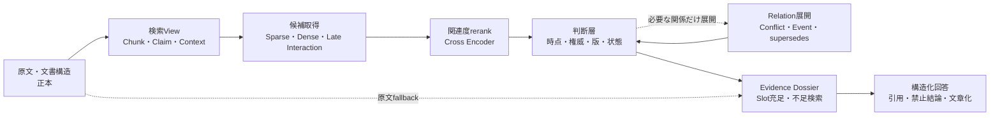

# 既存RAG手法の詳細調査とFragrachの研究方針

調査日: 2026-08-01  
対象: 500文書・100問の青羽精機コーパス、およびFragrachのEvidence / Claim / Relation / Conflict構想

## 結論

現時点の文献とFragrachの実測結果を合わせると、単一の「最新RAG手法」へ置き換えるのが最善ではない。最も有望なのは、次の責務を分けた構成である。

1. 原文と文書構造を失わない強い通常RAGを土台にする。
2. Sparse、Dense、Late Interactionを質問特性に応じて使い分け、広めの候補を得る。
3. 一般的な関連度は日本語対応Cross Encoderでrerankする。
4. 時点、権威性、版、状態、矛盾は関連度とは別の決定規則で扱う。
5. 複数文書にまたがる質問だけ、分解、Relation展開、Event Graphを起動する。
6. 必要な回答要素が揃ったかを検査し、不足分だけ追加取得する。
7. 回答前に根拠を確定し、構造化回答、引用、禁止結論を検証してから文章化する。

既存手法で強化できるのは主に1、2、3、5、6、7である。4の「同じ質問に関連する複数の記述から、用途・適用時点・権威性に基づいて扱いを決め、未解決なら矛盾として残す」は、一般的な関連度rerankだけでは不足する。ここがFragrachの独自層になり得る。

ただし、独自性は複雑さそのものでは証明できない。強い通常RAG、一般reranker、時間対応reranker、関係コンパイルを一層ずつ比較し、検索品質、解決品質、回答品質、構築費、質問時遅延を分けて測る必要がある。



## 調査上の注意

本文では、査読論文、プレプリント、公式モデルカード、企業の技術記事を区別する。異なるベンチマークのスコアを横並びにして優劣を決めない。モデルカードの「多言語対応」は日本語社内文書での有効性を保証しないため、実装候補を選ぶ根拠にだけ使い、採用判断は青羽精機の保留27問で行う。

2026年の論文には公開直後のものも含まれる。再現コード、学習データ、ライセンス、推論環境を実装前に再確認する。

## Fragrachの現在地

現在の100問評価では、検索方法ごとに次の傾向が得られている。

| 条件 | R@5 | R@10 | R@20 | Conflict両側取得@10 | 解決精度@10 | Distractor@5 |
|---|---:|---:|---:|---:|---:|---:|
| Tuned Sparse | 74.0% | 89.5% | 99.5% | 92.3% | 83.3% | 74.4% |
| Qwen Hybrid、Sparse比率0.85 | 75.0% | 91.5% | 99.5% | 96.2% | 80.0% | 74.0% |
| Qwen Denseのみ | 48.7% | 79.5% | 未採用 | 53.8% | 71.4% | 84.4% |
| Ruri Denseのみ | 65.7% | 86.5% | 99.0% | 88.5% | 87.0% | 78.0% |

この結果から、次の四点が分かる。

- 日本語文字n-gram Sparseは弱い仮Baselineではなく、現時点の主力である。
- Denseを少量混ぜるとR@5、R@10、矛盾両側取得は改善する。
- ただし、矛盾両側を取得できても正規側を上位に置けるとは限らない。関連度と解決順序は別問題である。
- Denseは言い換えに強い可能性がある一方、固有名、数値、規程、版を含む社内コーパスでは単独利用に足りない。

したがって、次の研究はDense比率の微調整だけに留めず、候補取得、関連度rerank、ガバナンス判断、Relation展開、回答組立を別々に改善する。

## 1. 原文保持と強い通常RAG

### 文書構造を保つBaseline

長文RAGでは、複雑な要約木やAgent方式だけでなく、原文の構造と順序を維持してretrieve-then-readするDOS RAGが強いBaselineになると報告されている。Token予算を揃えると、複雑な方式と同等または上回る場合がある。[Stronger Baselines for Retrieval-Augmented Generation with Long-Context Language Models](https://aclanthology.org/2025.emnlp-main.1656/)

これはFragrachにとって重要である。Claimや要約を原文の代替物にすると、コンパイル時に失った限定条件を検索時に復元できない。L0 Source / Evidenceを正本として残し、Chunk、Claim、Contextを交換可能なRetrieval Viewにする必要がある。

### Chunking

Late Chunkingは、長い文書を先にEmbedding modelへ通し、周辺文脈を持つToken表現を得てからチャンクへpoolingする。生成LLMを使わず、孤立したチャンクの文脈欠落を抑える候補である。[Late Chunking](https://arxiv.org/abs/2409.04701)

Contextual Retrievalは、各チャンクへ短い文脈説明を付け、文脈付き表現をBM25とEmbeddingへ使う。原文を保持したまま検索用表現を増やす点で、Fragrachのレイヤー設計に近い。[Contextual Retrieval](https://www.anthropic.com/engineering/contextual-retrieval)

一方、2026年のChunking比較では、単純な構造ベースChunkingがコーパス内検索で強く、LLM Chunkingは文書内検索で強いなど、優位性がタスク依存だった。Context付加にも常時の勝者はない。[A Reproducible Taxonomy of Chunking Methods for Retrieval-Augmented Generation](https://arxiv.org/abs/2602.16974)

HiChunkは階層Chunkingと親子の自動マージを用い、細かい一致と広い文脈の両立を狙う。[HiChunk](https://aclanthology.org/2026.acl-long.1372/) Summary-Augmented Chunkingも、文書要約をチャンクへ付けて類似文書間の取り違えを減らしているが、対象領域に特化した要約が常に有利とは限らなかった。[Summary-Augmented Chunking](https://aclanthology.org/2025.nllp-1.3/)

Fragrachでは、まず見出し境界、箇条書き、表、Front Matterを保持する決定的Chunkingを強くする。Contextual ChunkとLate Chunkingは、代名詞や前項参照を含むHard Setだけで増分を測る。LLMによる文脈説明はキャッシュ可能だが、説明に誤りが入るため原文の置換には使わない。

## 2. 候補取得: Sparse、Dense、Late Interaction

### SparseとDenseは固定比率で混ぜれば終わりではない

2026年のText/Table RAG benchmarkでは、23,000件超の質問でBM25がDenseを上回る条件があり、HybridとNeural rerankの組合せが有力だった。数値を正確に問う質問ではquery expansionの効果が限定的だった。[From BM25 to Corrective RAG](https://arxiv.org/abs/2604.01733) 同じデータ系列のT2-RAGBenchでもHybrid BM25が最も有効な構成だったが、表と文章をまたぐ質問には課題が残った。[T2-RAGBench](https://aclanthology.org/2026.eacl-long.8/)

FragrachのSparse優位は特殊な失敗ではない。固有名、規程番号、日付、金額、部署名は字面一致が強い。Denseは言い換え救済に使い、Sparseの代替にはしない。

現在は全質問に同じSparse比率0.85を使っている。しかし、DATはqueryごとにSparse/Denseの重みを動的に決め、固定融合の限界を扱う。[Dynamic Alpha Tuning for Hybrid Retrieval](https://arxiv.org/abs/2503.23013) HyPA-RAGは質問の複雑性を分類し、Sparse、Dense、Knowledge Graphを切り替える。[HyPA-RAG](https://aclanthology.org/2025.naacl-industry.79/) MoRも複数Retrieverを混合し、質問ごとに有用な取得経路を選ぶ。[Mixture of Retrievers](https://aclanthology.org/2025.emnlp-main.601/)

Fragrachでは、最初から学習Routerを導入せず、質問特徴による決定的Routerを先に比較する。

- 規程番号、固有ID、日付、数値、原文引用要求: Sparseを強める。
- 言い換え、目的、理由、類似概念: DenseまたはLate Interactionを増やす。
- 経緯、変更理由、複数部署、矛盾: Relation / Event経路を追加する。
- 「最新」「当時」「現在有効」: 時点Filterを候補取得前後に適用する。

### Learned Sparse

SPLADE系のLearned Sparseは語彙展開と転置索引の効率を両立する。SemEval 2026のIIMAS-RAGはquery rewriting、SPLADE、Dense、RRF、answerability判定を組み合わせ、query rewritingが大きな寄与を持った。ただし、取得が改善しても部分的Contextからの生成は難しかった。[IIMAS-RAG](https://aclanthology.org/2026.semeval-1.345/)

多言語Learned SparseにはMILCOのような研究もある。[MILCO](https://openreview.net/forum?id=Z6dVYEqurT) ただし、日本語のドメイン内学習データ作成と索引実装が必要である。まずBM25 + Dense + Cross Encoderを確定し、その残存失敗が語彙展開に集中した場合だけ導入する。

### Late Interaction

ColBERTv2は文書と質問を一ベクトルへ潰さず、Token単位の類似度を遅延相互作用で計算する。単一Denseより細かな一致を扱いながら、索引を圧縮する。[ColBERTv2](https://aclanthology.org/2022.naacl-main.272/) Jina-ColBERT-v2は多言語、長Context、次元可変に拡張している。[Jina-ColBERT-v2](https://aclanthology.org/2024.mrl-1.11/)

日本語固有語と意味一致を同時に扱う候補だが、現在のnpm + Rust配布にToken-level索引を組み込む費用は大きい。Cross Encoder rerankを先に測り、候補集合のRecallは十分だがDense類似度だけが弱いと確認された場合の第2候補とする。

## 3. 関連度rerank

### 有力候補

Cross Encoderは質問と各候補を同時に読み、候補取得後のtop 20～50をtop 5～10へ絞る。青羽精機で直ちに比較可能な候補は次の通りである。

| 候補 | 特徴 | ライセンス | 調査上の位置づけ |
|---|---|---|---|
| [hotchpotch/japanese-reranker-base-v2](https://huggingface.co/hotchpotch/japanese-reranker-base-v2) | 日本語ModernBERT系 | MIT | 日本語特化の第一候補 |
| [Qwen3-Reranker-0.6B](https://huggingface.co/Qwen/Qwen3-Reranker-0.6B) | 100言語超、32K Context | Apache-2.0 | 多言語汎用の第一候補 |
| [BAAI/bge-reranker-v2-m3](https://huggingface.co/BAAI/bge-reranker-v2-m3) | 多言語、軽量 | Apache-2.0 | 再現性の高い比較候補 |
| [hotchpotch/japanese-bge-reranker-v2-m3-v1](https://huggingface.co/hotchpotch/japanese-bge-reranker-v2-m3-v1) | bge-rerankerの日本語調整 | モデルカード要再確認 | 日本語調整の増分確認 |

Qwen3 Embedding/Reranker系列は0.6B、4B、8Bを持ち、多言語検索とrankingを同一系列で扱う。[Qwen3 Embedding](https://arxiv.org/abs/2506.05176) モデルサイズの大きさを精度の代理にせず、0.6Bを基準にLatencyと保留群を測る。

### ListwiseとLLM rerank

RankRAGはLLMにランキングと生成を学習させる。[RankRAG](https://arxiv.org/abs/2407.02485) Pairwise Ranking Promptingは既製LLMで候補対を比較し、複数benchmarkで教師ありrerankerを上回る結果を報告するが、比較回数が多い。[Pairwise Ranking Prompting](https://aclanthology.org/2024.findings-naacl.97/)

Listwise rerankerは候補全体を一度に比較できるが、提示位置のbiasがある。CapCalはこの位置biasを較正する。[Calibrating Position Bias in Listwise Reranking](https://aclanthology.org/2026.acl-short.68/) FIRSTは最初のToken logitsを使い、通常の生成型listwiseより高速化する。[FIRST](https://aclanthology.org/2024.emnlp-main.491/) 小型rerankerでtop 20を絞り、大型rerankerを少数候補へ使うCoRankingも費用対効果の候補である。[CoRanking](https://aclanthology.org/2025.findings-emnlp.273/)

Fragrachでは、Cross Encoder 3種を先に比較する。LLM rerankは、Cross Encoderが誤るHard Setに限定して評価する。全質問へCodex App Serverを呼ぶ方式は、再現性、費用、遅延のBaselineとして不利である。

### rerankerが解かないこと

一般rerankerが学習するのは主に質問への関連度である。「3営業日」と「5営業日」のどちらも質問に直接答えるなら、両者とも高得点になり得る。正式規程かFAQか、現在有効か廃止済みか、競合を開示すべきかは別の判断である。

そのため最終順位を単一スコアにせず、次の二段に分ける。

1. relevance rerank: 質問へ答える候補か。
2. governance resolution: authority、valid time、status、version、conflict policyに従って、正規、競合、履歴、参考を分類する。

## 4. 時点、権威性、矛盾

### 既存研究が示す問題

取得文書とモデル内部知識が競合すると、LLMは多数派や既存信念へ引かれる。[Tug-of-War](https://arxiv.org/abs/2402.14409) 文書同士の競合でも、単に両方をContextへ置けば透明に扱えるとは限らず、WhoQAは矛盾の明示を推奨する。[WhoQA](https://arxiv.org/abs/2410.15737/)

Astute RAGは内部知識と外部知識をsource-awareに統合し、信頼性を考慮する。[Astute RAG](https://arxiv.org/abs/2410.07176) RA-RAGはSource reliabilityを推定して優先順位に使う。[Reliability-Aware RAG](https://aclanthology.org/2025.emnlp-main.1738/) ConflictRAGは競合を検出、分類、解決してから生成し、埋め込み分類器と選択的LLMを組み合わせる。ただし2026年8月時点ではプレプリントとして扱う。[ConflictRAG](https://arxiv.org/abs/2605.17301)

時間については、古い文書が現行回答を妨げることが独立した問題として報告されている。[How Outdated Information Harms RAG](https://aclanthology.org/2025.acl-long.301/) Re³はrelevanceとrecencyの二段階取得を行い、古い文書の干渉を抑える。[Relevance and Recency Retrieval](https://aclanthology.org/2026.acl-long.1180/) 一方、正しい時間表現がContextにあっても、最終予測が時間推論を反映しない場合がある。[When Facts Change](https://aclanthology.org/2026.findings-acl.103/)

候補順の安定性も問題である。Stable-RAGは、Gold文書を先頭に置いても残りの候補順を変えるだけで回答が変動し得ることを示す。[Stable-RAG](https://aclanthology.org/2026.acl-long.1188/)

### Fragrachで必要な表現

原文を削除して「最新の正解」だけを残すと、過去時点の質問、変更理由、監査に答えられない。少なくとも次を分けて保持する。

```yaml
evidence:
  source_id: emergency-deployment-standard
  excerpt: "配備後3営業日以内に事後設計レビューを実施する"
  source_location: "4.2"

assertion:
  subject: emergency_deployment
  predicate: post_review_deadline
  value: 3_business_days
  modality: mandatory

governance:
  authority: official_standard
  status: active
  valid_from: 2026-04-01
  valid_to: null
  observed_at: 2026-04-10

relations:
  - type: conflicts_with
    target: faq-post-review-5-days
  - type: supersedes
    target: emergency-deployment-standard-v1
```

ATOMが観測時点と事実の有効時点を分ける考え方は、このモデルに適合する。[ATOM](https://aclanthology.org/2026.findings-eacl.49/) 時点は一つの`date`へ潰さず、文書を取得した時、発行した時、規則が有効な時を区別する。

矛盾は最終順位の勝敗だけにしない。解決可能なら正規側と根拠を示し、競合側を警告として同梱する。解決不能なら両候補を残し、回答に一意な結論を禁止する。厳格モードでは公開を止める。これは一般的rerankよりCompiler / governanceの責務に近い。

## 5. 複数文書、経緯、関係検索

### Query decomposition

複数条件や複数文書を必要とする質問は、一つのEmbeddingで一度に検索すると一部だけが上位に来やすい。Question Decomposition RAGは質問をsubqueryへ分け、結果を統合してrerankし、MultiHop RAGで大きな改善を報告した。[Question Decomposition for RAG](https://aclanthology.org/2025.acl-srw.32/) 2026年のexploration / exploitation方式は、探索用subqueryと絞り込み用subqueryを動的に使い分ける。[Query Decomposition with Exploration and Exploitation](https://aclanthology.org/2026.eacl-long.322/)

Fragrachでは、次の型に限って分解する。

- AとBの違い: A、B、比較軸。
- 変更理由と承認者: 変更Event、理由Evidence、承認Evidence。
- 現在値と旧値: 現行、履歴、supersedes関係。
- 複数部署の責任: 部署ごとの担当、handoff、最終責任。

すべての質問をLLMで分解すると呼び出し回数が増える。まずIntentと疑問表現から決定的なAnswer Contractを作り、未充足Slotだけsubqueryへ変換する。

### Relation / Graph

GraphRAGはEntity GraphとCommunity Summaryを作り、コーパス全体のglobal sensemakingを対象にする。[From Local to Global: A Graph RAG Approach](https://www.microsoft.com/en-us/research/publication/from-local-to-global-a-graph-rag-approach-to-query-focused-summarization/) DRIFTはglobal情報からlocal follow-upへ移る検索を加える。[DRIFT Search](https://www.microsoft.com/en-us/research/blog/introducing-drift-search-combining-global-and-local-search-methods-to-improve-quality-and-efficiency/)

HippoRAG 2はKnowledge Graph上のPersonalized PageRankを使い、事実、連想、sensemakingを統合する。[HippoRAG 2](https://arxiv.org/abs/2502.14802) SiReRAGは類似性だけでなく文書間の関連性を索引化する。[SiReRAG](https://openreview.net/forum?id=yp95goUAT1) PropRAGはproposition間の経路をbeam searchし、オンラインの生成LLMなしで多段根拠を探す。[PropRAG](https://arxiv.org/abs/2504.18070)

時系列には、Entity GraphとEvent Graphを分けるE²RAGが参考になる。[E²RAG](https://aclanthology.org/2026.eacl-long.90/) CIRAGはtriple、並列経路、複数粒度のContext expansionを組み合わせる。[CIRAG](https://aclanthology.org/2026.acl-long.1203/)

Fragrachに全面的なGraphRAGを最初から入れる必要はない。現在の質問は局所的な規程、期限、担当が多い。まず次の限定Relationを実装する方が費用と検証可能性に優れる。

- `same_as` / alias
- `supersedes` / superseded_by
- `conflicts_with`
- `supports` / derived_from
- `event_before` / event_after
- `applies_to`
- `approved_by` / owned_by

これらは質問に一致したEvidenceから一段だけ展開し、top-kとは別枠でDossierへ入れる。全社傾向やプロジェクト横断の共通原因を問うGoldを追加した後、GraphRAG、RAPTOR、HippoRAG 2を比較する。

## 6. 取得十分性とEvidence Dossier

top-kのスコアが高いことと、回答に必要な根拠が全部揃うことは異なる。S2G-RAGは現在のEvidenceが十分かを判定し、不足項目を構造化して追加検索する。[S2G-RAG](https://aclanthology.org/2026.acl-long.1185/) Corrective RAGは取得結果の品質を評価し、必要な場合だけ補正検索を行う。[Corrective RAG](https://arxiv.org/abs/2401.15884)

35方式を比較したAdaptive Retrieval調査では、単純な不確実性判定が複雑なpipelineと同等程度で、効率面に優れる条件も報告された。[Adaptive Retrieval Survey and Evaluation](https://aclanthology.org/2025.acl-long.319/) したがって、Fragrachのfallbackは常時起動せず、回答Slotの不足という観測可能な条件で起動する。

```yaml
answer_contract:
  slots:
    review_required: required
    deadline: required
    deadline_origin: required
    effective_at: required
    conflicts: required_if_present
    citations: required

retrieval_state:
  filled: [review_required, deadline]
  missing: [deadline_origin, effective_at]
  unresolved: [conflicts]
```

追加検索は`missing`だけを問い合わせる。Conflict Relationは`unresolved`へ別枠で追加する。候補を単純にtop 20からtop 40へ増やすより、質問に必要な情報の種類を保てる。

長Contextも無制限には使わない。QA性能は取得snippet数が約15件まで改善した後に停滞または低下するという報告がある。[How Many Retrieved Documents Are Enough?](https://aclanthology.org/2025.findings-naacl.375/) Dossierは根拠を削るだけでなく、Slot、主Evidence、競合Evidence、適用条件をまとまりとして配置する。

## 7. 回答生成と検証

正しい根拠が揃っていても、モデルが根拠を使わない、過度に要約する、答えるべきでない質問へ断言する問題が残る。GaRAGeでは、モデルは文脈への忠実性と回答拒否の双方に大きな余地を残した。[GaRAGe](https://aclanthology.org/2025.findings-acl.875/)

Evidence-First Structured Generationは、生成前に使う事実集合を確定し、各文を確定済みEvidenceへ結びつける。[EFSG](https://aclanthology.org/2026.rag4reports-1.14/) RLSeekは回答中のClaimに対応する引用Evidenceを明示させ、hallucination verificationへ用いる。[RLSeek](https://aclanthology.org/2026.acl-long.1492/)

Fragrachでは自由回答を一度で作らず、次の順にする。

1. Answer Contractを質問から作る。
2. Evidence DossierでSlotを埋める。
3. 各値へEvidence IDと状態を付ける。
4. 未解決Conflictから禁止結論を作る。
5. Schema検証を通す。
6. 検証済み構造だけを自然文にする。
7. 自然文の各主張がEvidence IDへ戻れるか検証する。

RAGCheckerは取得と生成の失敗を分離する。[RAGChecker](https://arxiv.org/abs/2408.08067) RAGVUEもretrieval、completeness、claim faithfulness、judge calibrationを分ける。[RAGVUE](https://aclanthology.org/2026.eacl-demo.35/) RAGEvalは用途固有Schemaを使い、完全性、hallucination、irrelevanceを測る。[RAGEval](https://aclanthology.org/2025.acl-long.418/) Fragrachの評価器も、最終Strict PassだけでなくCompile、Retrieve、Resolve、Assemble、Generate、Cite、Guardを分ける。

## 手法比較表

| 手法群 | 主に改善する失敗 | Fragrach適合度 | 主な弱点 | 初期優先度 |
|---|---|---:|---|---:|
| 構造保持Chunk + Tuned BM25 | 固有語、数値、文書構造 | 高 | 言い換え、関係 | P0、済 |
| Dense Hybrid | 言い換え、類似概念 | 高 | 単独では固有語に弱い | P0、初期評価済 |
| 日本語Cross Encoder | top-k内の関連度順位 | 非常に高 | 時点・権威を保証しない | P0 |
| 多言語Cross Encoder | 再現可能な汎用rerank | 高 | 日本語領域差 | P0 |
| 決定的governance rerank | 時点、版、権威、状態 | 非常に高 | metadata抽出品質に依存 | P0 |
| Query-adaptive fusion | Sparse/Denseの質問差 | 高 | Routerの誤分類 | P1 |
| Query decomposition | 複数条件、多段質問 | 高 | 呼出し数、誤分解 | P1 |
| Contextual / Summary Chunk | 孤立チャンク、類似文書 | 中 | 生成誤り、構築費 | P1 |
| Relation一段展開 | 矛盾両側、版、履歴 | 非常に高 | Relation誤抽出 | P1 |
| Slot-gap retrieval | 必須根拠の欠落 | 非常に高 | Contract設計が必要 | P1 |
| Evidence-first generation | 根拠未利用、誤引用 | 非常に高 | 生成処理が増える | P1 |
| Learned Sparse | 語彙差と転置索引 | 中 | 日本語学習、実装費 | P2 |
| ColBERT系 | Token-level意味一致 | 中 | 索引と配布が重い | P2 |
| GraphRAG / RAPTOR | 全体傾向、抽象質問 | 現Goldでは低 | 高い構築費、対象質問不足 | P2 |
| HippoRAG / Event Graph | 多段、連想、時系列 | 中～高 | Graph抽出と評価が必要 | P2 |
| LLM listwise rerank | 難しい意味判断 | 中 | 遅延、費用、位置bias | P2 |

## 研究仮説

### H8: 一般Cross EncoderでR@5は改善する

現在のHybrid top 20には必要根拠がほぼ含まれるため、候補集合を増やさずrerankするだけでR@5とDistractor@5が改善する。日本語特化modelは多言語modelより青羽精機で有利な可能性がある。

### H9: 一般rerankerだけでは矛盾解決精度は改善しない

正規側と競合側はどちらも質問に関連するため、relevance rerankは両側取得を維持しても、現行80.0%の解決精度を安定して上げない。

### H10: relevanceとgovernanceの二段順位が最も費用対効果に優れる

Cross Encoderで関連候補を絞った後、metadataとRelationによる決定的規則を適用すると、R@5を維持しながら解決精度と禁止誤答を改善する。全候補をLLMで比較するより速く再現可能である。

### H11: 固定Hybrid比率より質問Routerが良い

固有IDと数値質問ではSparse、言い換えではDense、経緯ではRelationを強めると、全体平均とIntent別の下位値が改善する。単一比率の最適化より保留群への過適合が小さい。

### H12: Claimを原文の代替にせず検索ViewにするとCompile Coverage低下を防げる

原文Evidenceを常時検索可能にし、Claim、Context、Summaryを追加Viewとして使えば、抽象化で欠けた情報をfallbackできる。無効・旧版の原文は削除せず、通常質問で降格し履歴質問で復帰させる。

### H13: Conflict Relation展開はtop-k拡大より両側取得を安定させる

一致したEvidenceから`conflicts_with`を辿り、top-k外でも競合側を別枠へ追加すると、Candidate数を増やすより少ないTokenでConflict completeを100%へ近づけられる。

### H14: Project HistoryはDense強化よりQuery decomposition + Event Relationが効く

理由、決定、承認、時系列が別文書にある質問では、一ベクトル検索よりSlot別subqueryとEvent Relation展開が必要Evidenceを揃えやすい。

### H15: Slot-gap retrievalは常時Evidence fallbackより効率的である

Claim top 5で必要Slotが揃えば追加検索せず、不足時だけ原文Evidenceを検索すると、回答要素再現率を上げながら平均Tokenと遅延を抑えられる。

### H16: Evidence-first構造化回答が検索改善をStrict Passへ変換する

Oracleでも残った生成・禁止誤答を、値とEvidence IDの固定、Conflict disclosure、prohibited conclusionsのschema検査により減らせる。

## 実験計画

### 実験A: rerankerを確定する

共通候補をTuned Sparseまたは現在のQwen Hybridからtop 20、top 50で取得し、次を比較する。

| ID | 条件 |
|---|---|
| A0 | Tuned Sparse、rerankなし |
| A1 | Qwen Hybrid 0.85、rerankなし |
| A2 | A1 + Japanese Reranker Base v2 |
| A3 | A1 + Qwen3-Reranker-0.6B |
| A4 | A1 + bge-reranker-v2-m3 |

R@5、R@10、Conflict complete、解決精度、Distractor@5、質問当たりLatency、memory、model download sizeを測る。73問で候補と設定を選び、27問では一度だけ確定値を測る。reranker promptをGold IDへ合わせない。

採用条件は、保留R@5が現在の72.2%を上回り、R@10を85.2%未満へ落とさず、質問時p95がローカル利用の許容範囲に収まることである。Conflict解決はこの実験の必須採用条件にしないが、悪化を記録する。

### 実験B: relevanceとgovernanceを分離する

Aの最良条件へ順に追加する。

1. status filterだけ。
2. valid timeだけ。
3. authority tierだけ。
4. supersedes Relation。
5. conflict disclosure policy。

質問時点が指定されない場合の既定時点も固定する。解決精度だけでなく、競合Evidenceを隠していないか、過去時点質問を壊していないかを測る。

### 実験C: 質問別Router

決定的Routerを作り、質問をlexical、semantic、temporal、conflict、multi-hopへ分類する。各分類でSparse/Dense比率、Relation展開、rerank候補数を変える。固定0.85との比較後にのみ、学習Routerを検討する。

### 実験D: 原文保持とRelationコンパイル

同じSourceから次を並列に索引化する。

- Raw structural chunks
- normalized Claim
- short source excerpt
- aliases
- supersedes / conflicts_with / event Relation

Claim-only、Raw-only、Raw + Claim、Raw + Claim + Relationを比較する。コンパイル失敗時もRaw-onlyとして検索できることを回帰試験にする。

### 実験E: Answer ContractとDossier

検索条件をA～Dの最良一つに固定し、次を比較する。

1. top-kをそのまま回答modelへ渡す。
2. Evidenceを重複除去しsource順に渡す。
3. Answer ContractのSlotへ配置する。
4. 3 + gap retrieval。
5. 4 + Conflict別枠 + prohibited conclusions。

ここで初めて最終回答を全量評価する。検索実験ごとに生成を回さず、検索と回答の原因を混ぜない。

## 直ちに実装するもの

次の実装順が最短で判断材料を増やす。

1. 共通top-k候補を保存できるrerank評価interface。
2. Japanese Reranker Base v2、Qwen3-Reranker-0.6B、bge-reranker-v2-m3 adapter。
3. relevance scoreとgovernance decisionを別fieldで保存する結果schema。
4. 時点、状態、権威性、版の決定的rerank。
5. Conflict / supersedesの一段展開。
6. Answer ContractのSlot充足検査。

各adapterは同じ候補JSONLを読み、同じ評価器へ結果を返す。これにより、モデル導入、Python sidecar、ONNX変換、Rust推論の選択を検索ロジックから分離できる。

## まだ実装しないもの

- 全面GraphRAG: 現在のGoldにglobal questionが少なく、効果を正しく測れない。
- RAPTOR全面導入: 長文抽象質問の評価群を先に作る必要がある。
- Learned Sparseの追加学習: Cross Encoder後の残存失敗を確認してから判断する。
- 強化学習reranker: RRPOは生成utilityとrankingを合わせる有望な考え方だが、まず固定Goldで診断可能なpipelineを作る。[RRPO](https://aclanthology.org/2026.acl-long.1406/)
- 全質問のLLM listwise rerank: 費用と再現性の割に、Cross Encoderとの差が未測定である。
- 古い原文の削除: 監査、履歴、過去時点質問を失うため行わない。

## 成功判定

短期の検索目標は次とする。

- 全100問R@5: 75.0%超
- 全100問R@10: 91.5%以上
- 保留27問R@5: 72.2%超
- 保留27問R@10: 85.2%以上
- Conflict両側取得@10: 96.2%以上、目標100%
- Conflict解決精度@10: Tuned Sparseの83.3%以上へ回復、目標90%以上
- Distractor@5: 74.0%未満

回答目標は、検索条件確定後に測る。

- 回答要素再現率: 88.6%以上
- 引用再現率: 71.2%以上
- 禁止誤答率: 0%
- Strict Pass: Raw RAGを有意に上回る方向を示す
- 回答入力Token: Raw RAGの1.5倍以内

100問では1問が1ポイント前後、Conflict質問はさらに標本が小さい。平均値だけでなく、質問ID別の改善・悪化、Intent別、既存16問、追加84問、開発73問、保留27問を併記する。最終的な製品主張は、別コーパスでも同じ傾向を再現してから行う。

## Fragrachの研究上の位置づけ

企業内で文書の効力が変わる条件は、一般的なauthority、時点、版だけでは表し切れない。業種・部門別の具体例、文書役割、適用Scope、個別例外、契約上の優先、正本性、Lineageまでの要件は[企業文書の有力度と活用ケース](enterprise-document-validity-cases_ja.md)にまとめた。

既存研究には、強いHybrid検索、rerank、時間対応、信頼性評価、Conflict処理、Graph検索、回答検証がそれぞれ存在する。Fragrachが「どれにもない」と主張するのは適切ではない。

Fragrachが狙える位置は、これらを質問時の一時的推論だけに任せず、利用目的ごとに次の再利用可能なKnowledge Buildへコンパイルすることである。

- 原文に遡れるEvidence
- 検索用のClaim / Context View
- 時点、状態、権威性、版
- Conflict、supersedes、support、Event Relation
- 公開を止める診断とWarning policy
- Answer Contractと禁止結論
- どのCompiler判断を経たかのprovenance

つまりFragrachは「通常RAGを置き換える検索器」ではなく、強い通常RAGと回答pipelineが、毎回同じ資料関係を推測し直さずに済むよう入力知識を構築するCompilerである。製品価値は、一般rerankerを土台として採用したうえで、矛盾、版、時点、権威性、回答制約にどれだけ追加効果を出せるかで評価する。
