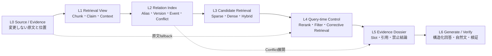

# RAG技術調査とFragrachの比較候補

調査日: 2026-08-01

本書は全体像と初期比較条件を示す。Sparse / Dense / rerank、時点・権威性・矛盾、Query decomposition、Graph、Evidence-first生成までの一次資料調査、採用優先度、追加仮説、具体的な実験順序は[既存RAG手法の詳細調査](rag-existing-methods-deep-dive-2026_ja.md)にまとめた。2026年7月末までの総説、横断比較、scaling study、ablationとFragrach実測の対応は、正式な要件根拠文書である[Fragrach要件根拠：RAG技術の現状評価](../requirements/01-rag-technology-assessment_ja.md)を参照する。

この調査の目的は、Fragrachの現在の実装を前提に改善案を探すことではない。十分に調整した通常RAG、検索後に根拠を絞り込む方式、索引作成前に知識を加工する方式を広く比較し、Fragrachが解くべき問題と採用するレイヤーを決めることである。

先に結論を述べると、検索後の絞り込みと事前コンパイルは代替関係ではない。一般的な関連度の改善にはHybrid検索とrerankが強く、用途、時点、権威性、版、矛盾を繰り返し扱う場合は事前に関係を明示する価値がある。Fragrachは原文を失わないEvidence層の上へ関係をコンパイルし、検索時のrerankと検証を組み合わせる方向が最も有望である。ただし、その価値は各レイヤーを外した比較で実証する必要がある。

## 現在の技術をどう分類するか

RAGの改善手法は、処理を行う時点で四つに分けられる。

| 段階 | 主な手法 | 改善するもの | 残りやすい問題 |
|---|---|---|---|
| 索引作成前 | 文書構造保持、Contextual Retrieval、Late Chunking | チャンクが失う周辺文脈 | 文書間の矛盾、時点、権威性 |
| 索引構築 | Hybrid検索、Late Interaction、階層索引、Knowledge Graph | 語彙差、粒度、複数文書関係 | 誤抽出、構築費、更新追従 |
| 検索時 | query expansion、rerank、Corrective RAG | 質問ごとの関連度と不要根拠 | 取得されなかった根拠、実行時費用 |
| 回答時 | Dossier、Self-RAG、引用検証、構造化回答 | 根拠利用、引用、禁止結論 | 入力根拠自体の欠落や誤り |

この分類を使うと、Fragrachは「索引作成前に全文を要約する製品」ではない。Evidenceを保存し、利用目的に応じたClaim、Relation、Conflict、回答制約を索引構築前に付加する方式である。検索時と回答時の改善を排除せず、その入力を安全にする役割を持つ。

## 強い通常RAGを先に作る必要がある

2025年の研究では、複雑な多段RAGだけでなく、文書本来の構造と順序を保った単純なretrieve-then-readも明示的な比較対象になっている。これは、高度な手法の効果を主張する前に、単純方式のToken予算と文書構造を十分に調整する必要があることを示している。[Stronger Baselines for Retrieval-Augmented Generation with Long-Context Language Models](https://aclanthology.org/2025.emnlp-main.1656/)

Fragrachでは、現在の日本語文字n-gram BM25を再現用Baselineとして残し、次の順で強化する。

1. チャンク粒度、重なり、見出し、Front Matter、BM25パラメータを調整する。
2. 疎検索と密検索を組み合わせるHybrid検索を追加する。
3. top 20程度を取得し、質問との関連度でrerankしてtop 5またはtop 10へ絞る。
4. 同じToken予算と回答モデルで最終回答を測る。

RAGCheckerの実験でも、チャンクサイズ、重なり、top-kは有用情報とノイズの量を変え、取得量を増やすと文脈利用が改善する一方でノイズ感度が悪化し得る。したがって、R@kだけでなく不要単位率と回答の忠実性を同時に測る必要がある。[RAGChecker](https://arxiv.org/abs/2408.08067)

## 軽量な事前加工

Contextual Retrievalは、チャンク単独では分からない短い説明を各チャンクへ付け、その文脈付き表現をEmbeddingとBM25の両方へ使う。原文を置き換えず検索表現を増やすため、FragrachのEvidence-first案に近い軽量な比較対象になる。Anthropicの実験では、Contextual Embeddings、Contextual BM25、rerankingの効果を組み合わせて評価している。[Contextual Retrieval](https://www.anthropic.com/engineering/contextual-retrieval)

Late Chunkingは、長い文書を先にモデルへ通し、周辺文脈を含むToken表現を得てからチャンク単位へpoolingする。LLMで説明文を生成せずにチャンクの文脈欠落を抑える方法であり、密検索を導入する場合の候補になる。[Late Chunking](https://arxiv.org/abs/2409.04701)

どちらも、原文の短い段落が「それ」「この手順」「前項」のような参照を含む場合には有望である。一方、正式規程と未更新FAQのどちらを優先するか、二つの値を矛盾として開示すべきかは、文脈付きEmbeddingだけでは明示的に解決しない。

## 検索時の絞り込みと補正

疎検索と密検索で広めに候補を集め、Cross EncoderやLLMでrerankする方式は、質問ごとの関連度を改善しやすい。ColBERTv2はToken単位のLate Interactionによって単一ベクトルより細かな対応を扱い、圧縮によって索引コストを抑える。[ColBERTv2](https://aclanthology.org/2022.naacl-main.272/)

RankRAGは一つのLLMを文脈ランキングと回答生成の両方へinstruction tuningする。検索後の候補選択を回答モデルに近い判断で行える一方、候補ごとのランキングは遅延を増やすと報告している。[RankRAG](https://arxiv.org/abs/2407.02485)

Corrective RAGは、取得結果の品質を評価し、信頼度に応じて追加検索や不要部分の除去を行う。検索結果が質問へ十分に答えられるかを実行時に判断するため、Fragrachの条件付きEvidence fallbackと直接比較できる。[Corrective Retrieval Augmented Generation](https://arxiv.org/abs/2401.15884)

Self-RAGは、検索が必要か、取得文書が関連するか、生成内容が根拠で支持されるかをreflection tokenで判断する。これはAnswer Contractと回答検証の比較対象になるが、専用の学習または対応モデルが必要である。[Self-RAG](https://openreview.net/forum?id=hSyW5go0v8)

検索時補正の利点は、未知の質問へ適応でき、全コーパスを再コンパイルせず判断を変更できることである。欠点は、最初の候補集合に入らなかった根拠をrerankでは救えないこと、質問ごとに推論費用が発生すること、権威性や時点を毎回読み直す必要があることである。

## 階層化とGraph RAG

RAPTORはチャンクを再帰的にクラスタリングして要約木を作り、異なる抽象度から検索する。長文全体をまとめる質問や、複数箇所を統合する質問に適している。[RAPTOR](https://openreview.net/forum?id=GN921JHCRw)

Microsoft GraphRAGは、文書からEntity GraphとCommunity Summaryを事前生成し、コーパス全体の傾向を問うglobal queryへ対応する。研究対象も主にglobal sensemakingであり、規程の期限や一つの承認者を答えるFragrachの現在の質問分布とは異なる。[From Local to Global: A Graph RAG Approach](https://www.microsoft.com/en-us/research/publication/from-local-to-global-a-graph-rag-approach-to-query-focused-summarization/)

この二方式は事前コンパイルの代表例だが、初期の直接比較対象にはしない。青羽精機コーパスへ全社傾向、障害群の共通原因、プロジェクト横断の意思決定といったglobal questionを追加した段階で比較する。現在の100問だけで評価すると、手法の得意領域を測れないためである。

## 矛盾と時系列は依然として独立した課題である

2026年のConfRAGは、異種Web文書に矛盾を含む質問を集め、強いモデルにも矛盾認識と理由説明の余地が残ることを示している。[ConfRAG](https://aclanthology.org/2026.acl-long.11/)

古い情報については、HOHが現行文書と履歴文書を保持する動的QAを構成し、RAGの時間的な頑健性を独立に評価している。[How Outdated Information Harms RAG](https://aclanthology.org/2025.acl-long.301/)

また、E2RAGは通常の非構造RAGが時間順序を明示的に扱わず、一般的なKnowledge GraphがEntityの変化を一ノードへ潰す問題を指摘し、Entity GraphとEvent Graphを分けている。[Entity-Event RAG](https://aclanthology.org/2026.eacl-long.90/)

これらはFragrachの問題設定に近い。単にEntityとRelationを抽出するだけでなく、Evidence、Event、適用期間、状態、権威性、Conflictを別々に保持する必要がある。とくに「古いので削除する」のではなく、通常質問では降格し、過去時点や変更履歴の質問では取得できる表現が必要になる。

## 長いContextへ全部入れるだけでは解決しない

長いContextを持つモデルでも、必要情報が入力中央にあると性能が落ちる現象が確認されている。[Lost in the Middle](https://aclanthology.org/2024.tacl-1.9/)

さらに、Context全長と正解位置を固定しても、文書数が増えるだけで性能が下がるという報告がある。したがって、Dossierの入力Tokenを減らすだけでなく、独立した検索単位の数と配置も制御する必要がある。[More Documents, Same Length](https://aclanthology.org/2025.findings-emnlp.1064/)

Fragrachで同じ論点のClaim、Evidence、Conflictを一つのDossierへ束ねる設計は、この問題への妥当な対策候補である。ただし、束ねる過程で異なる対象を混ぜない検証が必要になる。

## 比較対象として採用する構成

初期比較では、次の六条件を採用する。GraphRAGとRAPTORはglobal question追加後の別実験とする。

| ID | 構成 | 代表する考え方 | 実行時LLM |
|---|---|---|---|
| B0 | 現行Raw BM25 | 未調整の再現用Baseline | なし |
| B1 | Tuned Raw Sparse | チャンク、n-gram、BM25を調整した純粋RAG | なし |
| B2 | Tuned Raw Hybrid + Rerank | 検索後に広く取得して絞り込む強い通常RAG | rerankで使用可能 |
| B3 | Contextual Chunk Hybrid + Rerank | 軽量な事前文脈化と検索時絞り込み | 索引時とrerankで使用可能 |
| F1 | Fragrach Evidence + Relation | 原文を主とし、時点・権威・版・矛盾を事前コンパイル | 索引時 |
| F2 | F1 + Corrective Retrieval + Dossier | 事前知識と質問時補正を組み合わせる全体構成 | 索引時と質問時 |

B2を「検索後に絞り込む方式」の主比較対象、B3を「軽量な事前加工」、F1を「用途別の事前コンパイル」とする。F2は製品全体の性能を測るが、F1との差によって質問時処理の寄与を分離する。

## 提案する仮説

### H1: Tuned Rawは現行Rawを改善するが、矛盾と時点では頭打ちになる

チャンクとBM25の調整によって全体R@5とR@10は上がる。一方、類似語を持つ旧版と現行版は両方とも関連文書なので、Conflict complete、解決順位、禁止誤答は関連度調整だけでは十分に改善しないと予想する。

### H2: Hybrid検索とrerankは通常質問の最強Baselineになる

疎検索が固有語と数値、密検索が言い換え、rerankが質問との意味対応を補うため、B2は通常質問のR@5と不要単位率でB1を上回ると予想する。ただし、正規文書と競合文書のどちらも質問へ関連する場合、rerankerに時点・権威情報を渡さなければ解決順位は安定しない。

### H3: Contextual Chunkは孤立した段落を救うが、文書関係の代替にはならない

B3は短い節、代名詞、表の一行でB2を上回ると予想する。一方、説明文の生成誤りと索引Token増加があり、Conflict Unitの明示的接続は増えない。

### H4: Claim-onlyよりEvidence-first Relationの方が情報損失に強い

原文Evidenceを常に検索可能な正本とし、Claimを検索View、Relationを順位・展開規則として扱えば、現行Claim-onlyのCompile Coverage不足を回避できると予想する。無効な原文は削除せず、状態と時点で降格する。

### H5: Conflictは類似検索ではなくRelation展開で取得すべきである

質問に一致したClaimまたはEvidenceからConflict edgeを辿り、正規側と競合側を別枠で追加すれば、Conflict Unit Recallと両側完全取得率が上がると予想する。top-kの偶然に任せない点がB2、B3との差になる。

### H6: 検索時補正と事前コンパイルは相補的である

Corrective Retrievalは未知質問と抽出漏れを救い、事前Relationは時点・権威・矛盾の判断材料を供給する。F2はF1より通常質問のRecallを、B2より矛盾・時系列の解決精度を改善すると予想する。代わりに質問時の遅延とTokenが増える。

### H7: Dossierは取得改善を最終回答へ変換するために必要である

検索結果をそのまま渡す方式では、根拠数が増えるほど不要文書と配置問題が増える。回答Slot、正規Evidence、競合Evidence、禁止結論をまとめたDossierは、同じ取得結果からStrict Passと引用を改善すると予想する。

## レイヤー構造

比較可能性を保つため、実装を次の境界へ分ける。

各実験は一レイヤーだけを交換する。B1からB2ではL3とL4、B2からB3ではL1、B3からF1ではL1とL2、F1からF2ではL4とL5の効果を測る。回答モデルを変える実験はL6として別に扱い、検索・コンパイルの改善と混ぜない。

## 実装と評価の順序

1. B1のSparse tuningを完了し、開発群、保留群、全100問の目標値を固定する。
2. B2のHybrid候補とrerankerを選び、同じGoldで強い通常RAGを確定する。
3. B3としてContextual Chunkを追加し、軽量な事前加工の増分を測る。
4. FragrachをEvidence-firstへ変更し、L2のRelationをLLM出力とRust検証へ追加する。
5. Conflict edge展開とCorrective RetrievalをL4へ実装する。
6. DossierをL5として接続し、良好な検索条件だけ最終回答を評価する。

検索評価ではR@5、R@10、R@20、不要単位率、Conflict Recall、Conflict Complete、Conflict Unit Recall、解決精度とCoverageを測る。回答評価では引用再現率、回答要素、禁止誤答率、Strict Pass、入力Token、遅延を測る。事前処理時間と質問時費用は分けて報告し、品質点へ混ぜない。

この順序により、B2が十分に強ければFragrachの価値を過大評価せずに済む。逆に、B2やB3でも矛盾、版、時点が残り、F1またはF2で改善した場合は、事前Knowledge Build固有の効果として説明できる。
