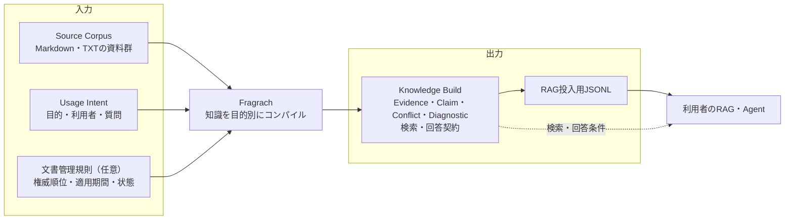

<p align="center">
  
</p>

# Fragrach ユーザーマニュアル

**Dependency-aware Living Corpus RAG**

対象バージョン: 0.1.0 開発版  
更新日: 2026-08-01

## Fragrachの役割

Fragrachは、RAGへ登録するコーパスを解析し、各文書に付与すべきメタデータをコンパイルするCLIです。通常のRAGが文書を検索して回答するのに対し、Fragrachはその入力を準備します。検索API、ベクトルデータベース、チャット画面は提供しません。



図の右端にあるRAGやAgentは利用者が用意します。Fragrachの役割は、その手前で原文と利用目的を照合し、根拠、矛盾、情報不足を失わない知識成果物を作ることです。

原文をEvidenceへ分割し、選択したコンパイルProviderでEvidence付きClaim候補を抽出します。その後、Rust側で参照先、適用期間、文書の権威性、状態、矛盾、不足を検証し、Knowledge Buildとして確定します。判断できない矛盾は勝手に解消せず、Warningと根拠を残します。

主な利用者は、社内RAGを構築する開発者です。文書管理者は文書の権威順位と施行日を整え、業務担当者はUsage Intentと未解決事項を確認します。RAG開発者は確定したJSONLと検索・回答契約を下流システムへ組み込みます。

## 現在の対応範囲

入力できる文書はUTF-8のMarkdown、`.markdown`、プレーンテキストです。PDF、Office文書、画像、OCRには対応していません。

Claim抽出Providerは、OllamaとCodex App Serverから選べます。標準のOllama endpointを使う場合、Evidence本文は端末外へ送信されません。外部Ollama endpointを指定した場合はそのホストへ、Codex App Serverを選んだ場合はCodexが使用するモデルProviderへEvidence本文が送られます。

npm用パッケージとWindows x64、Linux x64/arm64、macOS x64/arm64の構成は用意されていますが、0.1.0はnpmレジストリへ未公開です。現時点ではソースからビルドするか、ローカルで作成したtarballを使います。ライセンスも`UNLICENSED`であり、組織導入用の公開リリースではありません。

## 最短の利用手順

### 1. CLIとコンパイルProviderを準備する

開発版にはRust 1.94以降とCargoが必要です。リポジトリのルートでreleaseバイナリを作ります。

```powershell
cargo build --release --locked
.\target\release\fragarach.exe --help
```

以降の例は`fragarach.exe`を`PATH`へ追加したものとして`fragarach`と記します。追加しない場合は、各コマンドを`.\target\release\fragarach.exe`へ置き換えてください。

Ollamaを起動し、構造化出力を扱えるモデルを用意してください。このリポジトリの評価では`gemma4:latest`を使っています。

```powershell
ollama pull gemma4:latest
ollama serve
```

Ollamaが別の端末ですでに動いている場合、`ollama serve`を重ねて実行する必要はありません。

Codex App Serverを使う場合はCodex CLIをインストールし、あらかじめCodexへサインインしてください。Fragrachはコンパイル中にCodexのログイン画面を開きません。

```powershell
codex --version
```

### 2. ワークスペースを初期化する

以下では、原文を`C:\knowledge\corpus\sources`、Fragrachの管理領域を`C:\knowledge\work`に置きます。

```powershell
fragarach init C:\knowledge\work
```

成功すると`C:\knowledge\work\.fragarach`が作られます。FragrachはSource Root内の原文を変更しませんが、`.fragarach`内のManifest、SQLiteデータベース、解析結果は更新します。

### 3. 文書を走査する

```powershell
fragarach scan `
  --source C:\knowledge\corpus\sources `
  --workspace C:\knowledge\work `
  --include "**/*.md,**/*.txt" `
  --exclude "**/drafts/**,**/~$*" `
  --max-file-size 1048576 `
  --max-errors 0
```

走査結果は`.fragarach/manifest.json`と`.fragarach/parsed/`へ保存されます。完全重複、追加、変更、削除、未対応形式を記録し、内容とParser版が同じ解析結果は再利用します。シンボリックリンクはたどらず、`.git`、`.fragarach`、`node_modules`は既定で除外します。

`--max-errors`または`--max-warnings`の上限を超えると非ゼロ終了します。`scan`自体が完了しても個別文書が`unsupported`になることはあるため、CIでは終了コードとManifestの集計を確認してください。

### 4. 利用目的を定義する

Usage Intentは、コーパス全体から何を取り出すかを制限します。次は最小例です。

```yaml
id: developer-onboarding
goal: 新任開発者が本番作業までに必要な手続を根拠付きで理解する
users:
  - new-product-developer
tasks:
  - 本番アクセスの申請条件を確認する
  - リリース前の確認担当を確認する
questions:
  - 本番アクセスは誰の承認で何時間まで利用できるか
  - リリース前に誰がどの確認を行うか
requirements:
  evidence_required: true
  temporal_scope_required: true
  unresolved_conflicts_allowed: true
```

保存後、構文と必須項目を検証します。

```powershell
fragarach intent validate `
  --file C:\knowledge\corpus\intents\developer-onboarding.yaml
```

Intentが広すぎるとClaim数、LLM利用量、検索時のノイズが増えます。一つの利用者群が同じ判断に使う質問をまとめ、異なる業務目的は別のIntentに分けてください。

### 5. 文書の権威性と期間を付ける

Source Rootの親に`corpus.yaml`を置くと、Fragrachがコンパイル時と再コンパイル時に読みます。

```yaml
authority_precedence:
  - corporate_policy
  - corporate_standard
  - approved_review_record
  - guidance
  - record

authority_hints:
  - pattern: "sources/**/standards/*.md"
    authority: corporate_standard
  - pattern: "sources/**/faq/*.md"
    authority: guidance
  - pattern: "sources/**/archive/*"
    lifecycle: superseded
```

順位は上にあるほど優先されます。更新日が新しい、文章が詳しい、LLMの信頼度が高いという理由だけでは競合を解決しません。文書固有の適用期間はFront Matterへ記述できます。

```yaml
---
status: active
effective_from: 2026-04-01
effective_to: 2027-03-31
---
```

日付は`YYYY-MM-DD`です。「変更後3営業日以内」のような期限は適用期間ではなくClaimの内容として扱います。

### 6. Knowledge Buildをコンパイルする

出力先は既存でないパスを指定します。既存Buildを上書きしないためです。

```powershell
fragarach compile `
  --workspace C:\knowledge\work `
  --intent C:\knowledge\corpus\intents\developer-onboarding.yaml `
  --provider ollama `
  --model gemma4:latest `
  --output C:\knowledge\builds\developer-onboarding-v1
```

Codex App Serverを使う場合も、Knowledge Buildの形式と後段のRust検証は同じです。

```powershell
fragarach compile `
  --workspace C:\knowledge\work `
  --intent C:\knowledge\corpus\intents\developer-onboarding.yaml `
  --provider codex-app-server `
  --model gpt-5.6-luna `
  --reasoning-effort low `
  --llm-concurrency 8 `
  --output C:\knowledge\builds\developer-onboarding-luna-v1
```

文書ID、版、Position、対象文書、確認文書がfront matterに明記され、本文からClaimを抽出しない用途では、LLMを呼ばない`metadata` providerを使えます。

```powershell
fragarach compile `
  --workspace C:\knowledge\work `
  --intent C:\knowledge\corpus\intents\document-control.yaml `
  --provider metadata `
  --model front-matter-v1 `
  --output C:\knowledge\builds\document-control-v1
```

`metadata`は、明示された文書管理metadataをDocument Profile、Position Relation、Decision Packetへ変換し、通常の検証を行う限定providerです。`scope`にはJSON objectを指定でき、`organization` / `entity`、`jurisdiction`、`site`、`product`、`asset`、`person`、`project`、`lot`、`contract`の各値は文字列または文字列配列として扱います。本文からClaimや欠けたPositionを推定せず、`claims.jsonl`は空になります。必要な管理情報が原文にない場合は、OllamaまたはCodex App Serverによる抽出を使ってください。

既知のRelation familyでは、scopeの対象文書ID、本文に完全一致で明記された既知document IDの順に接続先を決定します。候補が複数で一意に決められない場合は推測で接続せず、`FRG-REL-UNRESOLVED-REQUIRED-SLOT` warningを出します。warningの対象文書へscopeを追加するか、LLM providerで不足部分を補完してください。

必要に応じて、次のオプションを使います。

- `--provider`: `ollama`、`codex-app-server`、`metadata`。既定は`ollama`
- `--compile-strategy`: `dossier-v1`、`global-v1`、`linear-v2`。既定は`dossier-v1`。旧名`hybrid-v2`も互換aliasとして受け付けるが、新規Build Manifestには`dossier-v1`と記録する
- `--ollama-endpoint`: 既定は`http://127.0.0.1:11434`
- `--codex-command`: Codex CLIの実行ファイル。既定は`codex`
- `--reasoning-effort`: Codexモデルのreasoning effort。既定は`low`
- `--batch-size`: 1回の抽出へ渡すEvidence数。既定は12
- `--llm-concurrency`: 同時に実行するLLM抽出requestの上限。既定はCodex App Serverが8、Ollamaが1。複数processや複数shardを同時実行する場合は、全processの合計並列度を考慮して各processの値を下げる
- `--no-cache`: 保存済みのClaim抽出応答を使わず、すべてLLMで再抽出する
- `--as-of YYYY-MM-DD`: ビルド全体の基準日
- `--authority-precedence a,b,c`: `corpus.yaml`の順位をコマンドで上書き
- `--on-unresolved-conflict error`: 未解決ConflictをErrorにする
- `--warnings-as-errors`: すべてのWarningで公開を失敗させる

コンパイルはSource文書ごとのバッチを使い、長い文書だけ境界を重ねて分割します。複数batchは`--llm-concurrency`の上限内で並列実行し、完了順ではなく入力batch順へ戻して検証します。Codex App Serverは並列度ぶん独立clientを起動します。OllamaはVRAM消費とserver側の直列化を考慮して既定1であり、利用環境で安全性を確認した場合だけ明示的に増やしてください。`metadata`はLLM requestを発行しないため、この並列度は使いません。候補Claimが存在しないEvidence IDを引用した場合や、日付形式が不正な場合はRust側で拒否します。相対的な期限を適用期間と誤認した候補は、期限内容を残して無効な日付だけを除去します。

Claim抽出応答は既定で`.fragarach/cache/claim-extraction-v1`へバッチごとに保存されます。Source本文とメタデータ、Usage Intent、Provider、モデル識別情報が同じ場合だけ再利用します。Ollamaではモデルdigest、seed、コンテキスト長を、Codex App ServerではCodex CLI版、モデル、reasoning effort、プロトコル版を識別情報に含めます。抽出プロンプト、出力スキーマ、述語カタログも一つの指紋として記録されるため、精度改善で抽出契約を変更すると古いキャッシュは自動的に対象外になります。Build Manifestの`extraction_cache_hits`、`extraction_cache_misses`、`llm_calls`で利用状況を確認できます。

再コンパイル前に、保存済みキャッシュのIntent、Source数、Evidence数、Claim数、モデルを読み取り専用で確認できます。

```powershell
fragarach cache report --workspace C:\knowledge\work
```

機械処理する場合はグローバルオプションの`--json`を付けます。報告に残っているエントリは「現在の条件でも再利用される」という意味ではありません。再利用可否は、コンパイル時に現在の入力と抽出指紋を含む完全なキーで判定されます。

成功したBuildは指定先へ一度に公開されます。ポリシー上失敗したBuildは指定先へ出さず、`.fragarach/failed-builds/<build-id>`へ診断付きで保存します。中断した一時Buildは完成Buildとして扱われませんが、中断前に完了したClaim抽出応答はキャッシュへ残るため、同じ条件で`compile`を再実行すると続きから処理できます。同じワークスペースへの`scan`、`compile`、`recompile`の並行実行はロックで拒否されるため、先行処理の終了後に再実行してください。

### 7. Warningを確認する

```powershell
fragarach report `
  --build C:\knowledge\builds\developer-onboarding-v1
```

Knowledge Buildの状態は次のいずれかです。

| 状態 | 意味 |
|---|---|
| `completed` | 現在のポリシーで公開可能 |
| `completed_with_warnings` | 公開されたが、人による確認が必要 |
| `failed` | 公開不可。失敗Build領域に保存 |

未解決Conflictは、候補、Evidence、解決できない理由、対応案を`conflicts.jsonl`と`diagnostics.jsonl`へ残します。現在は、同じ節のチェック項目の多くに担当者があり一部だけ欠ける場合も、Intentがリリースやチェックリストを扱うときに`FRG-CST-MISSING-OWNER`として警告します。

探索用途ではWarningを回答時に開示して使えることがあります。規程案内や自動実行では、`--on-unresolved-conflict error`または`--warnings-as-errors`を使い、担当者が判断するまで公開しない運用が安全です。0.1.0にはConflict overrideファイルを承認・適用する機能はまだありません。原文、Front Matter、`corpus.yaml`のいずれかを修正して再走査または再コンパイルしてください。

### 8. 決定的な規則だけを再適用する

権威順位、Front Matter、重複文書の別パス、不足・競合規則を修正しただけなら、LLM抽出をやり直さずに再コンパイルできます。

```powershell
fragarach recompile `
  --workspace C:\knowledge\work `
  --build C:\knowledge\builds\developer-onboarding-v1 `
  --output C:\knowledge\builds\developer-onboarding-v2
```

`recompile`は既存のClaimとEvidenceを読み、決定的な検証と成果物ハッシュを更新します。新しい出力先が必要で、Build Manifestの`llm_calls`、`prompt_tokens`、`completion_tokens`は0になります。原文本文やUsage Intentが変わった場合は、`scan`後に`compile`を実行してください。

### 9. RAGへ渡す

```powershell
fragarach export `
  --build C:\knowledge\builds\developer-onboarding-v2 `
  --format jsonl `
  --output C:\knowledge\exports\developer-onboarding.jsonl
```

JSONLはEvidenceを中心に関連Claimをまとめます。各行には、原文本文、Claim、条件、状態、権威性、Conflict ID、Intent ID、引用位置が入ります。完全重複した文書のパスは同じEvidenceの別名として保持されます。Conflictとは別の根拠付きDiagnosticも独立した検索単位として出るため、情報不足を下流RAGが検索できます。

すでに旧Buildを索引済みなら、全件を登録し直さず差分だけを出力できます。

```powershell
fragarach export `
  --base-build C:\knowledge\builds\developer-onboarding-v1 `
  --build C:\knowledge\builds\developer-onboarding-v2 `
  --format jsonl `
  --output C:\knowledge\exports\developer-onboarding-v1-v2.delta.jsonl
```

差分には、追加または変更された検索レコードの`upsert`、対象Buildから消えたIDの`delete`、末尾の`commit`だけが入ります。変更のないレコードは入りません。原文編集では引用IDを別内容へ上書きしないため、通常は旧Evidenceの`delete`と新Evidenceの`upsert`になります。

下流RAGでは少なくとも次を実装してください。

1. Intentごとに索引またはフィルターを分ける。
2. 質問の`as_of`とClaimの`valid_from`、`valid_to`で対象時点を絞る。
3. `retrieval-profile.yaml`の権威順位を検索スコアと回答判断へ反映する。
4. `answer-contract.yaml`に従って引用と未解決Conflictを回答へ出す。
5. 差分適用時は現在のBuild IDが`base_build_id`と一致することを確認し、操作をstagingへ適用した後、`commit`を検証して`target_build_id`へ切り替える。途中状態は検索へ公開しない。

Fragrachはベクトル化や登録処理を行わないため、JSONLを利用中の検索基盤へ渡すアダプターは利用者が実装します。差分exportは最小操作と版境界を定義しますが、LanceDBなど各基盤のtransactionそのものは実行しません。

## Knowledge Buildの読み方

```text
knowledge-build/
├─ build-manifest.json
├─ usage-intent.yaml
├─ evidence.jsonl
├─ claims.jsonl
├─ conflicts.jsonl
├─ diagnostics.jsonl
├─ unresolved-questions.md
├─ retrieval-profile.yaml
├─ answer-contract.yaml
├─ provenance.json
└─ overview.md
```

`build-manifest.json`はBuild状態、入力Manifestのハッシュ、成果物ハッシュ、件数、処理時間、LLM呼び出し数とtoken数を記録します。`provenance.json`はProvider、モデル、Prompt契約、Intentハッシュ、Parser版、基準日、権威順位を記録します。

Evidenceは原文から切り出した検証単位、ClaimはEvidenceが述べている内容の構造化表現です。Claimは一つ以上のEvidence参照がなければ採用されません。Conflictは複数のClaimを同時に真と扱えない可能性、Diagnosticはその理由と人が取れる対応です。

IR Schemaは現在`0.2`です。1.0未満では、readerとBuildのSchema版が完全一致する場合だけ互換とみなします。別プログラムは`build-manifest.json`を先に読み、未知の版を推測で処理しないでください。

## 評価結果と限界

付属の架空社内コーパス47文書、4 Intent、16問を使い、Raw RAG、正解データから作ったOracle、Actual Knowledge Buildを同じ日本語BM25、top-k 5、`gemma4:latest`で比較しました。コーパスは初期版の25文書、14,825文字から47文書、29,704文字へ増やし、正解文書と質問を変えずに似た語を含む周辺文書を追加しています。

| 指標 | Raw RAG | Oracle | Actual Build |
|---|---:|---:|---:|
| 根拠再現率@5 | 79.2% | 96.9% | 79.2% |
| 引用再現率 | 61.5% | 61.5% | 45.8% |
| 必須回答要素の再現率 | 89.1% | 95.3% | 79.7% |
| Behavior Accuracy | 100.0% | 100.0% | 100.0% |
| 禁止誤答率 | 0.0% | 6.3% | 0.0% |
| Strict Pass率 | 37.5% | 37.5% | 18.8% |

Oracleは「正しい知識単位を作れた場合の上限」であり、Fragrachの実装結果ではありません。Oracleの根拠再現率と回答要素はRaw RAGより高い一方、Actual BuildはRaw RAGを上回りませんでした。Actualを同じ条件で3回実行しても、根拠再現率79.2%、回答要素79.7%、Strict Pass 18.8%で一致しました。現時点では、コンセプトの上限効果は見えるものの、実抽出と検索用表現の精度は不足しています。

このActualは、Claimが付いたEvidenceだけを検索したBaselineです。追加のアブレーションでは、Claimがない原文Evidenceも検索できるfallbackを加えると、根拠再現率88.5%、引用70.8%、回答要素85.9%、Strict Pass 50.0%となり、3回再現しました。Raw RAGのStrict Pass 37.5%は上回りましたが、禁止誤答率が0%から6.3%へ増え、索引単位も184から2,279へ増えています。したがって、全Evidenceを無条件に混ぜるのではなく、Claimを優先し、根拠不足時だけEvidenceを補う参照アダプターが必要です。

実コンパイルでは、値が空のClaim候補を検証で棄却できるよう改善しました。一方、「下書きは30日、承認済みは7年」という一つのEvidenceから、LLMが誤って「下書きは7年」というClaimを作り、偽のConflictを発生させました。Fragrachは未解決Conflictを含むBuildの公開を停止しましたが、Evidence IDが正しくてもClaimの意味が正しいとは限りません。`diagnostics.jsonl`の確認と抽出結果のサンプリングレビューが必要です。

この結果は架空コーパスと一つのモデルによる開発時評価です。実データで導入判断する前に、利用目的ごとの質問、時点、禁止回答、人手判定を用意し、Raw RAGと並行評価してください。推奨文書数、メモリ、ディスク容量の保証値はまだありません。

47文書の初回コンパイルは、Intentごとに約300秒から599秒、LLM呼び出し47回、入力token約13.5万から13.6万でした。4 Intentの合計は約30分25秒、入力542,495 tokenです。検証規則だけを更新した`recompile`は、LLM 0回、35msでした。現在の`compile`は同じ抽出条件の応答をSource単位でキャッシュするため、2回目以降は未変更バッチのLLM呼び出しを省略します。端末、モデル、文書構成、キャッシュ状態で変わるため、これらは性能保証ではありません。精度評価は[最終評価](evaluations/final-metrics_ja.md)を参照してください。

## npmパッケージをローカル検証する

レジストリ公開前のパッケージを確認する場合は、releaseバイナリを現在のOS用パッケージへ配置し、`npm pack`でtarballを作ります。

```powershell
cargo build --release
npm run stage:npm

npm pack .\packages\npm\platforms\win32-x64 `
  --pack-destination .\target\npm-packs
npm pack .\packages\npm\fragarach `
  --pack-destination .\target\npm-packs
```

ランチャーにはNode.js 18以降が必要です。プラットフォーム別パッケージがないOSやCPUでは、対応バイナリが見つからないというエラーになります。

## 困ったとき

`workspace is not initialized`なら、指定した`--workspace`へ先に`init`を実行します。`workspace is already bound to another source root`なら、以前と同じSource Rootを使うか、別のワークスペースを初期化してください。

`output already exists`なら、過去Buildを削除せず新しい出力パスを指定します。失敗理由は`report --build <失敗Buildのパス>`または`diagnostics.jsonl`で確認できます。

Providerへの接続や構造化出力に失敗した場合、公開済みBuildは変更されません。Ollamaではendpoint、モデルの導入状態、Ollamaのログを確認します。Codex App ServerではCodex CLIの版、サインイン状態、モデルの利用可否を確認します。修正後に同じ`compile`を再実行すると、中断前に保存された抽出キャッシュを再利用します。キャッシュを使わず原因を切り分ける場合は`--no-cache`を指定します。

走査結果が想定より多い場合は、Source Rootを狭くし、`--include`、`--exclude`、`--max-file-size`を設定します。機密文書を外部Ollama endpointやCodexのモデルProviderへ送信できるか、コンパイル前にProvider設定と走査Manifestを確認してください。
